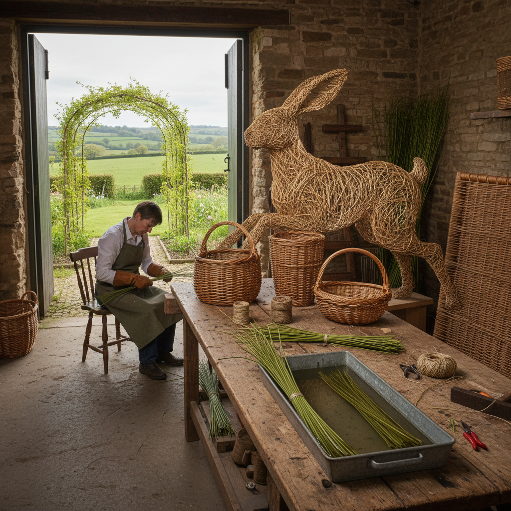

# Willow Art 柳编艺术

> "Willow is the weaver's wood — supple as leather when fresh, strong as rope when dry, growing back each year from the same stump in long straight rods perfect for bending. A willow basket is a living thing twice over: first as a growing plant, then as a woven form that carries the memory of the tree's flexibility in every curve and crossing." — Unknown

## 概述

柳编艺术（Willow Art）是以柳条为主要材料进行编织和造型创作的艺术形式——利用柳条天然的柔韧性、强度和优美的色泽，通过编织、弯曲和缠绕等技法创造篮筐、家具、雕塑和装置艺术。柳编是欧洲最重要的传统编织工艺之一。

柳编艺术的实践包括：1）柳编篮筐——用柳条编织的各种容器；2）柳编家具——柳条制作的椅子和桌子；3）柳编雕塑——用柳条创造的大型雕塑；4）柳编围栏——用活柳条编织的花园围栏；5）活柳建筑——用活的柳树编织成的凉亭和隧道；6）柳编装置——大型柳编艺术装置；7）柳编人偶——用柳条编织的巨型人偶（如英国的柳人）。

## 核心特征

| 特征 | 描述 |
|------|------|
| 柔韧 | 极好的柔韧性 |
| 可再生 | 每年可收割的可再生材料 |
| 结构 | 自我支撑的编织结构 |
| 有机 | 有机的自然形态 |
| 大型 | 可创造大型作品 |
| 活体 | 可用活柳条创作 |

## 视觉特征

- **线条**：流畅的柳条线条
- **编织**：紧密或开放的编织纹理
- **色彩**：从绿色到棕色的天然色
- **曲线**：优美的弯曲造型
- **透光**：编织间隙的透光效果
- **有机**：有机的自然形态

## 代表作品

| 作品 | 艺术家 | 年代 | 意义 |
|------|--------|------|------|
| *Willow Man* | Serena de la Hey | 2000 | 英国巨型柳人 |
| *Living willow structures* | Various | 当代 | 活柳建筑 |
| *Willow baskets* | 传统 | 古代至今 | 传统柳编篮 |
| *Willow sculptures* | Various | 当代 | 柳编雕塑 |
| *Willow coffins* | Various | 当代 | 环保柳编棺材 |

## 历史时间线

| 时期 | 事件 |
|------|------|
| 新石器时代 | 最早的柳编遗存 |
| 古代 | 欧洲的柳编传统 |
| 中世纪 | 柳编作为重要手工业 |
| 19世纪 | 柳编产业的高峰 |
| 当代 | 柳编的艺术化和环保复兴 |

## 中国语境

柳编艺术在中国有悠久的传统。中国北方（特别是山东、河北、河南）是重要的柳编产区——中国的柳编工艺有数千年历史。山东的柳编产品在国际市场上享有盛誉——从柳编篮筐到柳编家具，中国是世界上最大的柳编产品出口国之一。中国的柳编技艺包括多种编织方法——平编、绞编、勒编、砌编等，每种方法产生不同的纹理和强度。中国当代的一些艺术家在探索柳编的艺术化——用柳条创造大型雕塑和装置。中国的柳编产业也在向环保和可持续方向发展——柳编作为塑料的天然替代品越来越受到关注。

## AI生成概念图

## 与其他风格的关系

- **Basket Weaving** → 编篮艺术
- **Rattan Art** → 藤编艺术
- **Land Art** → 大地艺术
- **Eco Art** → 生态艺术
- **Sculpture** → 雕塑
- **Living Art** → 活体艺术

---

*浮光艺志 | Chronicle of Artistry*
