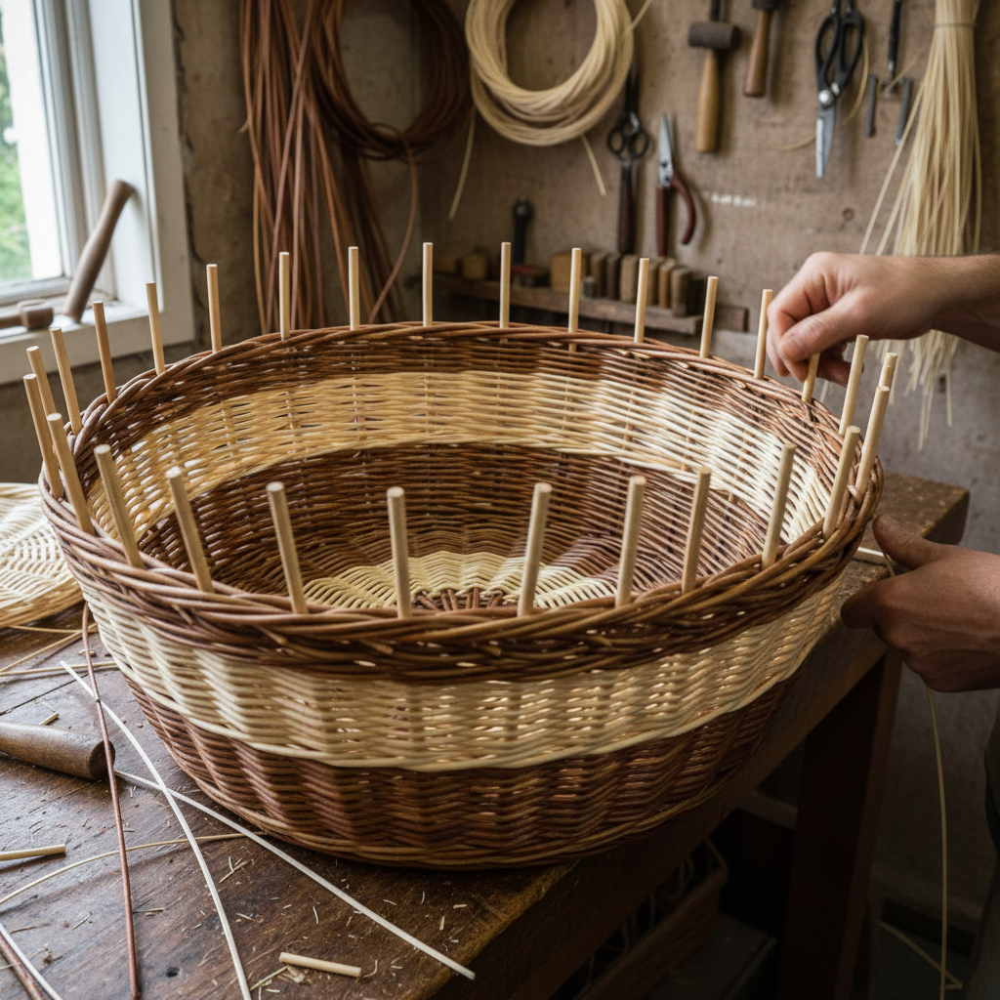

# Willow Weaving Art 柳条编织艺术

> "Willow weaving is architecture grown from the ground — living rods harvested in winter are soaked, bent, and interlaced into baskets, fences, sculptures, and shelters using techniques unchanged since the Neolithic. The willow remembers its life as a growing thing and brings that organic energy into every curve and twist. A well-made willow basket is not merely a container but a record of the dialogue between human intention and the wood's natural spring." — Unknown

## 概述

柳条编织艺术（Willow Weaving Art）是一种使用柳树枝条（osier/willow）进行编织的传统手工艺——将冬季采收的柳条在浸泡软化后编织成篮筐、围栏、家具和雕塑等各种器物和结构。柳条编织是人类最古老的手工艺之一，可追溯到新石器时代，以其强度、弹性和自然美感著称。

柳条编织艺术的实践包括：1）材料准备——采收和浸泡柳条；2）底部编织——编织篮筐的底部结构；3）侧壁编织——编织立体的侧壁；4）边缘收口——完成边缘的收口处理；5）活柳编织——使用活的柳条编织生长中的结构；6）柳条雕塑——大型的柳条艺术雕塑；7）当代柳条编织——将传统技法与现代设计结合的创作。

## 核心特征

| 特征 | 描述 |
|------|------|
| 柳条 | 使用柳树枝条 |
| 弹性 | 柳条的天然弹性 |
| 古老 | 新石器时代的传统 |
| 结构 | 强大的结构性能 |
| 活体 | 可使用活柳编织 |
| 可持续 | 可再生的材料 |

## 视觉特征

- **编织**：规律的编织纹理
- **有机**：有机自然的曲线
- **色彩**：柳条的自然色彩
- **结构**：清晰的结构逻辑
- **质朴**：质朴自然的美感
- **力量**：结构的力量感

## 代表作品

| 作品 | 艺术家/文化 | 年代 | 意义 |
|------|-------------|------|------|
| *Neolithic fish traps* | 史前 | 新石器时代 | 最早的柳条编织 |
| *English wicker baskets* | 英国 | 传统 | 英国柳条篮 |
| *Living willow structures* | 国际 | 当代 | 活柳建筑 |
| *Tom Hare sculptures* | 英国 | 当代 | 柳条雕塑大师 |
| *Contemporary willow art* | 国际 | 当代 | 当代柳条艺术 |

## 历史时间线

| 时期 | 事件 |
|------|------|
| 新石器时代 | 柳条编织的起源 |
| 古代 | 各文明的柳条编织传统 |
| 中世纪 | 柳条篮筐的广泛使用 |
| 19世纪 | 维多利亚时代柳条家具 |
| 当代 | 柳条编织的艺术化发展 |

## 中国语境

柳条编织在中国有悠久的传统和广泛的应用。中国的柳编是重要的民间手工艺——从篮筐、簸箕到柳条箱都是传统的日用品。中国山东临沭是著名的"柳编之乡"——柳编产业是当地的支柱产业。中国的柳编产品是重要的出口商品——远销欧美和日本市场。中国的非物质文化遗产中，多项柳编技艺被列入保护名录——传承这一古老的编织传统。中国当代的一些设计师将柳编与现代设计结合——创造出具有当代感的柳编家具和装饰品。中国的乡村振兴战略中，柳编作为一种可持续的手工艺产业——为农村地区提供就业机会和经济收入。中国的一些艺术家使用柳条创作大型装置艺术——将传统材料赋予当代艺术表达。

## AI生成概念图

## 与其他风格的关系

- **Basket Weaving** → 篮筐编织
- **Rush Weaving** → 灯芯草编织
- **Living Architecture** → 活体建筑
- **Land Art** → 大地艺术
- **Sustainable Design** → 可持续设计
- **Folk Craft** → 民间工艺

---

*浮光艺志 | Chronicle of Artistry*
