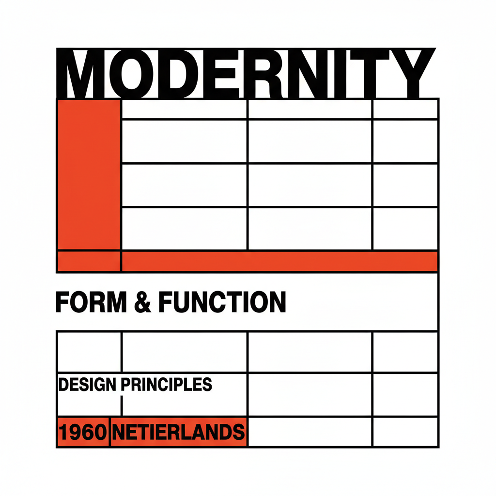

# Wim Crouwel 维姆·克劳威尔

> **时期：** 1928–2019  
> **关键词：** 网格字体、New Alphabet、荷兰系统设计、数字先知

## 概述

Wim Crouwel 是荷兰平面设计师，以极端系统化的设计方法闻名。他1967年设计的New Alphabet——一套完全基于水平和垂直线条的字体——预言了数字时代的像素化显示，将排版推向了纯粹几何的极限。

## 风格特征

- **网格绝对化**：所有设计元素严格遵循网格
- **像素化字体**：只用水平和垂直线条构成字母
- **系统方法**：设计是一套规则系统而非个人表达
- **荷兰理性**：冷静、客观、去个人化的设计态度
- **未来预见**：1960年代就预见了数字显示的视觉逻辑

## 代表作品

- *New Alphabet*（1967）
- *阿姆斯特丹市立博物馆海报*系列
- *Gridnik 字体*
- *Fodor 博物馆视觉识别*

## 概念图

