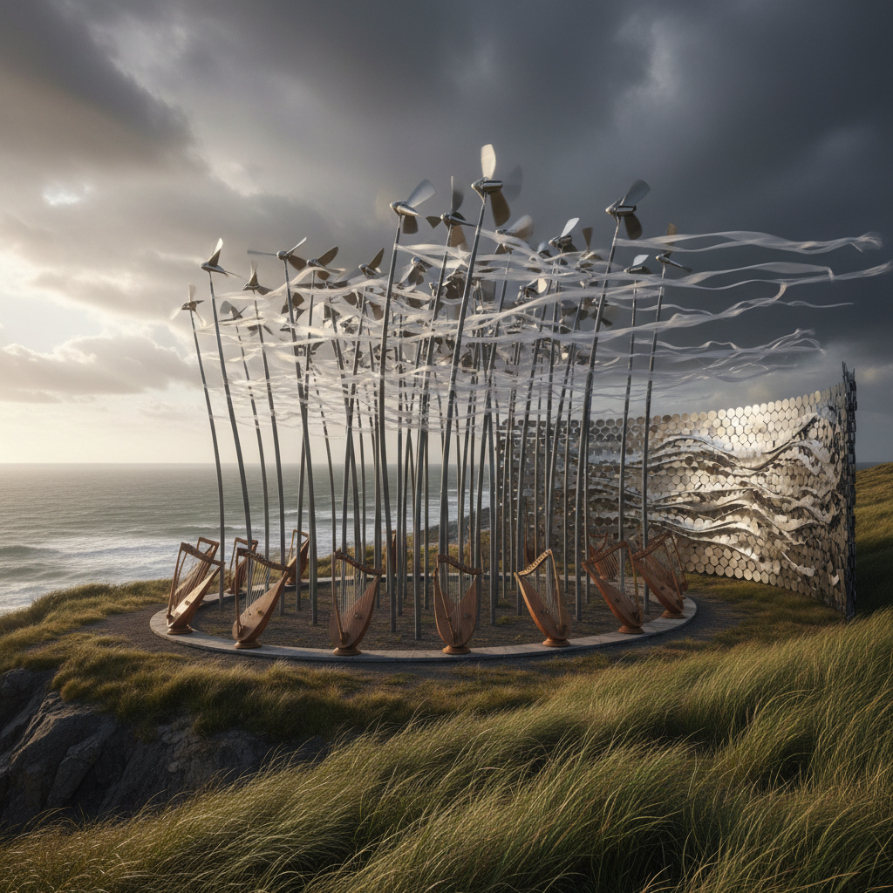

# Wind Art 风艺术

> "Wind art makes visible the invisible — it gives form to the formless, shape to the shapeless, presence to the absent. Wind is everywhere and nowhere, touching everything yet grasped by nothing. The wind artist builds instruments for the atmosphere to play, creates sails for invisible currents to fill, designs flags for forces no eye can see. Every wind sculpture is a collaboration between human intention and atmospheric chaos, between the fixed and the flowing, between what we build and what the sky decides to do with it." — Unknown

## 概述

风艺术（Wind Art）是以风——空气的运动——为媒介、动力和合作者的艺术实践。风是地球上最普遍但最不可见的自然力量之一，风艺术通过各种方式让风变得可见、可听、可感。

风艺术的实践包括：1）风动雕塑——被风驱动的动态雕塑（风车、风铃、风旗）；2）风的可视化——让风的路径和力量变得可见（烟雾、丝带、织物）；3）风琴/风笛——利用风产生声音的装置；4）风力绘画——让风驱动画笔或颜料进行创作；5）风筝艺术——将风筝作为空中雕塑和绘画；6）风蚀艺术——利用风的侵蚀力量塑造材料。

## 核心特征

| 特征 | 描述 |
|------|------|
| 不可见 | 让不可见变可见 |
| 动态 | 持续运动 |
| 声音 | 风产生的声音 |
| 不可控 | 无法控制风 |
| 方向 | 风向的变化 |
| 力量 | 风力的大小 |

## 视觉特征

- **飘动**：织物和旗帜的飘动
- **旋转**：风车和涡轮的旋转
- **弯曲**：被风弯曲的材料
- **轻盈**：轻质材料的使用
- **线条**：风的流线可视化
- **空间**：开阔的户外空间

## 代表作品

| 作品 | 艺术家 | 年代 | 意义 |
|------|--------|------|------|
| *Kinetic sculptures* | Alexander Calder | 1930年代 | 风动雕塑先驱 |
| *Wind Wand* | Len Lye | 1996 | 巨型风动杆 |
| *Wind installations* | Ned Kahn | 2000年代 | 建筑风动立面 |
| *The Wind Portal* | Najla El Zein | 2013 | 纸风门 |
| *Wind Trees* | Jérôme Michaud-Larivière | 2015 | 风力发电树 |

## 历史时间线

| 时期 | 事件 |
|------|------|
| 古代 | 风铃、风车、风筝的发明 |
| 1930年代 | Calder的动态雕塑 |
| 1960年代 | 动态艺术运动 |
| 2000年代 | 建筑风动立面 |
| 当代 | 风能与艺术的结合 |

## 中国语境

风艺术在中国有极其深厚的文化传统。中国是风筝的发源地——风筝在中国有超过两千年的历史，从军事用途发展为精美的民间艺术。潍坊被称为"世界风筝之都"，每年举办国际风筝节。中国传统文化中"风"有丰富的象征意义——"风水"中风是核心元素、"国风"代表文化传统、"风骨"代表人格品质。中国传统的风铃（檐铃）不仅是装饰，也有驱邪和报时的功能。中国当代的一些艺术家在探索风艺术：将中国传统风筝的工艺与当代艺术结合、在中国的风力发电场创作大地艺术、以及将中国传统的"听风"文化与声音艺术结合。

## AI生成概念图

## 与其他风格的关系

- **Kinetic Art** → 动态艺术
- **Sound Art** → 声音艺术
- **Land Art** → 大地艺术
- **Weather Art** → 气象艺术
- **Ephemeral Art** → 短暂艺术
- **Kite Art** → 风筝艺术

---

*浮光艺志 | Chronicle of Artistry*
