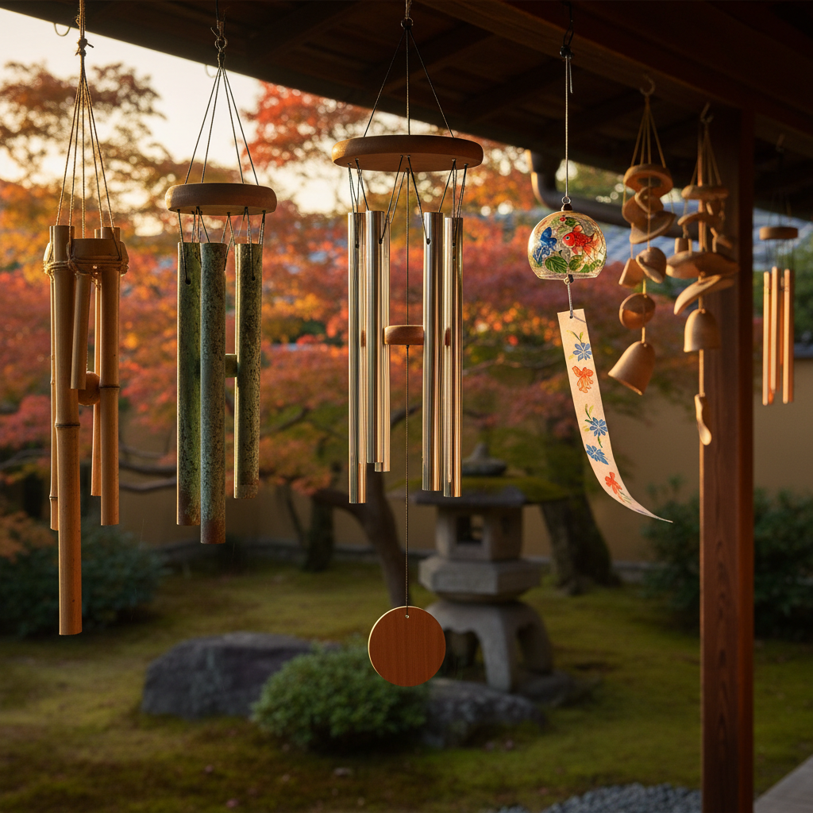

# Wind Chime Art 风铃艺术

> "A wind chime is a collaboration between the artist and the wind — the maker shapes the materials, tunes the tones, and balances the elements, but it is the invisible hand of moving air that plays the instrument. Every breeze becomes a unique composition, never to be repeated. A wind chime transforms the random energy of weather into music, making the invisible audible and the chaotic harmonious." — Unknown

## 概述

风铃艺术（Wind Chime Art）是设计和制造由风力驱动发声的悬挂装置的艺术形式——通过精心选择材料、调音和造型设计，创造出既是视觉雕塑又是风力乐器的作品。风铃艺术将声学、材料科学和美学设计融为一体。

风铃艺术的实践包括：1）金属风铃——用铝管、铜管或钢管制作的调音风铃；2）玻璃风铃——用玻璃片或玻璃管制作的风铃；3）陶瓷风铃——用陶瓷片制作的风铃；4）竹风铃——用竹管制作的风铃；5）贝壳风铃——用贝壳和海洋材料制作的风铃；6）艺术风铃——以艺术表达为目的的大型风铃装置；7）日本风铃（風鈴）——日本传统的玻璃或铁制风铃。

## 核心特征

| 特征 | 描述 |
|------|------|
| 声音 | 风驱动的声音 |
| 悬挂 | 悬挂的结构 |
| 随机 | 随机的演奏 |
| 调音 | 精心的调音 |
| 材料 | 材料决定音色 |
| 环境 | 与环境互动 |

## 视觉特征

- **悬挂**：垂直悬挂的元素
- **金属**：金属管的光泽
- **透明**：玻璃的透明质感
- **运动**：风中的轻微摆动
- **光影**：阳光穿过的光影
- **简洁**：简洁的造型设计

## 代表作品

| 作品 | 艺术家 | 年代 | 意义 |
|------|--------|------|------|
| *Japanese furin* | 传统 | 古代至今 | 日本传统风铃 |
| *Tuned wind chimes* | Various | 当代 | 精确调音风铃 |
| *Large wind harps* | Various | 当代 | 大型风琴装置 |
| *Glass wind chimes* | Various | 当代 | 玻璃风铃 |
| *Bamboo wind chimes* | Various | 古代至今 | 竹风铃 |

## 历史时间线

| 时期 | 事件 |
|------|------|
| 古代 | 中国和东南亚的早期风铃 |
| 唐代 | 中国寺庙风铃的繁荣 |
| 江户时代 | 日本风铃文化的确立 |
| 20世纪 | 现代调音风铃的发展 |
| 当代 | 风铃作为艺术装置 |

## 中国语境

风铃艺术在中国有悠久的历史。中国是风铃的发源地之一——早在商代就有青铜铃的使用。中国传统建筑中的"铁马"（檐铃）是重要的建筑装饰——寺庙、宝塔和宫殿的飞檐下悬挂的风铃，既有装饰作用也有驱邪的寓意。中国传统文化中，风铃的声音被认为能净化空间、驱除邪气。中国的寺庙风铃——特别是大型铜铃——以其深沉悠远的音色闻名。中国当代的一些艺术家和设计师在创新风铃设计——将中国传统的风铃美学与现代材料和声学设计结合。中国的风铃文化也与风水学说密切相关——不同材质和数量的风铃被认为有不同的风水效果。

## AI生成概念图

## 与其他风格的关系

- **Sound Sculpture** → 声音雕塑
- **Kinetic Art** → 动态艺术
- **Metal Art** → 金属艺术
- **Glass Art** → 玻璃艺术
- **Installation Art** → 装置艺术
- **Environmental Art** → 环境艺术

---

*浮光艺志 | Chronicle of Artistry*
