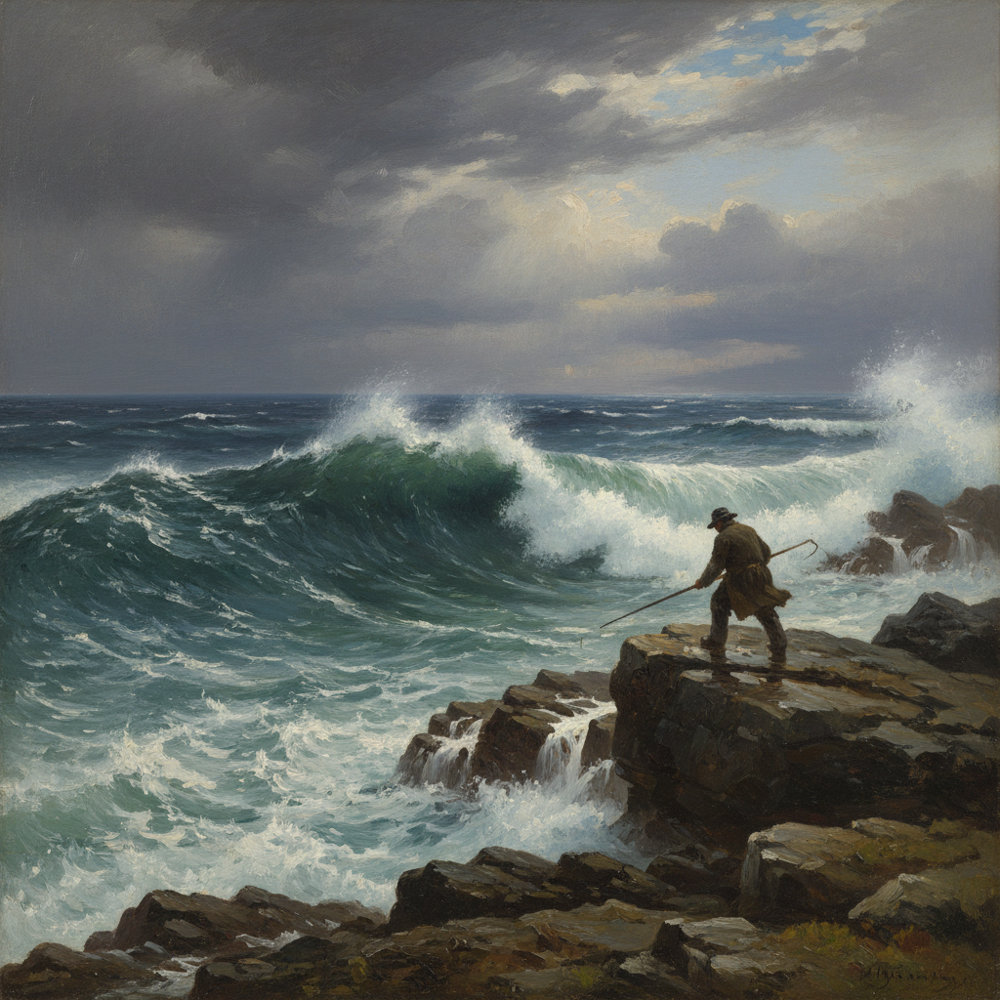

# Winslow Homer 温斯洛·霍默

> "The life that I have chosen gives me my full hours of enjoyment." — Winslow Homer

## 概述

温斯洛·霍默（Winslow Homer，1836–1910）是美国最伟大的画家之一，以描绘大海的力量和人与自然的搏斗闻名。从内战插画到缅因州海岸的惊涛骇浪，他的作品记录了美国精神中的坚韧与孤独。

## 核心特征

| 特征 | 描述 |
|------|------|
| 海洋力量 | 巨浪拍击岩石的壮观场景 |
| 人与自然 | 渔民、猎人与大自然的搏斗 |
| 水彩大师 | 美国水彩画的最高成就 |
| 光线真实 | 户外光线的精确观察 |
| 叙事性 | 每幅画都讲述生存的故事 |
| 孤独感 | 晚期作品中人物的消失 |

## 代表作品

| 作品 | 年代 | 意义 |
|------|------|------|
| *The Gulf Stream* | 1899 | 人在大海中的渺小与坚韧 |
| *Breezing Up* | 1876 | 美国乐观精神的象征 |
| *Northeaster* | 1895 | 纯粹的海洋力量 |
| *Snap the Whip* | 1872 | 美国童年的黄金记忆 |

## AI生成概念图

## 与其他风格的关系

- **American Realism** → 美国写实主义的巅峰
- **Hudson River School** → 继承美国风景画传统
- **Turner** → 共享对海洋力量的迷恋
- **Watercolor tradition** → 将水彩提升为严肃媒介
