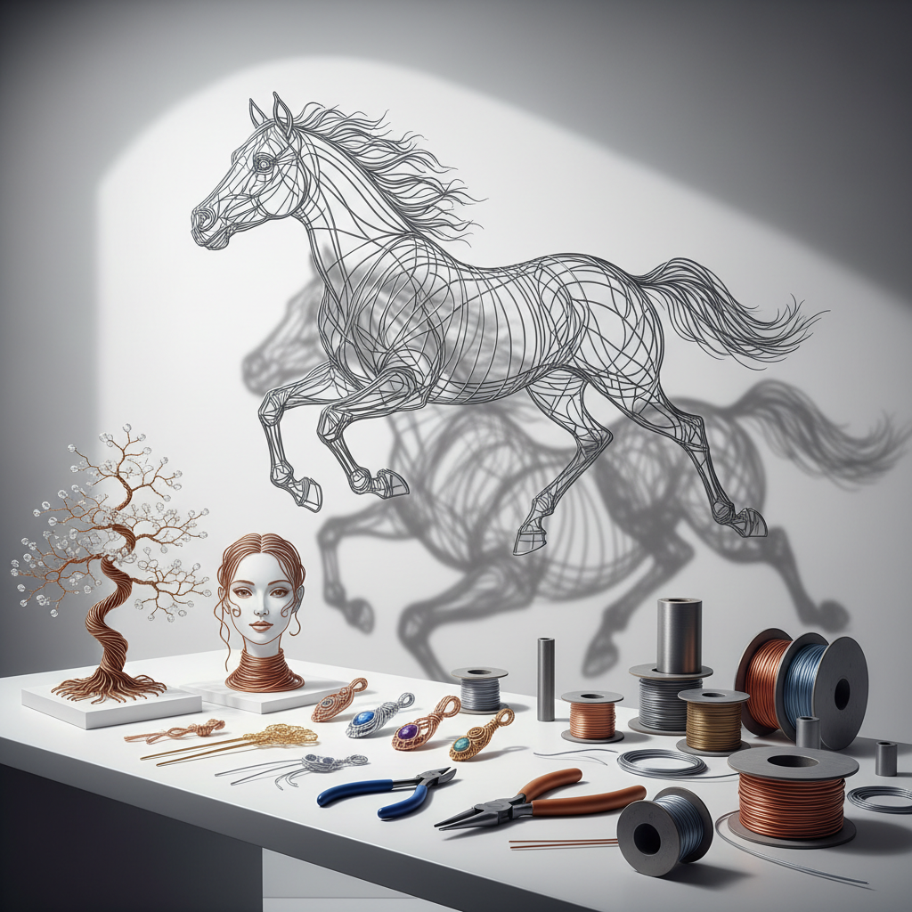

# Wire Art 金属丝艺术

> "Wire is line made physical — a drawing that exists in three dimensions, a sketch that casts shadows, a contour that you can walk around. When an artist bends wire into form, they are doing what a draftsman does with a pencil, but in space rather than on paper. Wire art proves that a single continuous line can describe volume, suggest mass, and capture movement without ever becoming solid." — Unknown

## 概述

金属丝艺术（Wire Art）是以金属丝（铁丝、铜丝、铝丝、银丝等）为主要材料进行艺术创作的实践——通过弯曲、缠绕、编织和焊接金属丝创造线性的三维艺术品。金属丝艺术以其独特的透明感和线条美著称。

金属丝艺术的实践包括：1）金属丝雕塑——用金属丝弯曲成人物、动物等造型；2）金属丝首饰——用金属丝编织的首饰（wire wrapping）；3）金属丝树——用金属丝制作的装饰树；4）金属丝肖像——用连续金属丝弯曲成人物肖像；5）金属丝装置——大型金属丝装置艺术；6）金属丝编织——用金属丝编织成网状结构；7）金属丝书法——用金属丝弯曲成文字。

## 核心特征

| 特征 | 描述 |
|------|------|
| 线性 | 纯粹的线条艺术 |
| 透明 | 透明的空间感 |
| 三维 | 三维的线条绘画 |
| 阴影 | 投射有趣的阴影 |
| 连续 | 常用连续线条 |
| 轻盈 | 视觉上的轻盈感 |

## 视觉特征

- **线条**：纯粹的线条美
- **透明**：可透视的结构
- **阴影**：投射的阴影图案
- **轻盈**：轻盈的视觉感受
- **金属**：金属的光泽
- **空间**：占据空间但不填满

## 代表作品

| 作品 | 艺术家 | 年代 | 意义 |
|------|--------|------|------|
| *Wire sculptures* | Alexander Calder | 1920年代 | 金属丝雕塑先驱 |
| *Wire portraits* | Various | 当代 | 金属丝肖像 |
| *Wire trees* | Various | 当代 | 金属丝树 |
| *Wire installations* | Various | 当代 | 金属丝装置 |
| *Wire jewelry* | Various | 当代 | 金属丝首饰 |

## 历史时间线

| 时期 | 事件 |
|------|------|
| 古代 | 金属丝的早期使用 |
| 中世纪 | 金属丝在首饰中的应用 |
| 1920年代 | 考尔德的金属丝雕塑 |
| 20世纪 | 金属丝艺术的发展 |
| 当代 | 金属丝作为当代艺术媒介 |

## 中国语境

金属丝艺术在中国有独特的文化传统和当代发展。中国传统的"花丝镶嵌"工艺——用极细的金银丝编织、堆垒成精美的装饰品——是世界上最精细的金属丝艺术形式之一，已被列入国家级非物质文化遗产。中国传统的铁丝编织——用铁丝编织成各种实用和装饰品——是民间手工艺的重要组成部分。中国当代的金属丝艺术家将传统花丝工艺的精细美学与当代雕塑结合，创作出融合传统技艺与现代形式的作品。中国的一些当代艺术家用金属丝创作大型公共艺术装置，利用金属丝的透明性和阴影效果创造独特的空间体验。

## AI生成概念图

## 与其他风格的关系

- **Sculpture** → 雕塑
- **Line Art** → 线条艺术
- **Metal Art** → 金属艺术
- **Jewelry Art** → 首饰艺术
- **Kinetic Art** → 动态艺术
- **Installation Art** → 装置艺术

---

*浮光艺志 | Chronicle of Artistry*
