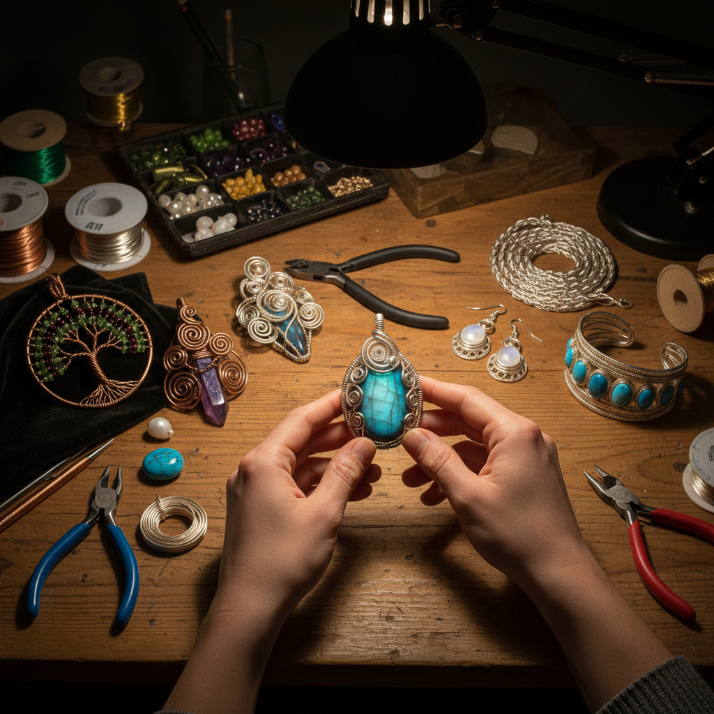

# Wire Wrapping Art 绕线艺术

> "Wire wrapping is drawing in three dimensions — each wrap, each coil, each spiral is a line in space that holds a stone or frames a form without heat, without solder, without anything but the wire's own tension and the maker's patience. The wire wrapper builds cages of beauty around captured gems, creating settings that are simultaneously structural and decorative, functional and ornamental." — Unknown

## 概述

绕线艺术（Wire Wrapping Art）是使用金属线（通常为铜线、银线或金线）通过缠绕、编织、盘绕和弯曲等技法，在不使用焊接的情况下创造首饰和装饰品的金属工艺——通过线材本身的张力和摩擦力固定宝石和构建结构，是一种纯粹依靠冷加工技法的珠宝制作方式。

绕线艺术的实践包括：1）宝石包裹——用线材包裹固定宝石；2）编织绕线——多根线材的编织结构；3）树形绕线——制作生命之树等造型；4）几何绕线——几何图案的线材构建；5）Viking knit——维京编织链技法；6）coiling——螺旋线圈装饰；7）当代绕线——将传统技法与现代设计结合的创作。

## 核心特征

| 特征 | 描述 |
|------|------|
| 无焊 | 完全不使用焊接 |
| 张力 | 依靠线材张力固定 |
| 立体 | 三维的线条构建 |
| 灵活 | 极其灵活的造型 |
| 可逆 | 理论上可以拆解 |
| 个性 | 高度个性化的创作 |

## 视觉特征

- **线条**：流畅的金属线条
- **螺旋**：优美的螺旋造型
- **编织**：精密的编织结构
- **包裹**：宝石的线材包裹
- **层次**：多层线材的层次感
- **光泽**：金属线的光泽

## 代表作品

| 作品 | 艺术家/文化 | 年代 | 意义 |
|------|-------------|------|------|
| *Ancient Egyptian wire jewelry* | 古埃及 | 公元前2000年 | 最早的绕线首饰 |
| *Viking knit chains* | 维京 | 8-11世纪 | 维京编织链 |
| *Art Nouveau wire work* | 新艺术运动 | 1890-1910 | 新艺术绕线 |
| *Contemporary wire wrap* | Various | 当代 | 当代绕线艺术 |
| *Tree of Life pendants* | 当代传统 | 当代 | 生命之树绕线 |

## 历史时间线

| 时期 | 事件 |
|------|------|
| 公元前2000年 | 古埃及最早的绕线首饰 |
| 古代-中世纪 | 各文化的绕线传统 |
| 维京时代 | Viking knit技法的发展 |
| 20世纪 | 绕线作为独立艺术形式 |
| 当代 | 绕线艺术的全球复兴 |

## 中国语境

绕线艺术在中国有快速的当代发展。中国古代的金银器制作中有类似绕线的技法——如花丝工艺中的"掐丝"就是一种金属线的冷加工技法。中国当代的手工首饰爱好者中，绕线（wire wrapping）是最受欢迎的入门技法之一——因为不需要焊接设备，门槛较低。中国的手工市集和电商平台上，绕线首饰是热门品类——从简单的绕线戒指到复杂的宝石包裹吊坠都有大量创作者。中国的一些手工工作室提供绕线课程——从基础技法到高级编织都有系统的教学。中国的绕线艺术家在社交媒体上非常活跃——分享教程和作品，形成了活跃的社区。中国的一些设计师将中国传统元素（如祥云、龙凤）融入绕线设计——创造具有东方特色的绕线首饰。

## AI生成概念图

## 与其他风格的关系

- **Filigree** → 花丝工艺
- **Jewelry Art** → 珠宝艺术
- **Metal Art** → 金属艺术
- **Bead Art** → 珠饰艺术
- **Sculpture** → 雕塑
- **Craft Art** → 工艺美术

---

*浮光艺志 | Chronicle of Artistry*
