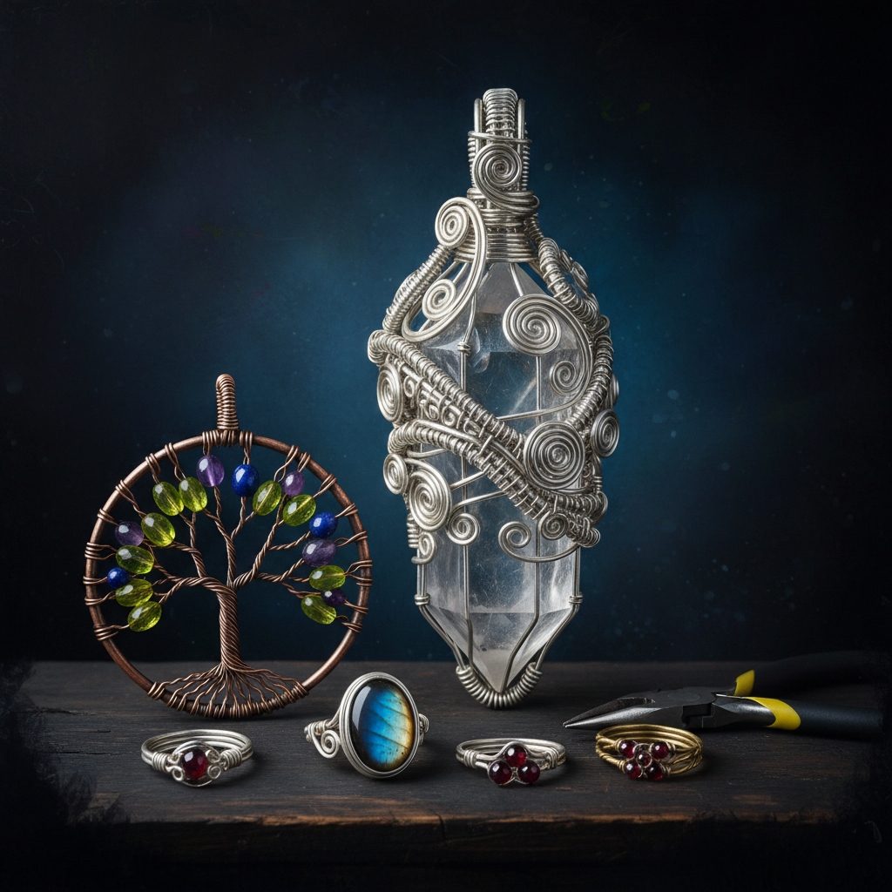

# Wire Wrapping 绕线工艺

> "Wire wrapping is jewelry without fire — cold metal bent into warm beauty by patience alone." — Unknown

## 概述

绕线工艺（Wire Wrapping）是不使用焊接，仅通过弯曲、缠绕和编织金属丝来固定宝石并创造装饰结构的珠宝制作技法。这是人类最古老的珠宝技法之一——早在焊接技术发明之前，人类就已经用金属丝包裹和固定宝石。从古埃及的金丝首饰到当代的艺术绕线珠宝，这种"无火"的冷加工技法以其无限的创造可能性和独特的有机美感持续吸引着珠宝艺术家。

绕线工艺的魅力在于：约束中的自由——只用一根线，不借助任何热源或化学品，创造出无限复杂的三维结构。

## 核心特征

| 特征 | 描述 |
|------|------|
| 无焊 | 不使用焊接 |
| 弯曲 | 冷弯金属丝 |
| 缠绕 | 丝线的缠绕固定 |
| 包镶 | 包裹固定宝石 |
| 手工 | 完全手工制作 |
| 有机 | 有机的线条美感 |

## 视觉特征

- **线条**：流动的金属丝线条
- **缠绕**：精密的缠绕结构
- **有机**：有机的自然形态
- **宝石**：金属丝包裹的宝石
- **层次**：多层线条的层次感
- **手工**：明显的手工质感

## 代表作品

| 作品 | 艺术家 | 年代 | 意义 |
|------|--------|------|------|
| *Ancient Egyptian wire jewelry* | 匿名 | 公元前2000年 | 最早的绕线首饰 |
| *Celtic torcs* | 匿名 | 铁器时代 | 凯尔特金属丝项圈 |
| *Victorian wire work* | 匿名 | 19世纪 | 维多利亚时代绕线 |
| *Contemporary wire art* | Various | 当代 | 当代艺术绕线珠宝 |
| *Tree of Life pendants* | Various | 当代 | 生命之树绕线吊坠 |

## 历史时间线

| 时期 | 事件 |
|------|------|
| 公元前2000年 | 古埃及的金丝首饰 |
| 铁器时代 | 凯尔特金属丝工艺 |
| 中世纪 | 欧洲的金属丝装饰 |
| 19世纪 | 维多利亚时代的复兴 |
| 1960s-70s | 嬉皮文化中的绕线珠宝 |
| 当代 | 当代艺术绕线的繁荣 |

## 中国语境

中国传统的金银丝工艺（花丝工艺/掐丝）与绕线工艺有密切关系——花丝镶嵌是中国宫廷珠宝的代表技法，将极细的金银丝编织、堆垒、焊接成精美的装饰品。虽然中国花丝通常使用焊接，但基本的丝线操作技法与绕线工艺相通。当代中国的独立珠宝设计师中，绕线工艺（特别是无焊绕线）正在流行。

## AI生成概念图

## 与其他风格的关系

- **Filigree** → 花丝工艺的相关技法
- **Jewelry** → 珠宝制作技法
- **Metalwork** → 冷加工金属工艺
- **Celtic Art** → 凯尔特金属丝传统
- **Macramé** → 编结工艺的金属版
- **Sculpture** → 金属丝雕塑

---

*浮光艺志 | Chronicle of Artistry*
