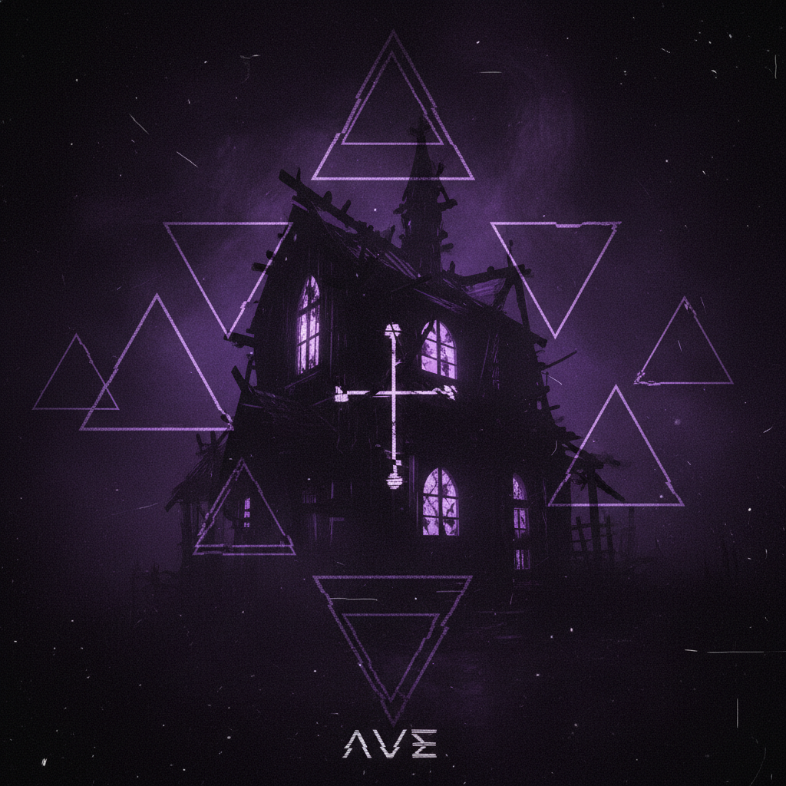

# Witch House 巫宅



> **"▲符号、拖慢的人声、暗网美学——互联网深处最黑暗的电子音乐。"**

## 概述

| 维度 | 描述 |
|------|------|
| 时期 | 2009–2014/影响至今 |
| 别名 | Witch House, Drag, Haunted House |
| 核心色彩 | 黑色、深紫、暗红、灰色 |
| 关键元素 | Unicode符号(▲†‡)、拖慢人声、暗网美学、occult |
| 代表人物 | Salem, Crystal Castles, oOoOO, White Ring |
| 关联风格 | Nu-Goth, Dark Wave, Industrial, Shoegaze |

---

## 历史脉络

| 年份 | 事件 |
|------|------|
| 2009 | Salem "King Night" EP——Witch House 先声 |
| 2010 | "Witch House" 一词被 Travis Egedy 命名 |
| 2011 | 全盛期——Tumblr/SoundCloud 场景 |
| 2012 | Crystal Castles "(III)"——主流交叉 |
| 2013 | 开始衰落——但影响延续 |
| 2020s | 作为美学标签继续存在 |

### 核心哲学

Witch House 的精神是**"互联网的黑暗面有自己的声音——拖慢、扭曲、不可搜索"**：
- 黑暗 = 美学（"越黑暗越美"）
- 符号 = 身份（"用▲†代替字母——让搜索引擎找不到我们"）
- 拖慢 = 扭曲（"把流行歌曲拖慢到恐怖"）
- 互联网 = 地下（"我们存在于互联网的裂缝中"）
- "如果你能轻易找到我们——我们就不够地下"

---

## 视觉语法

### 色彩系统

```
主色：
  黑色 (#000000) — 绝对主导
  深紫 (#1A001A) — 神秘
  暗红 (#4A0000) — 血色

辅色：
  灰色 (#333333) — 噪点
  白色 (#FFFFFF) — 闪烁、对比
  深蓝 (#000033) — 深渊

规则：
  - 极暗
  - 噪点/故障
  - 低分辨率
  - occult 符号

质感：
  噪点 — 数字噪声
  故障 — Glitch
  烟雾 — 模糊
  VHS — 扫描线
```

### 标志性元素

| 类别 | 元素 |
|------|------|
| 符号 | ▲ △ † ‡ ✝ ☽ ⊕（Unicode occult） |
| 视觉 | 极暗、噪点、低分辨率、故障 |
| 音乐 | 拖慢人声、TR-808、暗黑采样、混响 |
| 命名 | 不可搜索的名字（符号代替字母） |
| 平台 | SoundCloud、Tumblr、暗网美学 |
| 态度 | 极端地下、不可搜索、occult、互联网 |

---

## 与千禧怀旧的关系

### 互联网地下文化的极端
- Witch House = 2010s 互联网最"地下"的音乐
- 与 Vaporwave 同时代但完全相反
- Vaporwave = 讽刺+明亮 / Witch House = 真诚+黑暗
- "Witch House 是互联网的阴影"

### 对 Nu-Goth 的影响
- Witch House 的视觉 → Nu-Goth 的美学
- occult 符号 → Tumblr 哥特文化
- "Witch House 给了 Nu-Goth 它的声音"

---

## 中国语境

- Witch House 在中国极为小众
- 与中国"暗黑电子"的交叉
- 中国地下电子音乐场景
- 作为"互联网亚文化"的研究对象

---

## 设计应用

| 场景 | 应用方式 |
|------|----------|
| 音乐 | 极暗+符号+噪点+低分辨率 |
| 数字 | 故障+暗黑+occult+不可搜索 |
| 品牌 | 极端地下+神秘+互联网+暗黑 |
| 视觉 | 噪点+低分辨率+符号+黑色 |

---

## 相关风格

← [Nu-Goth 新哥特](nu-goth.md) | [Industrial 工业风](industrial.md) →

↑ [返回千禧怀旧目录](README.md) | [返回总目录](../README.md)
