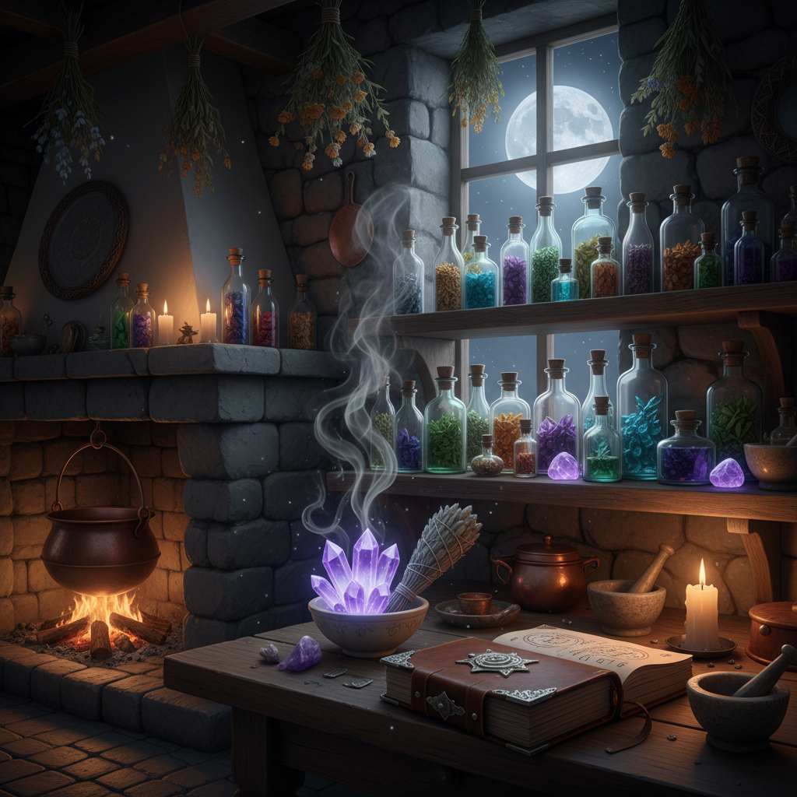

# Witchcore 巫术核




> **"月亮、水晶、塔罗牌和黑猫——当'女巫'从诅咒变成了自我赋权。"**

## 概述

| 维度 | 描述 |
|------|------|
| 时期 | 2015–至今（2020 疫情期间爆发） |
| 别名 | Witchcore, WitchTok, Witchy Aesthetic, Dark Cottagecore |
| 核心色彩 | 黑色、深紫、墨绿、银色、月光白 |
| 关键元素 | 蜡烛、水晶、塔罗牌、月相、草药、黑猫 |
| 代表人物 | #WitchTok 社群、Practical Magic、The Craft |
| 关联风格 | Cottagecore, Goblincore, Pastel Goth, Dark Academia |

---

## 历史脉络

### 2015–2019：Tumblr 的女巫复兴

现代 Witchcore 的兴起与"女巫"身份的文化重新定义密切相关：

**历史转变**：
- 中世纪："女巫" = 被迫害的女性
- 1960s–70s：女权运动重新拥抱"女巫"作为反抗符号
- 2010s：Tumblr 上的 "baby witch" 社群 → 将巫术作为自我照顾(self-care)的一部分
- 2020s：TikTok #WitchTok → 将巫术美学推入主流

### 2020：WitchTok 爆发

疫情期间，WitchTok 成为 TikTok 上增长最快的社群之一：
- 居家隔离 → 有时间研究塔罗、水晶、草药
- 对世界失控的焦虑 → 巫术提供"掌控感"的幻觉
- 自我照顾文化 → 仪式化的自我关怀（点蜡烛、冥想、泡澡）
- 与占星术热潮的交叉

### 核心哲学

现代 Witchcore 的核心不是"超自然力量"，而是：
- **意图设定**：通过仪式明确自己想要什么
- **自然连接**：关注月相、季节、植物
- **自我赋权**：拒绝被动，主动创造自己的现实
- **社群归属**：在线上找到志同道合的人
- **美学享受**：蜡烛、水晶、草药本身就很美

---

## 视觉语法

### 色彩系统

```
主色：
  黑色 (#0D0D0D) — 夜空、黑猫、长袍
  深紫 (#301934) — 神秘、灵性
  墨绿 (#013220) — 草药、森林
  银色 (#C0C0C0) — 月光、首饰
  月光白 (#F8F8FF) — 月亮、蜡烛光

辅色：
  暗金 (#B8860B) — 蜡烛火焰、星星
  血红 (#8B0000) — 玫瑰、仪式
  琥珀 (#FFBF00) — 蜂蜜、药水

质感：
  蜡 — 蜡烛、蜡封
  水晶 — 透明、折射
  干花/草药 — 有机、脆弱
  烟雾 — 熏香、鼠尾草
  天鹅绒 — 深色、柔软
```

### 标志性元素

| 类别 | 元素 |
|------|------|
| 工具 | 蜡烛（各色）、水晶、塔罗牌、鼠尾草 |
| 动物 | 黑猫、乌鸦、蛾子、蛇 |
| 植物 | 薰衣草、迷迭香、月桂、蘑菇 |
| 天象 | 月相、星座、日食、流星 |
| 符号 | 五芒星、三月女神、生命之树 |
| 服装 | 黑色长裙、披风、宽檐帽、银饰 |
| 空间 | 祭坛、药草架、蜡烛群、水晶阵 |

### Witchcore 的子类型

| 子类型 | 特征 |
|--------|------|
| Green Witch | 草药、花园、自然魔法 |
| Kitchen Witch | 烹饪、烘焙、食物魔法 |
| Cosmic Witch | 占星、月相、天体 |
| Sea Witch | 海洋、贝壳、潮汐 |
| Hedge Witch | 梦境、冥想、灵性旅行 |

---

## 与千禧怀旧的关系

### 90s–2000s 的女巫文化
- 《The Craft》(1996) — 90s 青少年女巫电影
- 《Charmed》(1998–2006) — 千禧年的女巫电视剧
- 《Harry Potter》(1997–2007) — 魔法世界的大众化
- 这些是很多千禧一代的童年记忆 → 2020s 的 Witchcore 回潮

### 与 Cottagecore 的关系
- Cottagecore = 白天的田园（烤面包、摘花）
- Witchcore = 夜晚的田园（点蜡烛、调草药）
- 两者经常被同一个人同时拥抱 → "Dark Cottagecore"

---

## 中国语境

- 占星/星座文化在中国年轻人中的流行
- 水晶收藏热潮
- 香薰蜡烛文化
- 与中国传统"风水""命理"的平行
- 小红书上的"仪式感生活"

---

## 设计应用

| 场景 | 应用方式 |
|------|----------|
| 品牌设计 | 深色底+金色细节+月相/星座图案 |
| 包装 | 黑色+金色+蜡封+神秘符号 |
| 空间 | 深色墙壁+蜡烛+水晶+干花+暗色木质 |
| 摄影 | 低调光+烟雾+蜡烛光+暗色道具 |

---

## 延伸阅读

- Aesthetics Wiki: [Witchcore](https://aesthetics.fandom.com/wiki/Witchcore)
- #WitchTok 文化现象分析
- 现代女巫运动与女权主义

---

## 相关风格

← [Goblincore 哥布林核](goblincore.md) | [Pastel Goth 粉彩哥特](pastel-goth.md) →

↑ [返回千禧怀旧目录](README.md) | [返回总目录](../README.md)
