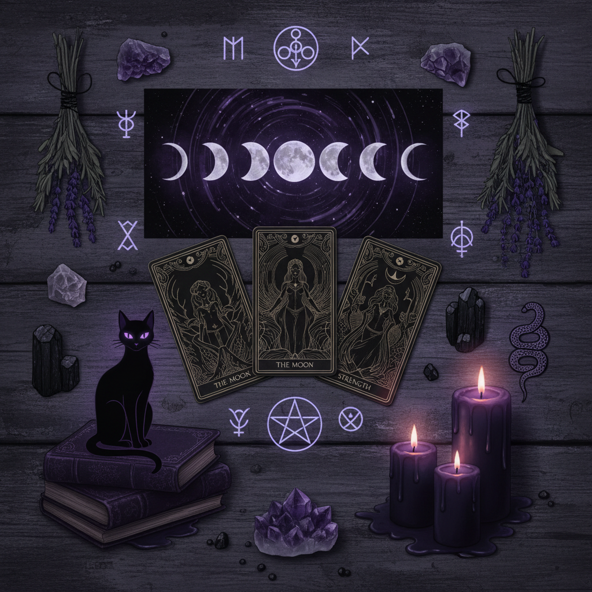

# Witchcore 巫核



> **"月光下的药草、塔罗牌、黑猫与蜡烛——现代女巫的数字美学。"**

## 概述

| 维度 | 描述 |
|------|------|
| 时期 | 2018–至今 |
| 别名 | Witchcore, Witch Aesthetic, Modern Witchcraft |
| 核心色彩 | 深紫、黑色、墨绿、月光银、暗金 |
| 关键元素 | 月相、水晶、药草、塔罗牌、蜡烛、黑猫 |
| 代表人物 | WitchTok 社区、Practical Magic、The Craft |
| 关联风格 | Dark Academia, Cottagecore Dark, Goblincore, Gothic |

---

## 历史脉络

### 从亚文化到 TikTok 主流

| 年份 | 事件 |
|------|------|
| 1990s | 《The Craft》《Practical Magic》电影 |
| 2010s | Tumblr 上的 Witch Aesthetic 社区 |
| 2018 | WitchTok 兴起 |
| 2020 | 疫情期间"居家巫术"爆发 |
| 2021–至今 | 水晶、塔罗成为主流消费品 |

### 为什么现在流行？

| 驱动力 | 解释 |
|--------|------|
| 女性赋权 | "女巫"= 不服从的女性 |
| 反科学主义 | 渴望神秘和不可解释的事物 |
| 自我关怀 | 仪式感 = 正念的另一种形式 |
| 美学吸引力 | 月亮、水晶、蜡烛本身就很美 |
| 社区感 | WitchTok 提供归属感 |

### 核心哲学

Witchcore 的精神是**"重新连接被遗忘的智慧"**：
- 自然不只是资源——它有灵性
- 月亮的周期影响生活节奏
- 仪式创造意义
- 直觉和理性同样重要
- "女巫"是力量的象征，不是诅咒

---

## 视觉语法

### 色彩系统

```
主色：
  深紫 (#2E0854) — 神秘、灵性
  黑色 (#0D0D0D) — 夜晚、力量
  墨绿 (#013220) — 药草、森林
  月光银 (#C0C0C0) — 月亮、水晶
  暗金 (#B8860B) — 蜡烛、古老

辅色：
  深红 (#8B0000) — 血、玫瑰
  靛蓝 (#191970) — 夜空
  琥珀 (#FFBF00) — 烛光

质感：
  烛光 — 温暖、摇曳
  烟雾 — 熏香、神秘
  水晶 — 透明、折射
  纸张 — 泛黄、手写
  织物 — 天鹅绒、蕾丝
```

### 标志性元素

| 类别 | 元素 |
|------|------|
| 天体 | 月相、星座、太阳、星星 |
| 植物 | 药草、蘑菇、干花、藤蔓 |
| 工具 | 塔罗牌、水晶球、坩埚、魔杖 |
| 动物 | 黑猫、乌鸦、蛾子、蛇 |
| 符号 | 五芒星、三重月亮、炼金术符号 |
| 氛围 | 蜡烛、熏香、月光、暗室 |

---

## 与千禧怀旧的关系

### 90s 女巫电影的回忆
- 《The Craft》(1996) = 千禧一代的童年记忆
- 《Charmed》(1998) = 成长伴侣
- 《Harry Potter》= 魔法世界的入口
- 现在的 Witchcore = 这些记忆的"成人版"

### 与 Dark Academia 的交叉
- 两者都热爱古老的知识和仪式
- Dark Academia = 学术的神秘
- Witchcore = 灵性的神秘
- 共同点：蜡烛、旧书、深色调

---

## 中国语境

- "巫核"/"女巫美学"在小红书的流行
- 与"新中式玄学"的交叉（风水、八字、塔罗）
- 水晶/塔罗在年轻人中的消费热潮
- "月亮仪式"/"新月许愿"的流行
- 与汉服/古风的交叉（道教美学）

---

## 设计应用

| 场景 | 应用方式 |
|------|----------|
| 品牌 | 月相图案+深色调+手写字体+金色装饰 |
| 包装 | 药草插画+深紫/黑色+神秘符号 |
| 空间 | 蜡烛+水晶+干花+深色墙面+天鹅绒 |
| 数字 | 月相动效+星座元素+暗色UI |

---

## 相关风格

← [Cottagecore Dark 暗黑田园核](cottagecore-dark.md) | [Dark Academia 暗黑学院](dark-academia.md) →

↑ [返回千禧怀旧目录](README.md) | [返回总目录](../README.md)
