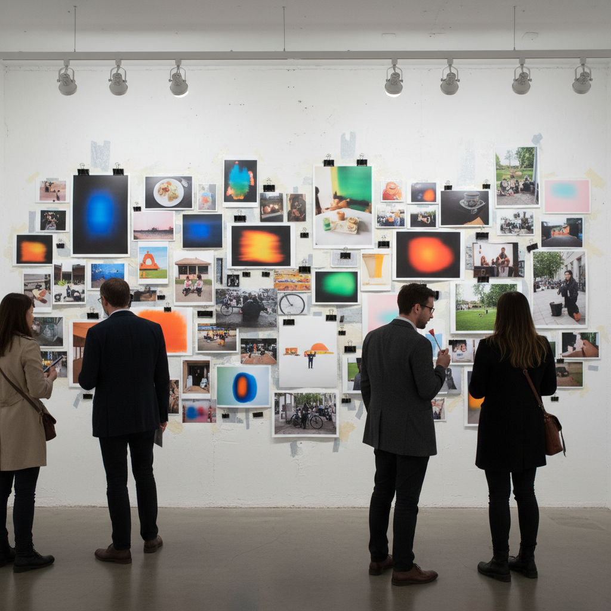

# Wolfgang Tillmans 沃尔夫冈·提尔曼斯

> **流派**: 当代摄影 · 后概念摄影  
> **时期**: 1968–至今 德国/英国  
> **关键词**: 日常美学、非等级展示、抽象摄影、青年文化

## 概述

沃尔夫冈·提尔曼斯是首位获得特纳奖的摄影师(2000年)。他彻底打破了摄影的等级制度——在同一面展墙上，一张朋友的快照、一幅抽象光影实验和一张政治新闻图片享有同等地位。他的展览方式本身就是作品：不同尺寸的照片用胶带、图钉或夹子直接贴在墙上，拒绝画框的仪式感。

## 视觉特征

- **混合展示**: 大小不一的照片以非等级方式排列
- **日常瞬间**: 朋友、食物、窗外风景、衣物褶皱
- **抽象实验**: 不用相机的暗房光影实验
- **青年文化**: 夜店、派对、LGBTQ社群的亲密记录
- **无框展示**: 照片直接贴墙，拒绝传统装裱

## 代表作品

- 《协和》(Concorde) 系列 (1997)
- 《Freischwimmer》系列 — 抽象暗房作品
- 《静物》系列 — 日常物品的诗意
- 《真相研究中心》(Truth Study Center, 2005–)

## 历史影响

提尔曼斯重新定义了摄影展览的方式和摄影的民主性。他证明了任何主题——无论多么平凡——都值得被认真观看。他的影响延伸到时尚摄影、社交媒体美学和当代策展实践。

## 相关风格

- [Contemporary Photography 当代摄影](contemporary-photography.md)
- [Snapshot Aesthetic 快照美学](snapshot-aesthetic.md)
- [Abstract Photography 抽象摄影](abstract-photography.md)
