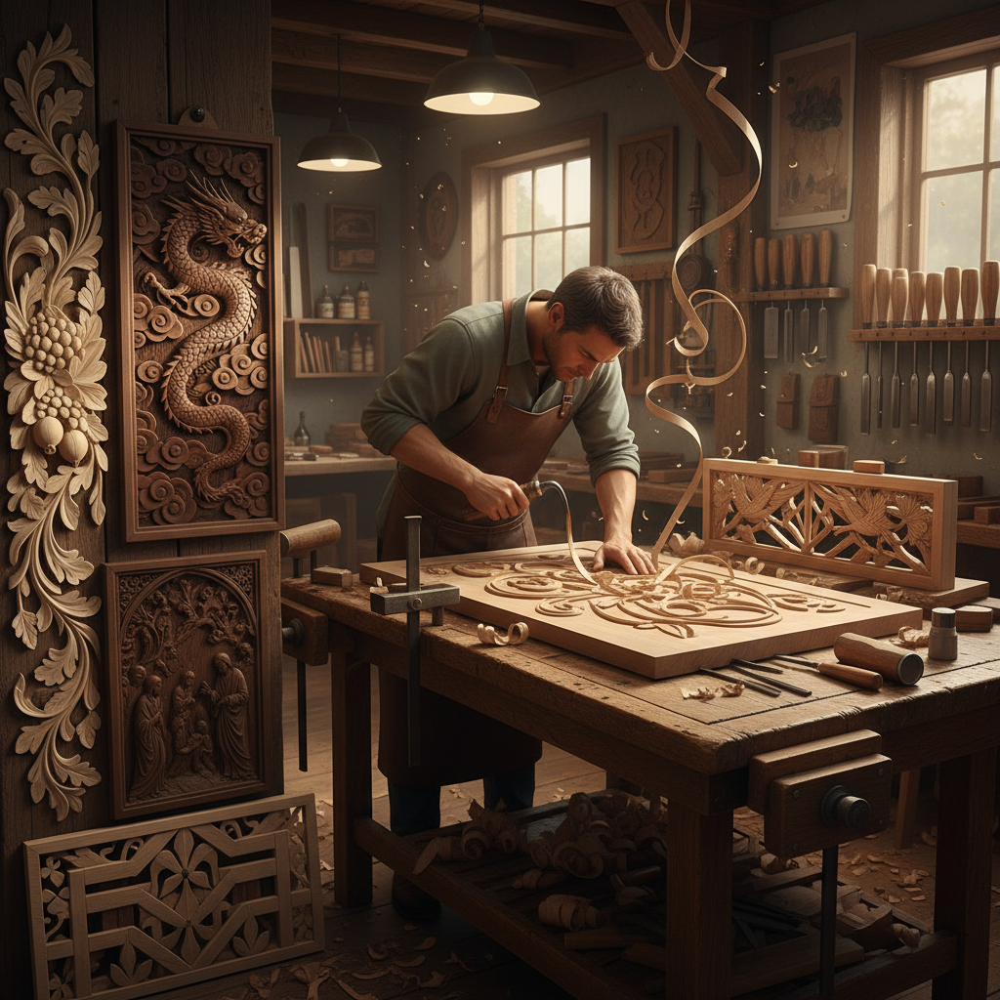

# Wood Carving Relief 木雕浮雕

> "Relief carving is drawing with a chisel — coaxing figures and landscapes from flat timber by removing everything that is not the image, leaving forms that rise from the background like memories surfacing from the grain of the wood itself." — Unknown

## 概述

木雕浮雕（Wood Carving Relief）是一种在平面木板上雕刻出凸起图案的雕刻技法——图像从背景中"浮"出来，但仍然附着在背景板上（区别于圆雕/立体雕刻）。浮雕根据凸起程度分为：浅浮雕（bas-relief/low relief，凸起较少）、高浮雕（high relief/alto-relief，凸起较多，接近半圆雕）和中浮雕（mezzo-relief）。

木雕浮雕的历史极为悠久——从古埃及的木棺浮雕到中世纪欧洲教堂的木雕祭坛画，从中国传统建筑的木雕装饰到日本的木雕佛像。木雕浮雕需要对木材纹理、工具使用和空间透视有深入的理解。当代木雕浮雕艺术家在传统技法的基础上融合现代设计理念，创作出从写实到抽象的多样化作品。

## 核心特征

| 特征 | 描述 |
|------|------|
| 凸起 | 图案从背景凸起 |
| 平面 | 基于平面的雕刻 |
| 层次 | 多层次的深度 |
| 木材 | 利用木材纹理 |
| 工具 | 使用雕刻刀具 |
| 传统 | 悠久的全球传统 |

## 视觉特征

- **层次**：多层次的深度感
- **光影**：凸起产生的光影
- **纹理**：木材的自然纹理
- **精细**：精细的雕刻细节
- **叙事**：叙事性的画面
- **温暖**：木材的温暖质感

## 代表作品

| 作品 | 艺术家 | 年代 | 意义 |
|------|--------|------|------|
| *Isenheim Altarpiece carvings* | Various | 中世纪 | 欧洲教堂木雕 |
| *Chinese architectural carvings* | 中国工匠 | 传统 | 中国建筑木雕 |
| *Grinling Gibbons carvings* | Grinling Gibbons | 17世纪 | 英国木雕大师 |
| *Japanese temple carvings* | 日本工匠 | 传统 | 日本寺庙木雕 |
| *Contemporary relief sculpture* | Various | 当代 | 当代浮雕艺术 |

## 历史时间线

| 时期 | 事件 |
|------|------|
| 古代 | 最早的木雕浮雕 |
| 中世纪 | 欧洲教堂木雕的鼎盛 |
| 文艺复兴 | 木雕浮雕的艺术化发展 |
| 传统 | 中国和日本的建筑木雕传统 |
| 工业革命 | 机械雕刻对手工的冲击 |
| 当代 | 木雕浮雕的艺术复兴 |

## 中国语境

木雕浮雕在中国有极其辉煌的传统——中国的传统建筑（如徽派建筑、闽南建筑）以精美的木雕浮雕装饰闻名。中国的东阳木雕、潮州木雕、黄杨木雕等都是国家级非物质文化遗产。中国的传统家具（如红木家具）上也有精美的浮雕装饰。中国的木雕浮雕题材丰富——花鸟、人物、山水、吉祥图案等。中国的当代木雕艺术家在传承传统技法的基础上进行创新。

## AI生成概念图

## 与其他风格的关系

- **Stone Carving** → 石雕
- **Woodcut** → 木刻版画
- **Sculpture** → 雕塑
- **Architectural Decoration** → 建筑装饰
- **Furniture Making** → 家具制作
- **Folk Art** → 民间艺术

---

*浮光艺志 | Chronicle of Artistry*
