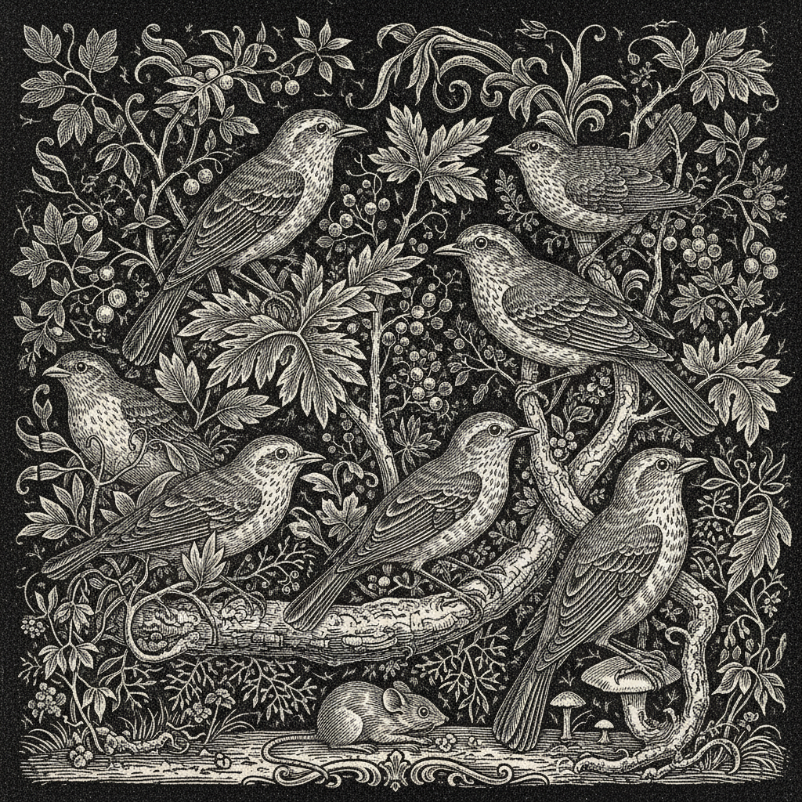

# Wood Engraving Art 木口木刻艺术

> "Wood engraving is drawing with light on darkness — the engraver cuts into the polished end-grain of boxwood with a burin, removing wood to create white lines and tones against a black ground. Unlike woodcut's bold knife-carved planks, wood engraving's hard end-grain permits lines as fine as a copper engraving, making it the supreme medium for book illustration before photography." — Unknown

## 概述

木口木刻艺术（Wood Engraving Art）是一种在硬木（通常是黄杨木）的横截面（木口/end-grain）上用雕刻刀进行精细雕刻的凸版印刷技法。与普通木刻（woodcut）在木板纵面上用刀切割不同，木口木刻在极其坚硬的横截面上用铜版画的雕刻刀（burin）工作，能够创造出极其精细的线条和色调。

木口木刻艺术的实践包括：1）木口准备——将黄杨木横截面抛光至镜面；2）雕刻——用雕刻刀在木口上刻出白线；3）交叉线——通过交叉线创造灰度色调；4）印刷——作为凸版在印刷机上印刷；5）书籍插图——为书籍创作精细插图；6）多木拼版——将多块小木口拼合成大版；7）当代木口木刻——将传统技法与现代创作结合。

## 核心特征

| 特征 | 描述 |
|------|------|
| 木口 | 在木材横截面上工作 |
| 精细 | 极其精细的线条 |
| 白线 | 在黑底上刻白线 |
| 黄杨 | 使用坚硬的黄杨木 |
| 雕刻刀 | 使用铜版画雕刻刀 |
| 插图 | 书籍插图的传统 |

## 视觉特征

- **精细**：极其精细的线条
- **黑白**：黑底白线的对比
- **色调**：交叉线创造的灰度
- **细节**：丰富的细节表现
- **质感**：木纹的微妙质感
- **经典**：经典的版画美学

## 代表作品

| 作品 | 艺术家/文化 | 年代 | 意义 |
|------|-------------|------|------|
| *Thomas Bewick illustrations* | 英国 | 1790年代 | 比维克的自然史插图 |
| *Gustave Doré engravings* | 法国 | 1860年代 | 多雷的文学插图 |
| *Eric Gill engravings* | 英国 | 1920-30年代 | 吉尔的木口木刻 |
| *Clare Leighton prints* | 英国/美国 | 1930-40年代 | 莱顿的木口木刻 |
| *Contemporary wood engraving* | 国际 | 当代 | 当代木口木刻 |

## 历史时间线

| 时期 | 事件 |
|------|------|
| 1790年代 | Thomas Bewick发展木口木刻 |
| 19世纪 | 书籍插图的黄金时代 |
| 1860年代 | 照相制版前的最后辉煌 |
| 20世纪初 | 私人出版社的艺术复兴 |
| 当代 | 木口木刻的持续发展 |

## 中国语境

木口木刻在中国的版画界有一定的认知和实践。中国的传统木刻以木板纵面为主——木口木刻作为西方技法在近代传入中国。中国的版画教育中，木口木刻作为精细版画技法——在中央美术学院等院校教授。中国当代的版画艺术家对木口木刻有所实践——将其精细的表现力用于当代创作。中国的书籍插图传统中，虽然以木板木刻为主——但木口木刻的精细品质对中国版画有所影响。中国的版画收藏中，西方木口木刻作品——作为版画艺术的重要类别被收藏。

## AI生成概念图

## 与其他风格的关系

- **Woodcut** → 木刻版画
- **Engraving** → 铜版雕刻
- **Letterpress** → 活版印刷
- **Book Illustration** → 书籍插图
- **Relief Printing** → 凸版印刷
- **Printmaking** → 版画

---

*浮光艺志 | Chronicle of Artistry*
