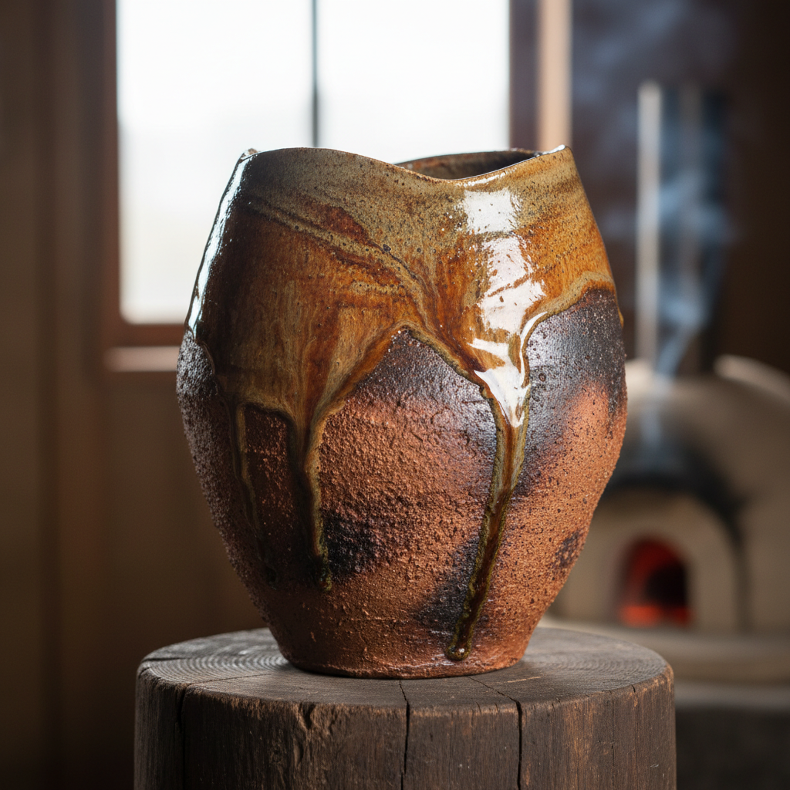

# Wood-Fired Art 柴烧艺术

> "Wood firing is a conversation between fire, clay, and time — the kiln speaks in ash and flame." — Contemporary wood-fire tradition

## 概述

柴烧艺术（Wood-Fired Art）是以木材为燃料、在传统窑炉中烧制陶瓷的艺术传统。柴烧是人类最古老的陶瓷烧成方式——木材燃烧产生的灰烬落在器物表面形成天然的"灰釉"（ash glaze），火焰的流动在器物上留下独特的"火痕"（fire marks），窑内不同位置的温度和气氛差异使每件作品都成为独一无二的存在。

柴烧的历史与陶瓷本身一样古老——从中国龙窑到日本穴窑（anagama），从欧洲中世纪窑炉到当代美国柴烧运动，木材烧成一直是陶瓷艺术的核心技术。20世纪中期以后，随着电窑和气窑的普及，柴烧从实用技术转变为一种有意识的艺术选择——陶艺家选择柴烧是为了追求那种只有木材燃烧才能产生的独特美学效果：自然灰釉的温润、火痕的变化、还原气氛的深沉色调。

柴烧艺术的核心要素包括：1）自然灰釉——木灰落在器物上形成的天然釉面；2）火痕——火焰流动留下的色彩变化；3）窑变——窑内不同位置产生的不同效果；4）时间性——长时间烧成（通常3-7天）；5）不可预测性——每次烧成结果的独特性；6）与自然对话——人、火、土、灰的协作；7）侘寂美学——不完美中的完美。

## 核心特征

| 特征 | 描述 |
|------|------|
| 自然灰釉 | 木灰形成天然釉面 |
| 火痕 | 火焰流动的色彩变化 |
| 窑变 | 不同位置不同效果 |
| 时间性 | 长时间烧成3-7天 |
| 不可预测性 | 每次烧成独特 |
| 侘寂美学 | 不完美中的完美 |

## 视觉特征

- **灰釉质感**：温润的天然灰釉
- **火色变化**：从橙红到深褐的渐变
- **闪光点**：灰烬熔融的闪光斑点
- **粗犷肌理**：未施釉部分的粗犷质感
- **色彩层次**：多层次的色彩叠加
- **自然痕迹**：贝壳、稻草等垫烧痕迹

## 代表作品

| 作品 | 年代 | 意义 |
|------|------|------|
| *中国龙窑柴烧* | 商代至今 | 最早的柴烧传统 |
| *日本备前烧* | 12世纪至今 | 日本柴烧代表 |
| *日本信乐烧* | 13世纪至今 | 侘寂美学 |
| *彼得·沃尔克斯作品* | 20世纪 | 美国柴烧先驱 |
| *杰克·特洛伊作品* | 当代 | 当代柴烧大师 |
| *中国当代柴烧* | 21世纪 | 中国复兴 |

## 历史时间线

| 时期 | 事件 |
|------|------|
| 新石器时代 | 最早的柴烧陶器 |
| 商周 | 中国龙窑发展 |
| 12-16世纪 | 日本六古窑柴烧传统 |
| 中世纪 | 欧洲柴烧窑炉 |
| 20世纪中期 | 电窑气窑普及，柴烧转为艺术选择 |
| 1970年代 | 美国柴烧运动兴起 |
| 当代 | 全球柴烧复兴 |

## 中国语境

柴烧是中国陶瓷最根本的传统——从商代的原始瓷到宋代五大名窑，中国古代所有伟大的陶瓷都是柴烧的产物。中国的龙窑（dragon kiln）是世界上最早的大型柴烧窑炉之一——其设计利用山坡的自然坡度，使火焰从下向上流动，是一种极其高效的柴烧方式。景德镇的蛋形窑（egg-shaped kiln）则是柴烧窑炉设计的另一个巅峰。当代中国柴烧运动正在蓬勃发展——许多陶艺家回归柴烧，重新探索这一古老技术的当代可能性。台湾的柴烧运动尤其活跃——将日本穴窑传统与中国茶道美学相结合，创造了独特的当代柴烧风格。

## 概念图

## 与其他风格的关系

- **Anagama** → 穴窑（日本柴烧）
- **Bizen Ware** → 备前烧
- **Shigaraki Ware** → 信乐烧
- **Dragon Kiln** → 龙窑（中国传统）
- **Ash Glaze** → 灰釉
- **Wabi-Sabi** → 侘寂美学

---

*浮光艺志 | Chronicle of Artistry*
