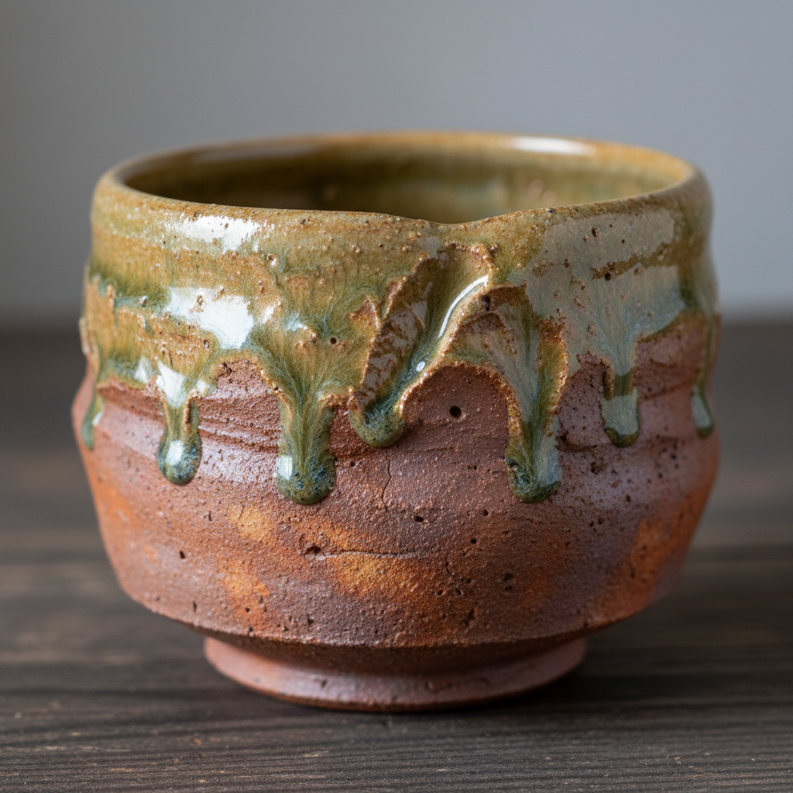

# Wood-Fired Ceramics 柴烧陶瓷

> **时期：** 传统–至今（当代复兴1970年代）  
> **关键词：** 自然落灰、窑变、火焰痕迹、长时间烧制、侘寂美学

## 概述

柴烧陶瓷是一种以木材为燃料的古老烧制方式，在当代被重新发现为一种独特的艺术表达。与电窑或气窑的可控性不同，柴烧的魅力在于不可预测——连续数天的烧制中，飞灰自然落在器物表面形成天然釉面，火焰的走向在陶土上留下独特的"火色"，每一件作品都是人与火、土与灰的一次性合作。

## 风格特征

- **自然落灰釉**：飞灰在高温下熔化形成天然玻璃质
- **火色（Hiiro）**：火焰直接在陶土上留下的色彩变化
- **窑变**：不可预测的化学反应产生的独特效果
- **长时间**：连续烧制3-7天甚至更长
- **侘寂美学**：不完美、不对称、朴素之美

## 代表人物与作品

- Shigaraki、Bizen、Iga 等日本古窑传统
- Anagama（穴窑）当代复兴
- Jack Troy 美国柴烧先驱
- Janet Mansfield 澳大利亚柴烧

## 概念图

