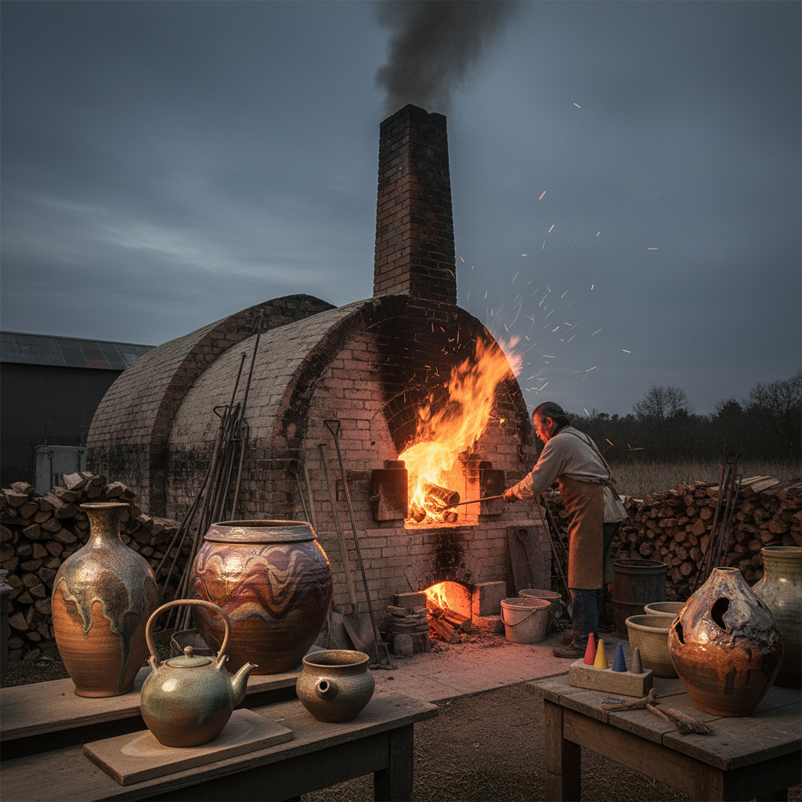

# Wood Firing 柴烧

> "Wood firing is a conversation with flame — the potter builds the kiln, stacks the work, and feeds the fire for days, but it is the wood ash, the draft, and the unpredictable chemistry of combustion that paint each piece with colors no glaze recipe can duplicate." — Unknown

## 概述

柴烧（Wood Firing）是使用木材作为燃料在窑中烧制陶瓷的技法。柴烧不仅仅是一种加热方式——木材燃烧产生的灰烬（wood ash）在高温下飘落到陶器表面，与陶土中的二氧化硅反应形成天然的灰釉（natural ash glaze）。同时，火焰的流动方向、温度的不均匀分布、还原与氧化气氛的交替，都在陶器表面留下独特的"火痕"（fire marks）。

柴烧的魅力在于其不可预测性和自然美——每一件作品都是窑内独特环境的产物。柴烧通常需要连续烧窑数天（3-7天甚至更长），期间需要不断添加木材维持温度。柴烧在日本（如备前烧Bizen、信乐烧Shigaraki）、韩国和中国都有悠久的传统。

## 核心特征

| 特征 | 描述 |
|------|------|
| 木材 | 使用木材作为燃料 |
| 灰釉 | 天然灰釉效果 |
| 火痕 | 独特的火痕 |
| 长时间 | 连续烧制数天 |
| 不可预测 | 结果不可完全预测 |
| 自然 | 自然的美学 |

## 视觉特征

- **灰釉**：天然的灰釉流淌
- **火痕**：火焰留下的痕迹
- **色彩**：从灰到棕到绿的变化
- **质朴**：质朴自然的美感
- **独特**：每件都独一无二
- **肌理**：丰富的表面肌理

## 代表作品

| 作品 | 艺术家 | 年代 | 意义 |
|------|--------|------|------|
| *Bizen ware* | 备前工匠 | 传统 | 备前烧 |
| *Shigaraki ware* | 信乐工匠 | 传统 | 信乐烧 |
| *Anagama fired works* | Various | 当代 | 穴窑柴烧 |
| *Contemporary wood-fired* | Various | 当代 | 当代柴烧 |
| *Korean onggi* | 韩国工匠 | 传统 | 韩国瓮器 |

## 历史时间线

| 时期 | 事件 |
|------|------|
| 新石器时代 | 最早的柴烧陶器 |
| 古代 | 各文明的柴烧传统 |
| 中世纪日本 | 备前、信乐等窑的发展 |
| 宋代中国 | 中国柴烧瓷器的巅峰 |
| 20世纪 | 柴烧在当代陶艺中的复兴 |
| 当代 | 全球柴烧陶艺运动 |

## 中国语境

柴烧在中国有着极其辉煌的历史——中国是世界上最早使用柴窑烧制瓷器的国家。中国历史上的名窑（如景德镇窑、龙泉窑、汝窑、钧窑等）都是柴烧窑。当代中国的柴烧陶艺正在经历复兴——许多陶艺家在各地建造柴窑，追求传统柴烧的自然美学。中国的建水、景德镇、德化等地有活跃的柴烧社区。中国的柴烧作品在国际陶艺界享有盛誉。

## AI生成概念图

## 与其他风格的关系

- **Salt Glazing** → 盐釉
- **Ash Glazing** → 灰釉
- **Raku Firing** → 乐烧
- **Pit Firing** → 坑烧
- **Anagama** → 穴窑
- **Ceramics** → 陶瓷

---

*浮光艺志 | Chronicle of Artistry*
