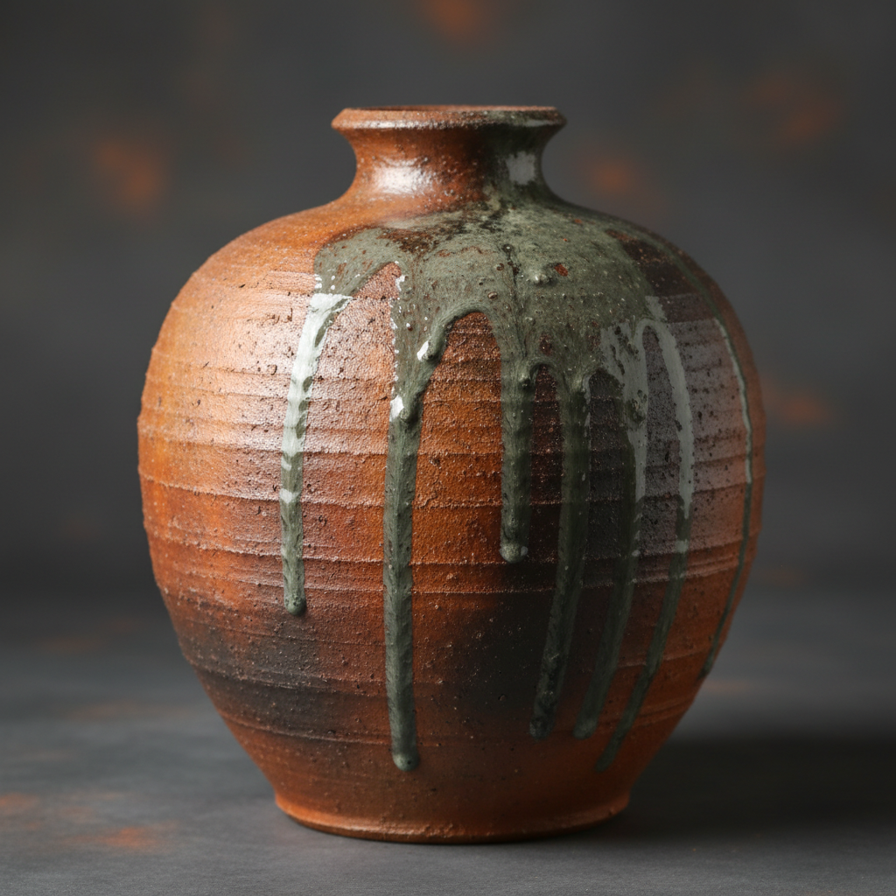

# Wood Kiln Art 柴窑艺术

> "Wood firing is ceramics at its most elemental — logs split and stacked, fed hour after hour into a dragon's mouth of brick and flame for days without rest, the ash carried on updrafts settling on pots like volcanic snow, melting into natural glaze where it lands thick and leaving bare flashing where it barely touches, each piece a map of its position in the kiln, a record of wind and fire written in glass and carbon that no other fuel can replicate." — Unknown

## 概述

柴窑艺术（Wood Kiln Art）是一种以木材为燃料、在传统柴烧窑中烧制陶瓷的艺术。柴窑烧制通常持续数天甚至数周——在漫长的烧制过程中，木灰随气流飘落在器物表面，在高温下熔化形成天然的灰釉；火焰的直接接触在坯体上留下"火痕"；不同位置的器物因受热和落灰的差异而呈现独特的效果。柴窑烧制是最古老也最具仪式感的陶瓷烧制方式。

柴窑艺术的核心要素包括：1）木材燃料——以木材为唯一燃料；2）长时间烧制——持续数天的烧制过程；3）天然灰釉——木灰落在器物上形成自然釉；4）火痕效果——火焰直接接触留下的痕迹；5）位置差异——窑内不同位置的不同效果；6）不可预测——每次烧制结果独一无二；7）仪式感——烧窑如同一场仪式。

## 核心特征

| 特征 | 描述 |
|------|------|
| 木材燃料 | 以木材为唯一热源 |
| 天然灰釉 | 木灰自然落釉 |
| 火痕效果 | 火焰留下的独特痕迹 |
| 长时烧制 | 持续数天的烧制 |
| 独一无二 | 每件作品不可复制 |
| 仪式感 | 烧窑的仪式性体验 |

## 视觉特征

- **灰釉流淌**：天然灰釉的流动效果
- **火色变化**：从橙红到深褐的火痕
- **表面肌理**：灰烬和火焰创造的纹理
- **色彩渐变**：从受火面到背火面的渐变
- **自然质感**：未经人为干预的自然美
- **碳化效果**：局部碳化的深色区域

## 代表作品

| 作品 | 艺术家/文化 | 年代 | 意义 |
|------|-------------|------|------|
| *日本备前烧* | 日本备前 | 12世纪起 | 柴烧的极致美学 |
| *信乐烧* | 日本信乐 | 13世纪起 | 自然灰釉之美 |
| *中国龙窑* | 中国南方 | 商代起 | 中国柴窑传统 |
| *Anagama窑* | 各地陶艺家 | 当代 | 穴窑的当代实践 |
| *当代柴烧* | 各地陶艺家 | 当代 | 柴烧的全球复兴 |

## 历史时间线

| 时期 | 事件 |
|------|------|
| 前3000年 | 最早的柴烧窑出现 |
| 商代 | 中国龙窑的发展 |
| 12世纪 | 日本备前烧等柴烧传统形成 |
| 20世纪 | 柴烧在全球陶艺中的复兴 |
| 当代 | 柴烧作为艺术表达的重要方式 |

## 中国语境

中国是柴窑的发源地之一——从商代的龙窑到宋代的各大名窑，中国数千年的陶瓷史几乎都是柴窑的历史。中国的龙窑——依山坡而建的长条形窑——是世界上最高效的柴烧窑型之一。景德镇的蛋形窑（镇窑）是中国柴窑技术的巅峰——它能在一次烧制中同时烧成不同温度需求的产品。中国当代陶艺中，柴烧正在经历强劲的复兴——越来越多的陶艺家建造自己的柴窑，追求"天人合一"的烧制体验。柴烧的不可预测性和仪式感与中国传统美学中的"天工"理念高度契合——最好的作品是人与火的合作，而非人对火的控制。

## AI生成概念图

## 与其他风格的关系

- **Ash Glaze** → 灰釉
- **Bizen Ware** → 备前烧
- **Shigaraki** → 信乐烧
- **Anagama** → 穴窑
- **Dragon Kiln** → 龙窑
- **Reduction Firing** → 还原烧成

---

*浮光艺志 | Chronicle of Artistry*
