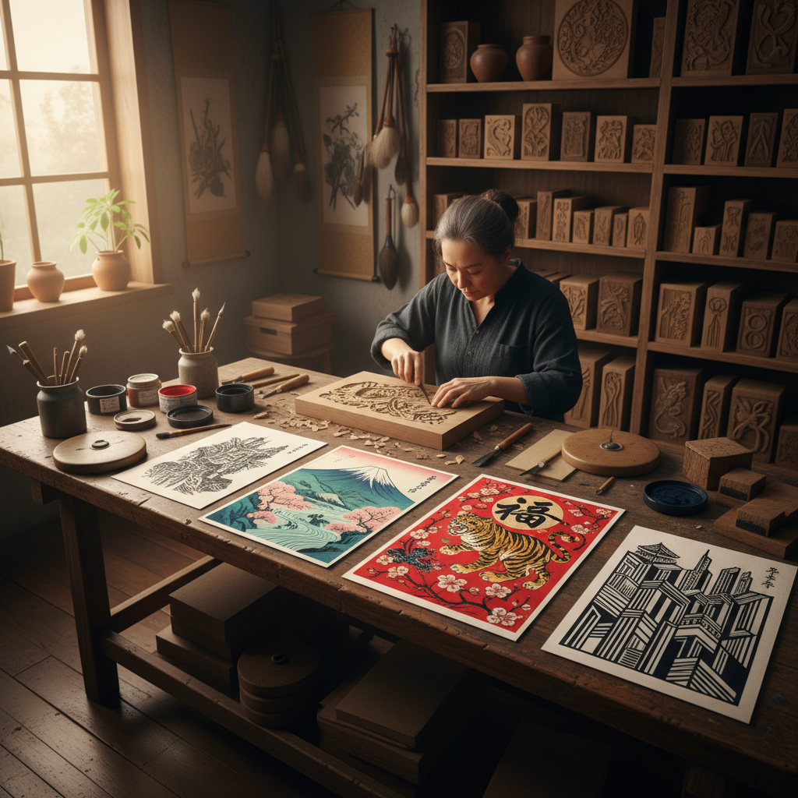

# Woodblock Printing 木版印刷

> "Woodblock printing is carving light from darkness — each cut removes wood to reveal the image hidden within the block." — Unknown

## 概述

木版印刷（Woodblock Printing）是在木板上雕刻图案，将凸起部分上墨后压印到纸张或织物上的凸版印刷技法。这是人类最早的印刷技术——中国在唐代就已经大规模使用木版印刷。木版印刷的独特之处在于"减法"思维——艺术家必须反向思考，雕去不需要印刷的部分，保留需要印刷的部分。每一刀都不可逆，需要极高的计划性和刀工。

木版印刷的哲学在于：以刀代笔——刀在木上的每一次切割都是一次不可撤回的决定，如同人生中的每一个选择。

## 核心特征

| 特征 | 描述 |
|------|------|
| 凸版 | 凸起部分印刷 |
| 雕刻 | 在木板上雕刻 |
| 减法 | 去除不印部分 |
| 反向 | 需要镜像思维 |
| 不可逆 | 每刀不可撤回 |
| 批量 | 可批量印刷 |

## 视觉特征

- **刀味**：木刻刀的独特痕迹
- **对比**：强烈的黑白对比
- **线条**：有力的线条表现
- **质感**：木纹的自然质感
- **粗犷**：粗犷有力的风格
- **色彩**：多色套印的可能

## 代表作品

| 作品 | 艺术家 | 年代 | 意义 |
|------|--------|------|------|
| *Diamond Sutra* | 匿名 | 868年 | 最早的印刷品 |
| *Hokusai's Great Wave* | 葛饰北斋 | 1831 | 浮世绘木版画 |
| *Dürer's Apocalypse* | Albrecht Dürer | 1498 | 欧洲木版画巅峰 |
| *Chinese New Year prints* | 匿名 | 传统 | 中国年画 |
| *Contemporary woodcuts* | Various | 当代 | 当代木版画 |

## 历史时间线

| 时期 | 事件 |
|------|------|
| 7世纪 | 中国最早的木版印刷 |
| 868年 | 《金刚经》——最早的印刷品 |
| 15世纪 | 欧洲木版画的发展 |
| 17-19世纪 | 日本浮世绘的黄金时代 |
| 1930s | 中国新兴木刻运动 |
| 当代 | 当代木版画艺术 |

## 中国语境

中国是木版印刷的发明国——唐代的雕版印刷是人类印刷史的开端。中国的木版印刷传统极其丰富：年画（杨柳青、桃花坞、绵竹）、佛经版画、书籍插图等。1930年代鲁迅倡导的新兴木刻运动将木版画与社会变革结合，产生了深远影响。当代中国的版画艺术家继续在木版领域创作，既有传承传统的水印木刻，也有探索当代表达的创新作品。

## AI生成概念图

## 与其他风格的关系

- **Ukiyo-e** → 浮世绘
- **Letterpress** → 活字印刷
- **Linocut** → 麻胶版画
- **Printmaking** → 版画
- **Chinese New Year Prints** → 年画
- **Relief Sculpture** → 浮雕（共享减法）

---

*浮光艺志 | Chronicle of Artistry*
