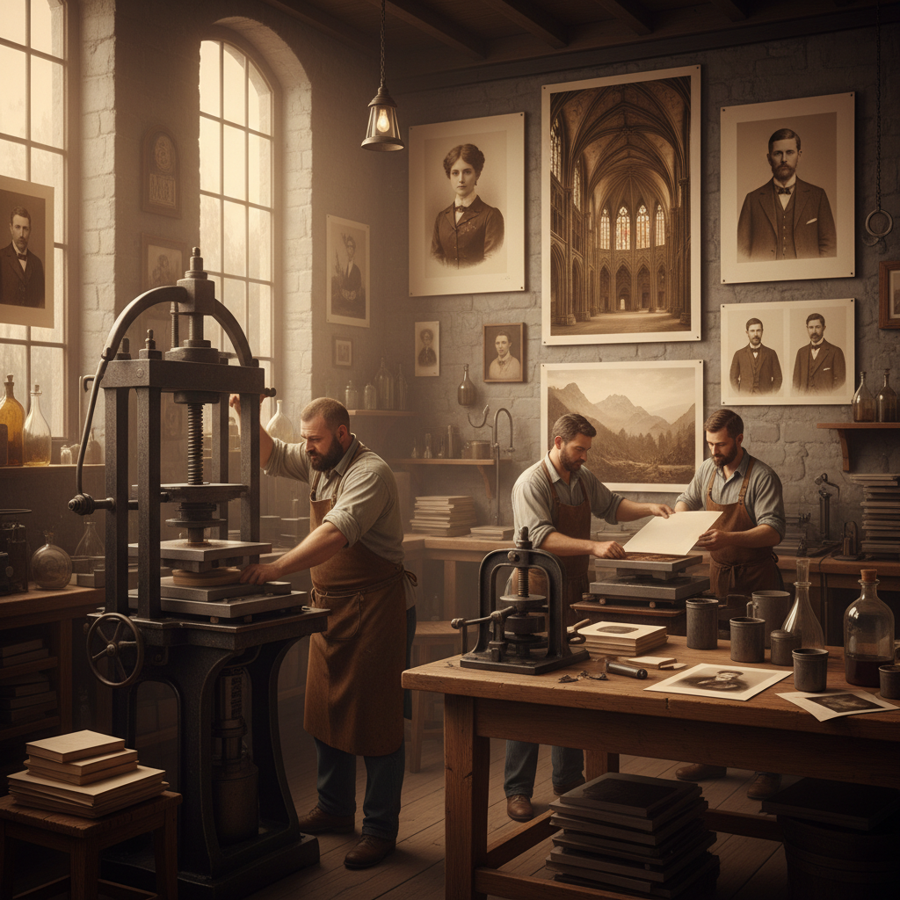

# Woodburytype 伍德伯里印刷

> "Woodburytype is the lost perfection of photomechanical printing — a lead mold pressed from a hardened gelatin relief, filled with pigmented gelatin and squeezed onto paper, producing continuous-tone prints of such exquisite quality that they are indistinguishable from actual photographs, yet printed by the thousands without a single grain of silver." — Unknown

## 概述

伍德伯里印刷（Woodburytype）是一种由Walter Bentley Woodbury在1864年发明的光机械印刷工艺——能够产生真正的连续色调印刷品（不需要半色调网点），质量可与银盐照片媲美。伍德伯里印刷被认为是19世纪最精美的摄影复制工艺之一。

伍德伯里印刷的过程极其精巧：首先制作一张重铬酸明胶浮雕（类似碳素印刷的中间步骤）——受光区域的明胶硬化形成浮雕。然后将这个明胶浮雕在液压机中压入一块软铅板，形成凹版模具。印刷时，将温热的含颜料明胶液倒入铅模中，覆盖纸张，用压力机压制——明胶在模具的深处（对应原始暗部）形成厚层，在浅处形成薄层，产生连续色调效果。

## 核心特征

| 特征 | 描述 |
|------|------|
| 铅模 | 使用铅版模具 |
| 连续色调 | 真正的连续色调 |
| 明胶 | 颜料明胶印刷 |
| 精美 | 极其精美的质量 |
| 机械 | 光机械印刷工艺 |
| 批量 | 可批量印刷 |

## 视觉特征

- **连续**：真正的连续色调
- **精细**：极其精细的细节
- **光泽**：明胶的微妙光泽
- **深度**：丰富的色调深度
- **浮雕**：微妙的浮雕质感
- **照片级**：照片级的质量

## 代表作品

| 作品 | 艺术家 | 年代 | 意义 |
|------|--------|------|------|
| *Woodburytype portraits* | Various | 1870-90s | 维多利亚时代肖像 |
| *Book illustrations* | Various | 1870-90s | 书籍插图 |
| *Woodburytype reproductions* | Various | 1870-90s | 艺术品复制 |
| *Contemporary Woodburytypes* | Various | 当代 | 当代伍德伯里印刷 |

## 历史时间线

| 时期 | 事件 |
|------|------|
| 1864年 | Walter Woodbury获得专利 |
| 1870-90年代 | 伍德伯里印刷的商业黄金期 |
| 1900年代 | 被半色调印刷取代而衰落 |
| 20世纪 | 几乎完全消失 |
| 当代 | 极少数艺术家的复兴尝试 |

## 中国语境

伍德伯里印刷在中国几乎没有实践者——这是一种极其罕见的历史性印刷工艺。中国的摄影史和印刷史研究中会提及伍德伯里印刷作为19世纪重要的光机械印刷技术。中国的博物馆和图书馆收藏中可能包含19世纪的伍德伯里印刷品（如维多利亚时代的书籍插图）。作为一种"失落的完美工艺"，伍德伯里印刷在中国的替代摄影和印刷艺术爱好者中有学术性的关注。

## AI生成概念图

## 与其他风格的关系

- **Carbon Printing** → 碳素印刷
- **Photogravure** → 照相凹版
- **Collotype** → 珂罗版
- **Gum Bichromate** → 重铬酸胶印
- **Photomechanical Printing** → 光机械印刷
- **Alternative Photography** → 替代摄影

---

*浮光艺志 | Chronicle of Artistry*
