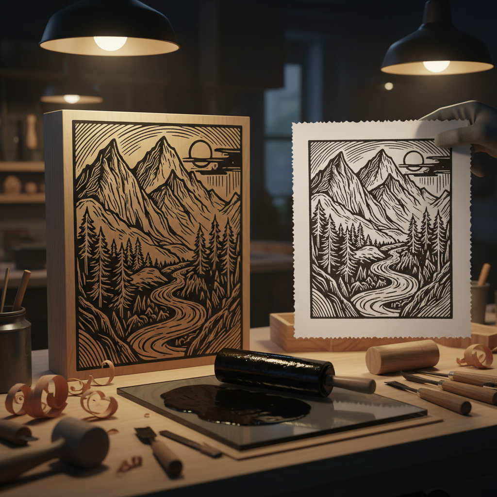

# Woodcut Art 木刻艺术

> "The woodcut has a primitive strength that no other medium can match." — Ernst Ludwig Kirchner

## 概述

木刻艺术（Woodcut Art）是最古老的版画形式——在木板上雕刻图案，涂墨后印刷到纸上。木刻的特点是黑白对比强烈、线条刚劲有力、具有独特的刀味和木味。从中国唐代的佛经插图到德国表现主义的木刻，从日本浮世绘到墨西哥革命版画，木刻是跨越文化的普世艺术形式。

木刻的力量在于它的直接性和民主性——材料简单、可以大量复制、适合传播思想。

## 核心特征

| 特征 | 描述 |
|------|------|
| 凸版 | 凸起部分着墨印刷 |
| 黑白 | 强烈的黑白对比 |
| 刀味 | 刻刀留下的独特痕迹 |
| 木味 | 木纹的自然肌理 |
| 可复制 | 可以大量印刷 |
| 直接性 | 刀法直接、不可修改 |

## 视觉特征

- **对比**：强烈的黑白对比
- **线条**：刚劲有力的刻线
- **肌理**：木纹的自然纹理
- **简洁**：高度概括的形象
- **力度**：刀法的力度感
- **粗犷**：相对粗犷的质感

## 代表作品

| 作品 | 艺术家 | 年代 | 意义 |
|------|--------|------|------|
| *金刚经插图* | 未知 | 868年 | 现存最早的印刷品 |
| *启示录* | Albrecht Dürer | 1498 | 西方木刻的巅峰 |
| *神奈川冲浪里* | 葛饰北斋 | 1831 | 浮世绘木版画的标志 |
| *Expressionist woodcuts* | Kirchner, Nolde | 1905-20s | 表现主义木刻 |
| *Mexican prints* | José Guadalupe Posada | 1890s-1910s | 墨西哥革命版画 |
| *中国新兴木刻* | 鲁迅推动 | 1930s | 中国现代木刻运动 |

## 历史时间线

| 时期 | 事件 |
|------|------|
| 唐代 | 中国发明木版印刷 |
| 868年 | 《金刚经》——最早的印刷品 |
| 15世纪 | 古腾堡——活字印刷革命 |
| 1498 | Dürer的《启示录》木刻 |
| 17-19世纪 | 日本浮世绘——彩色木版画 |
| 1905-20s | 德国表现主义木刻 |
| 1930s | 中国新兴木刻运动 |
| 当代 | 木刻作为当代艺术媒介 |

## 中国语境

中国是木刻的发源地——从唐代的佛经插图到明代的小说插图，从1930年代鲁迅推动的新兴木刻运动到延安木刻，木刻在中国有深厚的传统。中国新兴木刻运动将木刻作为社会批判和革命宣传的工具，影响了整个20世纪中国美术的发展。当代中国版画家继续探索木刻的新可能。

## AI生成概念图

## 与其他风格的关系

- **Printmaking** → 木刻是版画的最古老形式
- **Expressionism** → 表现主义大量使用木刻
- **Ukiyo-e** → 浮世绘是彩色木版画的极致
- **Folk Art** → 民间木版年画
- **Graphic Design** → 木刻影响了现代平面设计
- **Social Realism** → 木刻作为社会批判工具

---

*浮光艺志 | Chronicle of Artistry*
