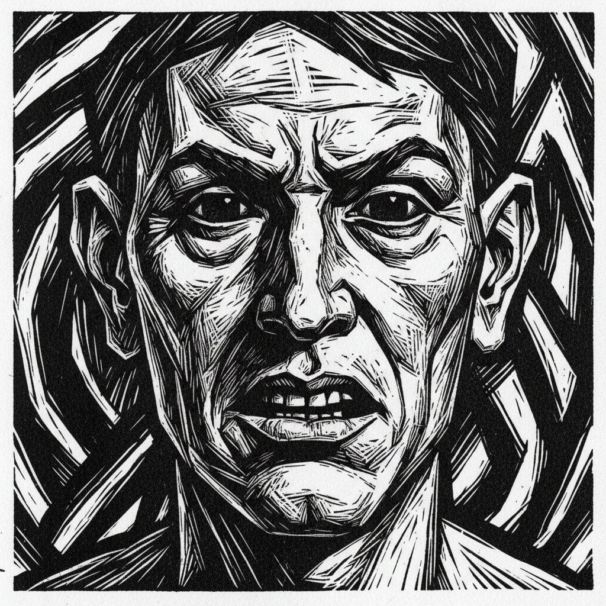

# Woodcut 木刻版画

> "The woodcut is the most ancient and the most democratic of all the graphic arts." — 版画传统

## 概述

木刻版画（Woodcut / Woodblock Print）是人类最古老的印刷技法之一——在木板上将不需要印刷的部分刻去，留下凸起的图案，涂上油墨后压印在纸上。从中国唐代的佛经插图到德国丢勒的《启示录》，从日本浮世绘到20世纪表现主义，木刻是跨越东西方文明的视觉语言。

木刻的魅力在于它的直接性和力量感——刀在木头上的阻力产生了独特的粗犷线条和强烈的黑白对比，这种"与材料搏斗"的质感是其他媒介无法替代的。

## 核心特征

| 特征 | 描述 |
|------|------|
| 凸版原理 | 刻去空白，留下凸起的图案 |
| 黑白对比 | 强烈的黑白正负形对比 |
| 木纹质感 | 木头的天然纹理成为画面的一部分 |
| 粗犷力量 | 刀与木的搏斗产生独特的力量感 |
| 大量复制 | 一块木板可印数千张 |
| 民主性 | 最廉价、最易传播的艺术形式 |

## 视觉特征

- **对比**：强烈的黑白对比——没有灰色调
- **线条**：粗犷的、有力的、带有刀痕的线条
- **木纹**：木头的天然纹理偶尔可见
- **边缘**：锐利的、不规则的边缘
- **平面**：天然的平面性——没有透视深度
- **力量**：原始的、直接的视觉冲击力

## 东西方传统

| 传统 | 时期 | 代表 | 特点 |
|------|------|------|------|
| 中国 | 唐代–至今 | 佛经插图、年画 | 最早的木刻印刷 |
| 日本 | 17-19世纪 | 浮世绘（北斋、广重） | 多色套印的极致 |
| 德国 | 15-16世纪 | 丢勒 | 精细的西方木刻巅峰 |
| 表现主义 | 20世纪初 | Kirchner, Nolde | 粗犷的现代木刻复兴 |
| 中国新兴 | 1930年代 | 鲁迅推动的新兴木刻 | 社会批判 |

## 代表人物

| 画家 | 木刻特点 | 时期 |
|------|---------|------|
| Albrecht Dürer | *Apocalypse* 系列 | 北方文艺复兴 |
| Katsushika Hokusai | *The Great Wave* | 日本浮世绘 |
| Ernst Ludwig Kirchner | 表现主义木刻 | 德国表现主义 |
| Edvard Munch | *The Kiss* 木刻版 | 表现主义 |
| M.C. Escher | 数学错视木刻 | 20世纪 |

## 与其他技法的关系

- **Etching** → 蚀刻是凹版，木刻是凸版
- **Lithography** → 石版画是平版，木刻是凸版
- **Ukiyo-e** → 日本浮世绘是木刻的东方巅峰
- **Expressionism** → 表现主义复兴了木刻的粗犷力量
- **Linocut** → 麻胶版画是木刻的现代变体

## 概念图

---

*浮光艺志 | Chronicle of Artistry*
