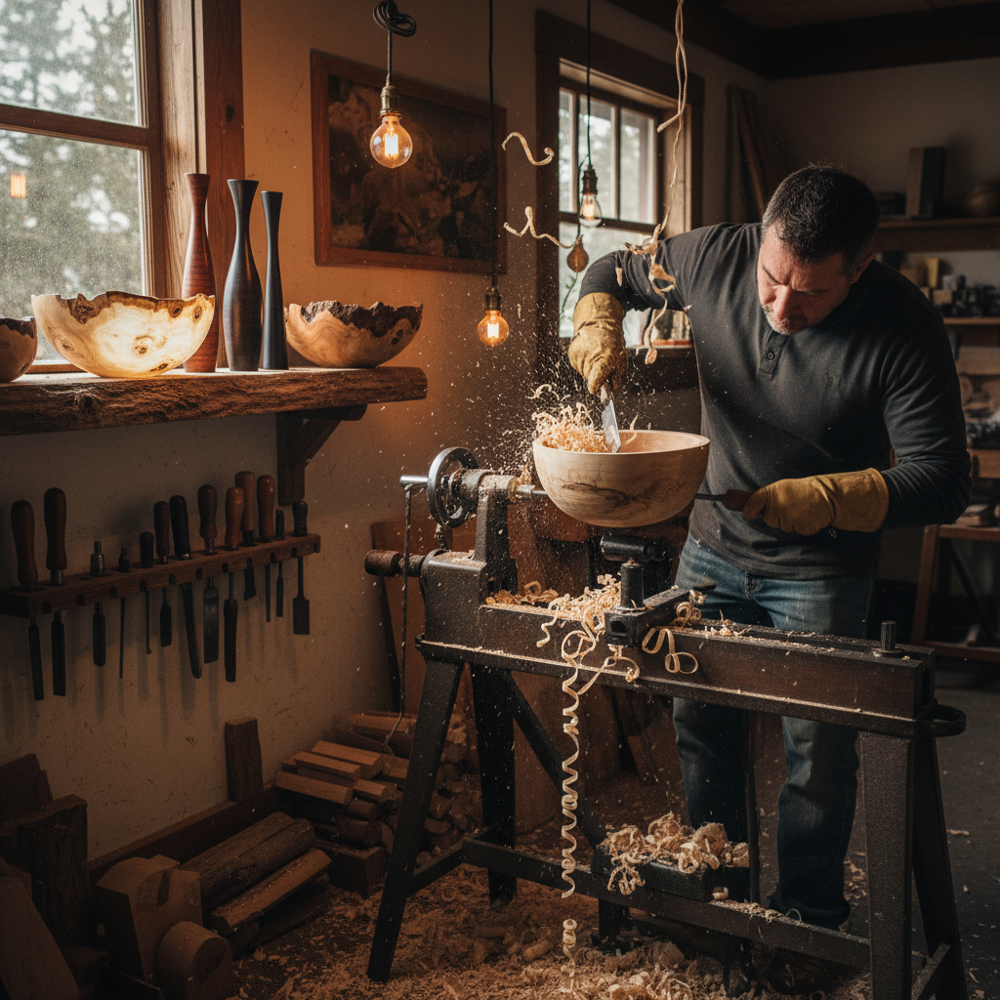

# Woodturning 木旋

> "Woodturning is sculpture at speed — the lathe spins, the tool cuts, and a cylinder of wood becomes a vessel of light." — Unknown

## 概述

木旋（Woodturning）是将木材固定在车床（lathe）上高速旋转，使用各种车刀切削成型的木工艺术。木旋是"减法雕塑"——从一块实心木材中去除多余部分，揭示隐藏在其中的形态。木旋可以制作从实用的碗、盘、杯到纯艺术性的薄壁容器和雕塑。木旋的独特之处在于旋转对称——车床的旋转决定了作品必然具有圆形截面，但艺术家可以通过偏心车削、多轴车削等技法打破这一限制。

木旋的魅力在于：揭示——每一刀都在揭示木材内部的纹理、色彩和结构，如同考古学家揭示埋藏的宝藏。

## 核心特征

| 特征 | 描述 |
|------|------|
| 车床 | 使用车床旋转 |
| 旋转 | 旋转对称的形态 |
| 减法 | 去除材料成型 |
| 纹理 | 揭示木材纹理 |
| 速度 | 快速的成型过程 |
| 器物 | 常制作圆形器物 |

## 视觉特征

- **圆润**：旋转对称的圆润
- **纹理**：木材的天然纹理
- **光滑**：车削后的光滑表面
- **薄壁**：精湛的薄壁技术
- **形态**：优美的曲线轮廓
- **自然**：木材的自然美

## 代表作品

| 作品 | 艺术家 | 年代 | 意义 |
|------|--------|------|------|
| *Egyptian turned vessels* | 匿名 | 古埃及 | 最早的木旋 |
| *James Prestini bowls* | James Prestini | 1930s-50s | 现代木旋先驱 |
| *David Ellsworth hollow forms* | David Ellsworth | 1970s+ | 薄壁空心容器 |
| *Merryll Saylan platters* | Merryll Saylan | 1980s+ | 木旋艺术 |
| *Contemporary art turning* | Various | 当代 | 当代木旋艺术 |

## 历史时间线

| 时期 | 事件 |
|------|------|
| 公元前1300年 | 古埃及的木旋证据 |
| 古希腊/罗马 | 弓弦车床的使用 |
| 中世纪 | 脚踏车床的发展 |
| 18世纪 | 动力车床的出现 |
| 1970s+ | 工作室木旋运动 |
| 当代 | 木旋作为纯艺术 |

## 中国语境

中国有悠久的木旋传统——传统的木碗、木盘、木轴等都是车床制作的。中国传统的"旋木"技艺在民间广泛存在。当代中国的木旋爱好者社区正在快速增长，许多人购置小型车床在家中创作。中国丰富的木材资源（如黄花梨、紫檀、楠木等）为木旋提供了优质材料。一些中国木旋艺术家将传统器物美学与现代木旋技法结合，创造出具有东方韵味的作品。

## AI生成概念图

## 与其他风格的关系

- **Woodworking** → 木工艺
- **Sculpture** → 雕塑
- **Whittling** → 削木雕刻
- **Ceramics** → 陶艺（类似的旋转成型）
- **Lathe Art** → 车床艺术
- **Bowl Making** → 碗盘制作

---

*浮光艺志 | Chronicle of Artistry*
