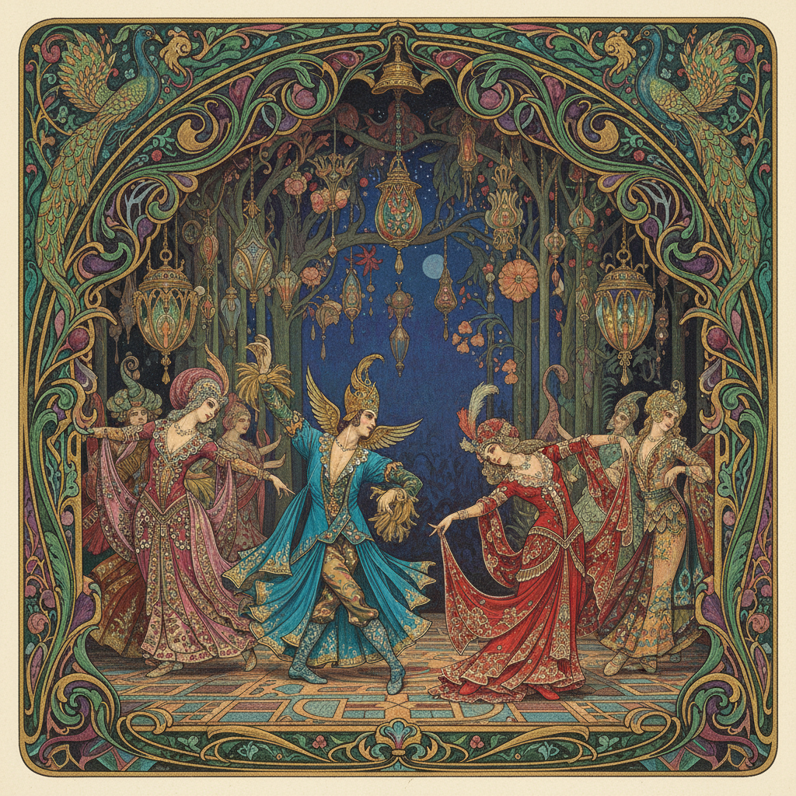

# World of Art Movement 艺术世界运动

> "Art should be free — free from social utility, free from moralism, free to pursue beauty for its own sake." — Sergei Diaghilev

## 概述

艺术世界运动（World of Art Movement / Мир искусства）是1898-1927年间俄罗斯最重要的艺术团体和文化运动之一。"艺术世界"由谢尔盖·佳吉列夫（Sergei Diaghilev）和亚历山大·贝努瓦（Alexandre Benois）等人创立——它既是一本同名杂志（1898-1904年），也是一个展览团体，更是一种艺术理念——主张"为艺术而艺术"，反对巡回派的社会功利主义，追求纯粹的美学价值。

"艺术世界"运动在俄罗斯艺术史上扮演了关键的过渡角色——它将俄罗斯艺术从19世纪的现实主义传统引向了20世纪的现代主义。运动的成员包括列昂·巴克斯特（Leon Bakst）、康斯坦丁·索莫夫（Somov）、姆斯季斯拉夫·多布任斯基（Dobuzhinsky）等杰出艺术家。"艺术世界"最伟大的成就是佳吉列夫的"俄罗斯芭蕾舞团"（Ballets Russes, 1909-1929年）——它将俄罗斯艺术家的舞台设计、服装设计和音乐带到了巴黎，震撼了整个西方艺术界。

艺术世界运动的核心要素包括：1）唯美主义——为艺术而艺术的理念；2）综合艺术——绘画、音乐、舞蹈、戏剧的综合；3）回顾主义——对18世纪和洛可可的怀旧；4）装饰性——强调装饰性和舞台效果；5）国际视野——将俄罗斯艺术推向世界；6）俄罗斯芭蕾——佳吉列夫芭蕾舞团的辉煌；7）书籍艺术——精美的书籍插图和设计。

## 核心特征

| 特征 | 描述 |
|------|------|
| 唯美主义 | 为艺术而艺术理念 |
| 综合艺术 | 绘画音乐舞蹈戏剧综合 |
| 回顾主义 | 对18世纪洛可可怀旧 |
| 装饰性 | 强调装饰性舞台效果 |
| 国际视野 | 将俄罗斯艺术推向世界 |
| 俄罗斯芭蕾 | 佳吉列夫芭蕾舞团 |

## 视觉特征

- **华丽色彩**：宝石般的华丽色彩
- **装饰线条**：精美的装饰性线条
- **舞台感**：戏剧性的舞台效果
- **东方元素**：波斯和东方的异国情调
- **怀旧氛围**：18世纪宫廷的怀旧
- **精美插图**：书籍和杂志的精美插图

## 代表作品

| 作品 | 艺术家 | 意义 |
|------|------|------|
| *火鸟舞台设计* | 巴克斯特 | 芭蕾设计 |
| *牧神午后服装* | 巴克斯特 | 服装设计 |
| *凡尔赛漫步* | 贝努瓦 | 回顾主义 |
| *艺术世界杂志* | 集体 | 出版设计 |
| *春之祭舞台* | 罗里赫 | 原始主义 |
| *索莫夫肖像画* | 索莫夫 | 唯美肖像 |

## 历史时间线

| 时期 | 事件 |
|------|------|
| 1898年 | 《艺术世界》杂志创刊 |
| 1899年 | 第一次"艺术世界"展览 |
| 1904年 | 杂志停刊 |
| 1909年 | 佳吉列夫俄罗斯芭蕾舞团成立 |
| 1910年代 | 芭蕾舞团震撼巴黎 |
| 1927年 | 团体正式解散 |
| 1929年 | 佳吉列夫去世 |

## 中国语境

"艺术世界"运动对中国艺术的影响主要通过两个渠道：一是佳吉列夫芭蕾舞团对全球舞台艺术的影响——中国现代舞台设计间接受到了巴克斯特等人的影响；二是"为艺术而艺术"的理念——这一理念在中国20世纪的艺术论争中反复出现。"艺术世界"运动在俄罗斯艺术史上的位置——作为现实主义和先锋派之间的过渡——与中国1980年代"新潮美术"运动的历史位置有某种相似性：两者都试图将本国艺术从单一的现实主义传统中解放出来，引向更多元的现代方向。"艺术世界"将俄罗斯艺术推向国际舞台的成功经验，对中国当代艺术的国际化也有重要的参考意义。

## 概念图

## 与其他风格的关系

- **Art Nouveau** → 新艺术运动（平行运动）
- **Ballets Russes** → 俄罗斯芭蕾舞团
- **Peredvizhniki** → 巡回展览画派（反对对象）
- **Russian Symbolism** → 俄罗斯象征主义（相关）
- **Aestheticism** → 唯美主义（英国平行）
- **Russian Avant-Garde** → 俄罗斯先锋派（后续）

---

*浮光艺志 | Chronicle of Artistry*
