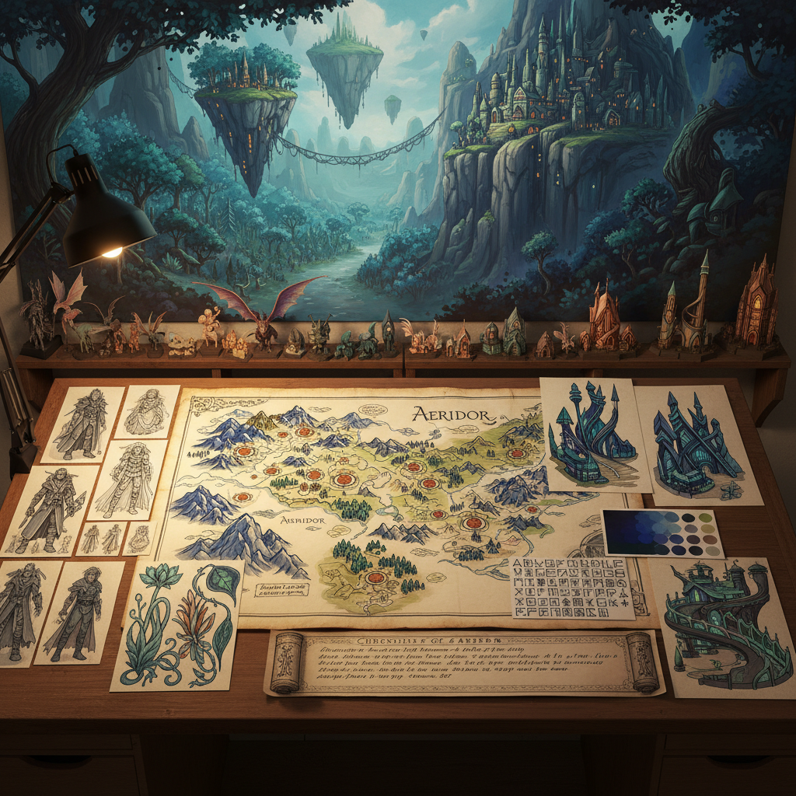

# Worldbuilding Art 世界构建艺术

> "Worldbuilding art is the creation of entire realities — not just a single image or story but a complete coherent universe with its own history, geography, physics, cultures, and aesthetics, a practice that has moved far beyond fantasy novels and games into contemporary art, architecture, and design, where artists create fictional worlds not as escapism but as tools for understanding our own, where the act of imagining a complete alternative reality becomes a way of revealing the hidden assumptions and contingencies of the world we actually inhabit." — Unknown

## 概述

世界构建艺术（Worldbuilding Art）是一种以创造完整虚构世界为核心的艺术实践。世界构建不仅仅是为故事创造背景——它是一种独立的创造性活动，涉及设计完整的文明、生态系统、历史、语言和美学体系。虽然世界构建的传统根植于奇幻和科幻文学（如托尔金的中土世界），但在当代艺术中，它已经发展为一种独立的艺术形式。

当代世界构建艺术的实践包括：1）视觉世界构建——通过绘画、数字艺术和概念设计创造虚构世界的视觉面貌；2）沉浸式世界——通过装置、VR和混合现实创造可进入的虚构世界；3）批判性世界构建——创造虚构世界来探索社会和政治议题；4）协作世界构建——多人共同创造和发展一个虚构世界；5）游戏世界——为电子游戏和桌游设计的完整世界。

## 核心特征

| 特征 | 描述 |
|------|------|
| 完整性 | 世界的内在完整性 |
| 一致性 | 内部逻辑的一致 |
| 深度 | 多层次的细节深度 |
| 系统 | 系统性的思考 |
| 想象 | 激进的想象力 |
| 沉浸 | 沉浸式的体验 |

## 视觉特征

- **地图**：详细的世界地图
- **建筑**：独特的建筑风格
- **生物**：虚构的生物设计
- **文字**：虚构的文字系统
- **服装**：独特的服装设计
- **景观**：异世界的景观

## 代表作品

| 作品 | 创作者 | 年代 | 意义 |
|------|--------|------|------|
| *Middle-earth* | J.R.R. Tolkien | 1937-73 | 世界构建的典范 |
| *Star Wars* universe | Various | 1977起 | 视觉世界构建 |
| *Codex Seraphinianus* | Luigi Serafini | 1981 | 艺术世界构建 |
| *Game worlds* | Various | 2000年代起 | 游戏世界设计 |
| *VR worlds* | Various | 2020年代 | 沉浸式世界 |

## 历史时间线

| 时期 | 事件 |
|------|------|
| 1930年代 | 托尔金的中土世界 |
| 1970年代 | 桌游和角色扮演的世界 |
| 1990年代 | 电子游戏世界的复杂化 |
| 2010年代 | 世界构建作为独立艺术形式 |
| 当代 | VR和AI辅助的世界构建 |

## 中国语境

世界构建在中国有极其丰富的传统和当代实践。中国古典文学中有大量的世界构建——从《山海经》的神话地理，到《西游记》的三界体系，到《红楼梦》的大观园微观世界。当代中国的世界构建实践包括：网络文学中庞大的"修仙"世界体系、游戏产业中的中国风世界设计（如《原神》的提瓦特大陆）、以及科幻文学中的未来世界想象（如刘慈欣的宇宙）。中国的一些当代艺术家也在实践世界构建——创造完整的虚构文明和美学体系作为艺术作品。中国的世界构建有其独特的文化特征——往往融合了中国传统的宇宙观、历史叙事和美学传统。

## AI生成概念图

## 与其他风格的关系

- **Fantasy Art** → 奇幻艺术
- **Concept Art** → 概念艺术
- **Science Fiction Art** → 科幻艺术
- **Game Design** → 游戏设计
- **Speculative Design** → 推测设计
- **Immersive Art** → 沉浸式艺术

---

*浮光艺志 | Chronicle of Artistry*
