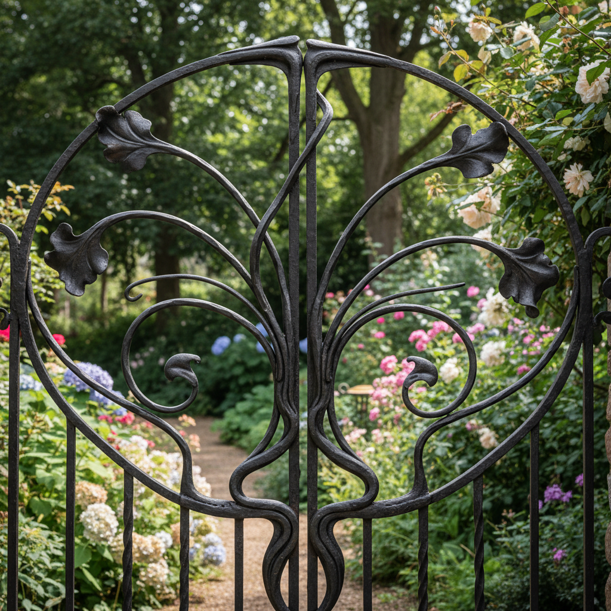

# Wrought Iron Art 锻铁艺术

> "Wrought iron is metal shaped by will — heated in a forge until it glows cherry-red, then hammered, twisted, scrolled, and riveted by hand into gates, railings, chandeliers, and screens of extraordinary grace, each piece bearing the marks of the blacksmith's hammer and the organic irregularities that distinguish handwork from casting, giving iron the fluidity of a drawn line." — Unknown

## 概述

锻铁艺术（Wrought Iron Art）是一种通过加热和锤打将铁塑造成各种装饰和功能性形态的传统金属工艺——与铸铁不同，锻铁是在热态下通过人力锤打、扭曲、弯曲和焊接来成型的，每件作品都带有手工锤打的痕迹和独特的有机质感。锻铁艺术在中世纪和文艺复兴时期达到高峰，至今仍是建筑装饰和艺术创作的重要媒介。

锻铁艺术的实践包括：1）加热——在锻炉中将铁加热至可塑状态；2）锤打——用锤子在铁砧上塑形；3）扭曲——将热铁扭曲成螺旋形；4）卷曲——将铁弯曲成涡卷形；5）焊接——将多个部件锻焊在一起；6）铆接——用铆钉连接各部件；7）当代锻铁——将传统技法与现代艺术创作结合。

## 核心特征

| 特征 | 描述 |
|------|------|
| 锤打 | 手工锤打成型 |
| 加热 | 在热态下塑形 |
| 有机 | 有机的手工质感 |
| 涡卷 | 优美的涡卷形态 |
| 建筑 | 建筑装饰功能 |
| 力量 | 力量与优雅的结合 |

## 视觉特征

- **涡卷**：优美的涡卷和曲线
- **锤痕**：手工锤打的痕迹
- **黑色**：传统的黑色表面
- **有机**：有机的不规则感
- **力量**：材料的力量感
- **优雅**：力量中的优雅

## 代表作品

| 作品 | 艺术家/文化 | 年代 | 意义 |
|------|-------------|------|------|
| *Medieval church screens* | 欧洲 | 12-15世纪 | 中世纪教堂屏风 |
| *Jean Tijou gates* | 英国 | 17世纪 | 让·蒂茹铁门 |
| *Art Nouveau ironwork* | 法国 | 19世纪末 | 新艺术锻铁 |
| *Edgar Brandt screens* | 法国 | 1920年代 | 埃德加·布兰特屏风 |
| *Contemporary blacksmithing* | 国际 | 当代 | 当代锻铁艺术 |

## 历史时间线

| 时期 | 事件 |
|------|------|
| 铁器时代 | 锻铁的起源 |
| 中世纪 | 教堂和城堡的锻铁装饰 |
| 文艺复兴 | 锻铁艺术的高峰 |
| 新艺术时期 | 锻铁的艺术化发展 |
| 当代 | 艺术锻铁的复兴 |

## 中国语境

锻铁在中国有悠久的传统。中国的铁匠——传统的打铁技艺有数千年的历史。中国的铁艺——在建筑装饰中有广泛的应用。中国当代的铁艺工作室——在各地逐渐增多。中国的非物质文化遗产中，打铁技艺——在一些地区被列为保护项目。中国的公共艺术中，锻铁雕塑——在城市空间中有一定的应用。中国的工艺美术教育中，锻铁作为金属工艺的重要方向——在相关课程中教授。

## AI生成概念图

## 与其他风格的关系

- **Cast Iron** → 铸铁
- **Blacksmithing** → 锻造
- **Art Nouveau** → 新艺术
- **Architectural Ornament** → 建筑装饰
- **Metalwork** → 金属工艺
- **Sculpture** → 雕塑

---

*浮光艺志 | Chronicle of Artistry*
