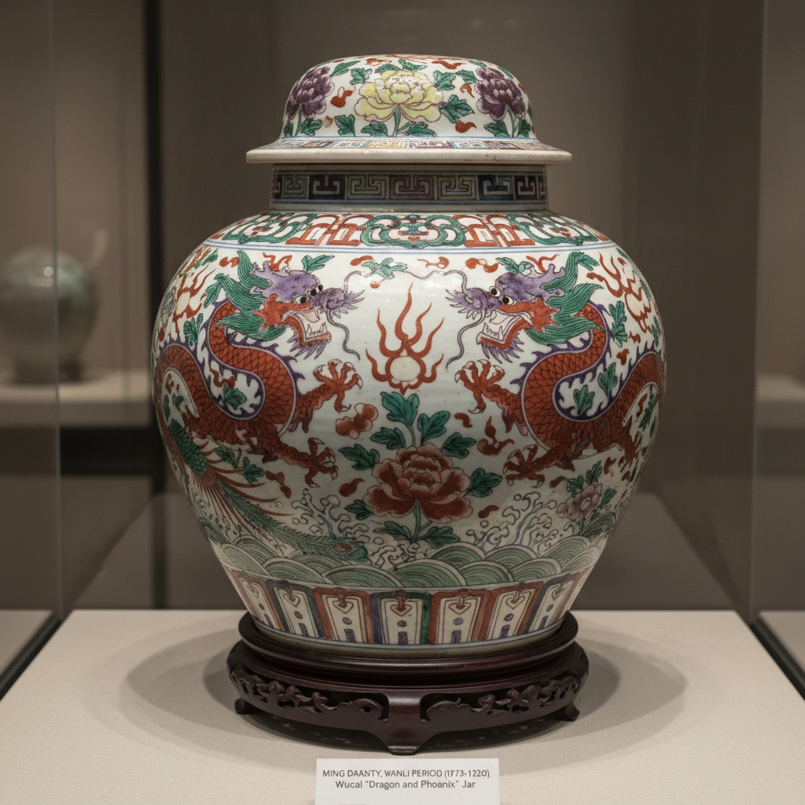

# Wucai Art 五彩艺术

> "Wucai is porcelain in full color — five colors and more applied over and under the glaze in bold, graphic compositions that tell stories of battles, romances, and mythical journeys across the surface of jars and vases, Ming dynasty China's answer to the illuminated manuscript, where every vessel becomes a narrative stage painted in red, green, yellow, purple, and blue." — Unknown

## 概述

五彩艺术（Wucai Art）是中国明清时期发展的一种多色彩绘瓷器艺术。五彩（意为"五种颜色"）实际上并不限于五种颜色——它泛指使用多种釉上彩料（有时结合釉下青花）进行装饰的彩瓷。五彩以其色彩鲜明、构图大胆、笔触奔放著称——是中国彩瓷中最具表现力的品类之一。明代嘉靖万历时期和清代康熙时期是五彩的两个高峰。

五彩艺术的核心要素包括：1）多色彩绘——使用多种色彩；2）釉上为主——以釉上彩为主要技法；3）色彩鲜明——色彩对比强烈鲜明；4）题材叙事——大量叙事性题材；5）笔触奔放——大胆奔放的笔触；6）明清传统——明清两代的传统；7）民间气息——浓郁的民间艺术气息。

## 核心特征

| 特征 | 描述 |
|------|------|
| 多色彩绘 | 使用多种色彩 |
| 釉上为主 | 以釉上彩为主 |
| 色彩鲜明 | 色彩对比强烈 |
| 题材叙事 | 大量叙事性题材 |
| 笔触奔放 | 大胆奔放笔触 |
| 民间气息 | 浓郁民间艺术气息 |

## 视觉特征

- **红绿为主**：以红色和绿色为主调
- **色彩浓烈**：浓烈鲜明的色彩
- **线条有力**：有力的线条勾勒
- **满工构图**：密集的装饰构图
- **故事场景**：叙事性的场景描绘
- **动感十足**：充满动感和活力

## 代表作品

| 作品 | 艺术家/文化 | 年代 | 意义 |
|------|-------------|------|------|
| *万历五彩龙凤大罐* | 景德镇 | 万历 | 万历五彩代表 |
| *嘉靖五彩鱼藻纹罐* | 景德镇 | 嘉靖 | 嘉靖五彩精品 |
| *康熙五彩人物棒槌瓶* | 景德镇 | 康熙 | 康熙五彩巅峰 |
| *康熙五彩花鸟凤尾尊* | 景德镇 | 康熙 | 大型五彩器 |
| *万历五彩花觚* | 景德镇 | 万历 | 花觚器形 |

## 历史时间线

| 时期 | 事件 |
|------|------|
| 明代宣德 | 五彩技法的早期发展 |
| 嘉靖万历 | 明代五彩的繁荣 |
| 清代康熙 | 五彩艺术的巅峰 |
| 雍正以后 | 粉彩逐渐取代五彩 |
| 当代 | 五彩的研究与收藏 |

## 中国语境

五彩是中国陶瓷彩绘中最具民间活力的品类。与斗彩的精致内敛不同，五彩以其大胆奔放的风格展现了中国民间艺术的生命力。明代嘉靖万历时期的五彩以龙凤、鱼藻、花卉等吉祥题材为主——色彩浓烈、构图饱满，体现了明代中后期的审美趣味。清代康熙时期的五彩则达到了技艺的巅峰——特别是人物故事题材的五彩瓷器，如同一幅幅精美的中国画，人物表情生动、场景丰富。五彩与粉彩的区别在于：五彩使用透明彩料直接绘制，色彩鲜明对比强烈；粉彩则用不透明的玻璃白打底后再上色，色彩柔和有渐变。五彩的"五"并非确指五种颜色——而是泛指多种颜色的意思。

## AI生成概念图

## 与其他风格的关系

- **Doucai** → 斗彩
- **Famille Verte** → 素三彩
- **Famille Rose** → 粉彩
- **Blue and White** → 青花
- **Overglaze Enamel** → 釉上彩
- **Ming Dynasty Ceramics** → 明代陶瓷

---

*浮光艺志 | Chronicle of Artistry*
