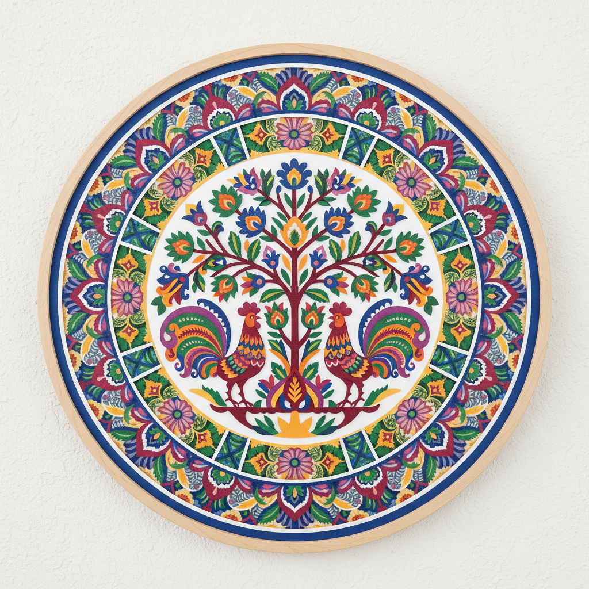

# Wycinanki 波兰剪纸 | Wycinanki

> **"农舍里的对称宇宙——波兰农妇用剪刀在彩纸上剪出公鸡、花朵和生命之树。"**

## 概述

Wycinanki（波兰剪纸 / 维奇南基）是波兰的传统民间剪纸艺术，起源于19世纪的波兰农村。农妇们用剪刀在彩色纸张上剪出对称的装饰图案，用来装饰农舍的墙壁和天花板。两个最著名的地区风格是：1）Kurpie地区的单色对称剪纸（将纸对折后剪出对称图案）；2）Łowicz地区的多层彩色剪纸（多层不同颜色的纸叠加）。Wycinanki是波兰国家文化身份的重要象征。

## 主要地区风格

| 地区 | 特征 |
|------|------|
| Kurpie | 单色，对折对称，精细 |
| Łowicz | 多层彩色，圆形构图 |
| Lublin | 单色，树形 |
| Podlasie | 几何，窗花 |

## 核心特征

- **剪刀技法**：纯剪刀剪切（不用刀）
- **对称性**：对折剪出对称图案
- **多层叠加**：Łowicz风格的彩色层次
- **农舍装饰**：贴在墙壁和天花板
- **季节更换**：节日前更换新剪纸
- **女性传统**：农妇的艺术表达

## 常见题材

| 题材 | 含义 |
|------|------|
| 公鸡 Kogut | 警醒、骄傲 |
| 生命之树 | 生命和繁荣 |
| 花束 | 美丽和祝福 |
| 星形 | 宇宙和秩序 |
| 鸟 | 自由和灵魂 |

## 视觉特征

- 精确的对称构图
- 鲜艳的多色层次（Łowicz）
- 精细的剪切细节
- 圆形或树形的整体构图
- 民间艺术的质朴活力
- 正负形的视觉张力

## 与其他风格的关系

| 风格 | 关系 |
|------|------|
| 中国剪纸 | 共享剪纸传统 |
| Scherenschnitte | 共享欧洲剪纸传统 |
| Papel Picado | 共享纸艺装饰 |
| 当代剪纸艺术 | Wycinanki的现代转化 |
| 波兰民间艺术 | Wycinanki是其核心 |

## 概念图

---

*浮光艺志 | Chronicle of Artistry*
