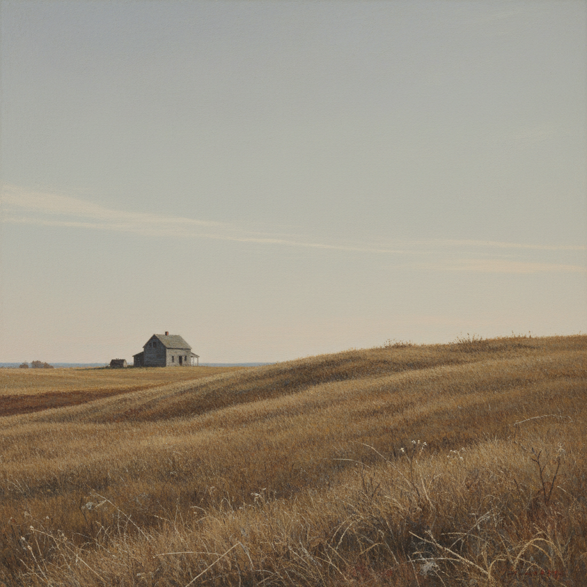

# Andrew Wyeth 安德鲁·怀斯

> "I prefer winter and fall, when you feel the bone structure of the landscape." — Andrew Wyeth

## 概述

安德鲁·怀斯（Andrew Wyeth，1917–2009）是美国最受欢迎也最具争议的画家之一。他以蛋彩画和水彩描绘宾夕法尼亚和缅因州的乡村风景与人物，画面中弥漫着一种孤寂、怀旧和时间凝固的氛围。

## 核心特征

| 特征 | 描述 |
|------|------|
| 蛋彩画 | 极其精细的干笔蛋彩技法 |
| 枯色调 | 棕色、灰色、枯草色的有限色板 |
| 乡村题材 | 农舍、枯草、窗户、孤独人物 |
| 时间凝固 | 画面中的一切似乎永远静止 |
| 细节执着 | 每一根草、每一块木纹 |
| 心理暗示 | 表面平静下的不安与神秘 |

## 代表作品

| 作品 | 年代 | 意义 |
|------|------|------|
| *Christina's World* | 1948 | 美国艺术最著名的图像之一 |
| *Wind from the Sea* | 1947 | 窗帘飘动中的整个世界 |
| *Helga Pictures* | 1971–85 | 秘密创作的250幅肖像 |
| *Winter 1946* | 1946 | 奔跑的男孩与父亲之死 |

## AI生成概念图

## 与其他风格的关系

- **American Realism** → 美国写实主义传统的延续
- **Hopper** → 共享美国孤独感，但更乡村
- **Romanticism** → 对自然的深层情感投射
- **Magic Realism** → 写实中的超现实暗示
