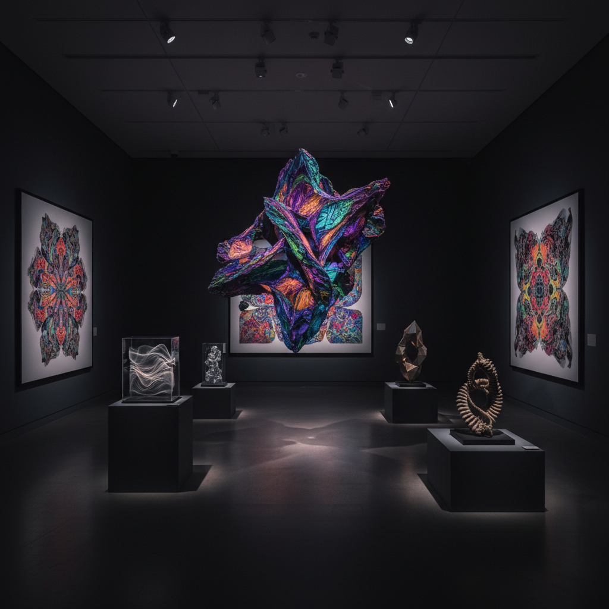

# Xenoart 异体艺术

> "Xenoart is art from elsewhere — art that deliberately estranges itself from human norms, that seeks to create forms, experiences, and meanings that feel genuinely alien, that pushes beyond the comfortable boundaries of human aesthetics into territories where beauty itself becomes unfamiliar, where the viewer encounters something that cannot be assimilated into existing categories, something that remains irreducibly other, irreducibly strange, irreducibly new." — Unknown

## 概述

异体艺术（Xenoart）是追求根本性的"异质性"（xenity/otherness）的艺术实践。"Xeno-"来自希腊语，意为"外来的、陌生的、异质的"。异体艺术试图创造真正"陌生"的美学体验——不是简单的"奇怪"或"前卫"，而是从根本上超越人类已知美学范畴的东西。

异体艺术的实践包括：1）非人类美学——尝试创造不以人类感知和偏好为中心的美学形式；2）异质材料——使用人类通常不会视为"艺术材料"的物质；3）异质感知——创造超越人类感官范围的体验（如紫外线、次声波、电磁场）；4）异质智能——与非人类智能（AI、动物、植物）合作创造人类无法独自想象的形式；5）异质时间——在人类无法直接感知的时间尺度上创作（极快或极慢）。

## 核心特征

| 特征 | 描述 |
|------|------|
| 异质 | 根本的异质性 |
| 陌生 | 不可同化的陌生 |
| 超越 | 超越人类范畴 |
| 非人 | 非人类中心 |
| 极端 | 极端的实验 |
| 未知 | 面向未知 |

## 视觉特征

- **不可名**：无法归类的形式
- **异质**：异质材料的组合
- **尺度**：极端的尺度
- **非对称**：非人类的对称性
- **色彩**：非自然的色彩组合
- **维度**：暗示更高维度

## 代表作品

| 作品 | 艺术家 | 年代 | 意义 |
|------|--------|------|------|
| *Xenofeminist art* | Laboria Cuboniks | 2015至今 | 异女性主义艺术 |
| *Alien aesthetics* | Various | 2010年代 | 异星美学 |
| *Non-human art* | Various | 2020年代 | 非人类艺术 |
| *Hyperdimensional art* | Various | 当代 | 超维度艺术 |
| *AI xenoart* | Various | 当代 | AI异体艺术 |

## 历史时间线

| 时期 | 事件 |
|------|------|
| 2010年代 | 异加速主义理论 |
| 2015 | Laboria Cuboniks的异女性主义宣言 |
| 2010年代 | 异体美学的理论化 |
| 2020年代 | AI使异体艺术成为可能 |
| 当代 | 异体艺术的实践扩展 |

## 中国语境

异体艺术在中国有独特的哲学资源。中国传统思想中的"道"——不可名、不可见、不可知的终极实在——与异体艺术追求的"根本异质性"有深刻的共鸣。庄子哲学中的"齐物"——消除人类中心的分类和判断——也为异体艺术提供了思想基础。中国传统美学中的"奇"——对奇异、怪诞、不可归类之物的欣赏（如奇石、怪松）——可以被视为一种古老的异体美学。中国当代的一些艺术家在探索异体艺术的可能性：利用AI创造超越人类想象的形式、探索中国传统的"道"的不可知性如何转化为当代艺术实践、以及将中国的"奇"美学与当代异体理论结合。

## AI生成概念图

## 与其他风格的关系

- **Posthumanism** → 后人类主义
- **AI Art** → 人工智能艺术
- **Speculative Art** → 推测艺术
- **Abstract Art** → 抽象艺术
- **Experimental Art** → 实验艺术
- **Alien Aesthetics** → 异星美学

---

*浮光艺志 | Chronicle of Artistry*
