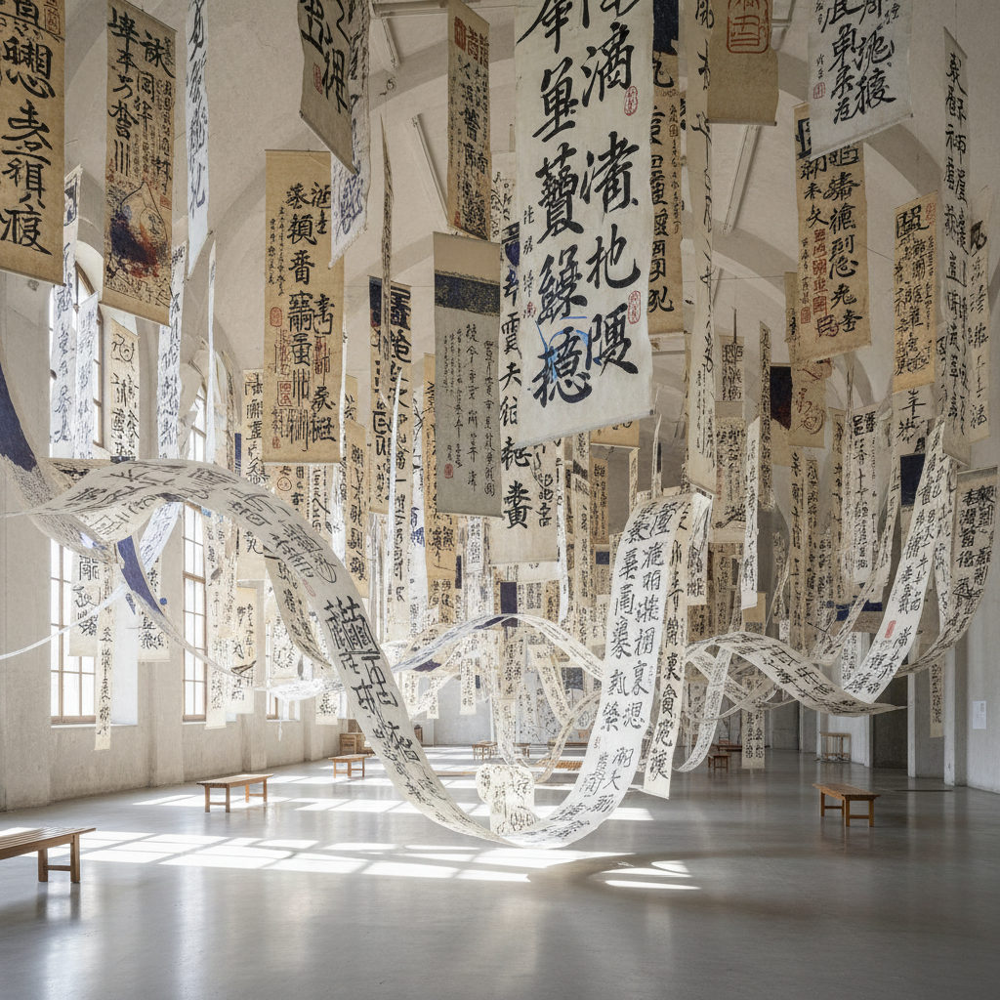

# Xu Bing 徐冰

> **流派**: 当代艺术 · 观念艺术 · 文字艺术  
> **时期**: 1955–至今 中国/美国  
> **关键词**: 伪文字、天书、文化翻译、跨语言

## 概述

徐冰是当代最重要的中国观念艺术家之一。他的核心关切是文字、语言和文化翻译的问题。他最著名的作品《天书》用四年时间手工刻制了4000多个看似汉字却无人能读的伪文字，印刷成传统线装书和长卷悬挂于展厅。后来的《地书》则用全球通用的图标符号写成一本任何人都能读懂的书。

## 视觉特征

- **伪汉字**: 结构完美但无意义的方块字
- **传统形式**: 线装书、卷轴、碑拓等中国传统载体
- **文字装置**: 巨幅文字悬挂或铺满整个空间
- **跨文化符号**: 英文方块字、图标语言等混合系统
- **手工精密**: 极其精细的木刻版画和印刷工艺

## 代表作品

- 《天书》(Book from the Sky, 1987–91)
- 《地书》(Book from the Ground, 2003–)
- 《英文方块字书法》(Square Word Calligraphy)
- 《凤凰》(Phoenix, 2008–10) — 建筑废料雕塑
- 《背后的故事》系列 — 光影装置

## 历史影响

徐冰揭示了文字的权力本质——我们对文字的敬畏来自形式而非内容。他的作品在东西方文化之间建立了独特的对话通道，证明了中国当代艺术可以在全球语境中提出普遍性的哲学问题。

## 相关风格

- [Cai Guo-Qiang 蔡国强](cai-guo-qiang.md)
- [Conceptual Art 观念艺术](conceptual-art.md)
- [Chinese Calligraphy 中国书法](chinese-calligraphy.md)
