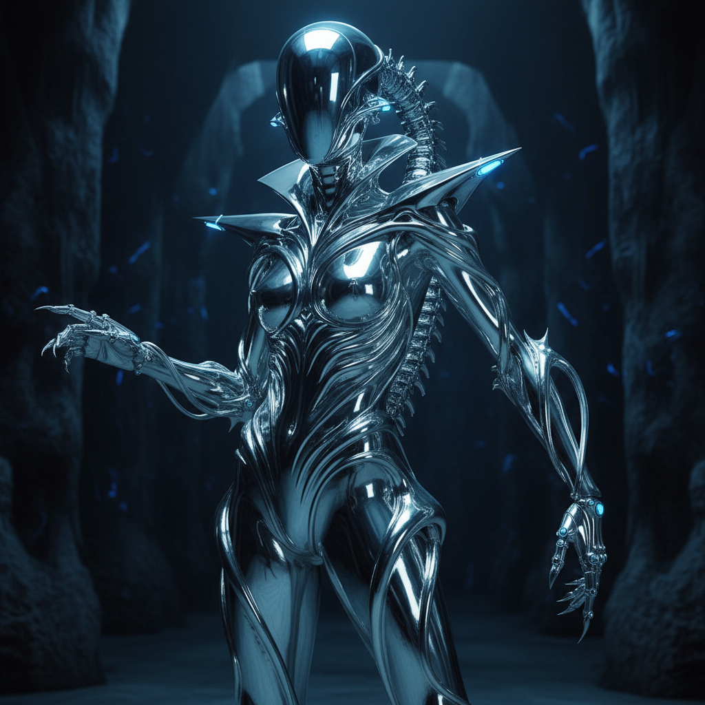

# Y3K（未来主义新浪潮）

> **别名**：Post-Y2K Futurism, Neo-Futurism, Cyber Couture, Mecha Fashion  
> **活跃年代**：2023 – 至今  
> **核心领域**：高端时尚、MV 视觉、社交媒体美学、AI 生成艺术

---

## 一句话定义

Y3K 是 Y2K 美学的"下一代进化"——如果 Y2K 是 2000 年对未来的想象，Y3K 则是 2020 年代对**更遥远未来**的想象：AI、元宇宙、生物科技、末世机甲，一切都更极端、更冷峻、更超人类。

---

## 视觉语言

| 元素 | 描述 |
|------|------|
| 材质 | 液态金属、镜面铬、生物机械、透明硅胶 |
| 色彩 | 银色、冷蓝、黑色、偶尔的荧光点缀 |
| 身体 | 机械义肢、外骨骼、面部金属装饰、非人类比例 |
| 空间 | 太空站、荒芜星球、实验室、虚拟空间 |
| 质感 | 光滑、冰冷、无机、精密 |
| 参考 | 科幻电影（*沙丘*、*银翼杀手*）、赛博朋克动漫 |

### 视觉 DNA 拆解

Y3K 的视觉系统可以分解为几个核心层次：

**材质层**：
- 液态金属（水银般的流动感）
- 碳纤维编织纹理
- 生物发光材料
- 透明/半透明硅胶和树脂
- 镜面铬（比 Y2K 的铬更"有机"——像液体而非固体）

**形态层**：
- 有机+无机的混合形态（生物机械）
- 非对称结构
- 尖锐的角度和流线型曲线并存
- 外骨骼式的外露结构

**光线层**：
- 冷色调为主（蓝、银、白）
- 点状荧光作为唯一暖色
- 环境光极暗，局部高光极亮
- 类似手术室或太空站的照明逻辑

---

## Y2K vs Y3K 深度对比

| 维度 | Y2K | Y3K |
|------|-----|-----|
| 时代情绪 | 乐观、天真、好奇 | 冷峻、警觉、超越 |
| 技术态度 | "技术让生活更好" | "技术改变人类本身" |
| 色彩 | 彩色、透明、泡泡糖 | 银色、黑色、冷光 |
| 材质 | 塑料、充气、果冻 | 金属、碳纤维、液态 |
| 身体观 | 装饰身体 | 改造/超越身体 |
| 代表物 | iMac G3、翻盖手机 | AI 芯片、外骨骼、神经接口 |
| 自然观 | 自然是友好的背景 | 自然已经消失或被重建 |
| 社交 | 连接所有人 | 超越人类社交 |
| 恐惧 | 千年虫（技术故障） | AI 取代人类（技术成功） |
| 音乐 | Eurodance、Pop | Hyperpop、Industrial、Ambient |

### 关键区别：乐观 vs 焦虑

Y2K 的核心情绪是**"未来会很棒"**——透明塑料、泡泡糖色、圆润形态，一切都在说"技术是友好的、好玩的、无害的"。

Y3K 的核心情绪是**"未来已经到来，而我们还没准备好"**——尖锐金属、冷色调、外骨骼，一切都在说"技术是强大的、不可逆的、可能危险的"。

---

## 历史时间线

| 时期 | 事件 |
|------|------|
| 2019-2021 | Y2K 回潮达到巅峰；Dua Lipa *Future Nostalgia* 定义了 Y2K 复兴的视觉 |
| 2022 | Y2K 开始饱和；时尚界寻找"下一个"；Bella Hadid 的 Coperni 喷涂裙 |
| 2022.11 | ChatGPT 发布——AI 焦虑成为文化主题 |
| 2023.01 | Mugler 1995 秋冬高定被赞达亚穿上红毯，引爆"机甲美学" |
| 2023.03 | *沙丘2* 预告片发布，末世未来主义视觉成为话题 |
| 2023-2024 | "Y3K" 标签在 TikTok/小红书上爆发；Gentle Monster 门店设计成为打卡点 |
| 2024.03 | *沙丘2* 上映，Zendaya 的宣传造型全面拥抱 Y3K |
| 2024 | AI 生成艺术推动超现实未来视觉的普及；Midjourney/DALL-E 让任何人都能创作 Y3K 视觉 |
| 2024-2025 | Apple Vision Pro 发布——"面部设备"从科幻变为现实 |
| 2025-2026 | Y3K 从时尚扩展到室内设计、产品设计、MV 制作；与 AI 美学深度融合 |

---

## 文化内核

### 从乐观到警觉

Y2K 诞生于互联网泡沫的乐观期——人们相信技术只会带来好事。Y3K 诞生于 AI 焦虑、气候危机和后疫情时代——人们对技术的态度变得**既迷恋又恐惧**。

这种矛盾心理体现在 Y3K 的视觉中：
- 它很美，但也很冷
- 它很强大，但也很孤独
- 它很先进，但也很不人性
- 你想穿上它，但你也害怕成为它

### 后人类想象

Y3K 的核心问题不再是"未来的手机长什么样"，而是：
- 人类和机器的边界在哪里？
- 身体是否可以被设计和升级？
- 在 AI 时代，"人"意味着什么？
- 当 AI 可以创造一切，人类的创造力还有价值吗？

这些问题不再是科幻小说的假设——它们是 2024 年的现实议题。Y3K 美学是这些焦虑的**视觉化表达**。

### 时尚作为盔甲

Y3K 时尚的潜台词是**防御**——金属外壳、尖刺、面罩、外骨骼。它不是为了"好看"，而是为了在一个不确定的未来中**生存和保护自己**。

这与 Y2K 时尚的"展示"逻辑完全相反：
- Y2K：透明材质、暴露身体、"看看我"
- Y3K：覆盖材质、保护身体、"别碰我"

### AI 美学的自我指涉

Y3K 与 AI 生成艺术有一种独特的共生关系：
- AI 工具（Midjourney、DALL-E）擅长生成 Y3K 风格的图片
- Y3K 的"超现实精密感"恰好是 AI 的强项
- 这导致了一个悖论：**Y3K 美学看起来像 AI 生成的，而 AI 生成的图片看起来像 Y3K**
- 两者互相强化，模糊了"人类创作"和"机器创作"的边界

---

## 子类型

| 子类型 | 特征 | 代表 |
|--------|------|------|
| **Mecha Fashion** | 外骨骼、机甲元素融入服装 | Mugler, Thierry Mugler Archive |
| **Bio-Tech** | 生物+技术的有机融合 | Iris van Herpen |
| **Dark Y3K** | 末世、废墟、生存主义 | *Mad Max* 系列视觉 |
| **Clean Y3K** | 极简、白色、实验室感 | Apple Vision Pro 美学 |
| **Alien Core** | 非人类形态、外星生物感 | H.R. Giger 的当代继承者 |
| **Digital Y3K** | 虚拟空间、数据可视化、AI 生成 | Beeple, Refik Anadol |

---

## 关键设计师与品牌

| 名称 | 贡献 |
|------|------|
| **Mugler**（Thierry Mugler 遗产） | 机甲女战士、昆虫形态、金属胸衣——Y3K 的精神祖先 |
| **Balenciaga** | 末世时尚、垃圾袋包、铠甲外套、Demna 的反乌托邦秀场 |
| **Iris van Herpen** | 3D 打印时装、液态金属裙、生物形态——技术与手工的极致融合 |
| **Coperni** | Bella Hadid 喷涂裙——"衣服在身体上生长"的概念 |
| **MISBHV** | 东欧赛博朋克街头——Y3K 的平价入口 |
| **Gentle Monster** | 未来主义眼镜、零售空间设计——Y3K 的商业化标杆 |
| **Rick Owens** | 暗黑建筑感、非对称剪裁——Y3K 的地下根基 |
| **Marine Serre** | 月牙 logo、升级再造、末世运动装——可持续 Y3K |

---

## 与其他风格的关系

| 风格 | 关系 |
|------|------|
| **Y2K / Cyber Y2K** | Y3K 是其精神续作，但更冷峻——从"好玩的未来"到"危险的未来" |
| **Chromecore** | 共享金属质感，但 Y3K 更有机/生物化 |
| **Synthwave** | 共享未来主义，但 Synthwave 怀旧而 Y3K 前瞻 |
| **Cyberpunk** | Y3K 从赛博朋克吸收了反乌托邦元素，但更"高级时尚"而非"街头" |
| **Acid Graphics** | 共享扭曲和极端视觉处理 |
| **Vaporwave** | 如果 Vaporwave 是"过去的未来"，Y3K 是"未来的未来" |

---

## 为什么收录在千禧怀旧章节？

Y3K 虽然面向未来，但它的存在**以 Y2K 为前提**——它是对千禧年未来主义的回应、进化和超越。没有 Y2K 的乐观天真，就没有 Y3K 的冷峻警觉。它们是同一枚硬币的两面：一面是"我们曾经如何想象未来"，另一面是"我们现在如何想象未来"。

更深层地说，Y3K 的存在本身就是一种怀旧行为——它怀念的是**"对未来充满想象"这种能力本身**。在一个未来似乎只有气候灾难和 AI 失控的时代，Y3K 试图重新夺回"想象未来"的权利。

---

## 中国语境

Y3K 在中国有独特的传播路径：

### 小红书 Y3K
- "Y3K 穿搭"成为 2023-2024 年的热门标签
- 银色配饰、金属面罩、未来感妆容
- 与"辣妹风"和"酷女孩"标签交叉

### 科幻影视推动
- *流浪地球* 系列的视觉设计
- *三体* 改编的概念艺术
- 国产科幻的视觉语言正在形成

### Gentle Monster 效应
- 中国门店的沉浸式空间设计成为 Y3K 美学的线下体验入口
- 年轻消费者通过"打卡"接触 Y3K 视觉

---

## 代表性视觉参考

- 赞达亚 *沙丘2* 首映红毯造型（Mugler 1995 Archive）
- Anya Taylor-Joy *疯狂的麦克斯：狂暴女神* 宣传造型
- Iris van Herpen 高定系列（*Sensory Seas*、*Earthrise*）
- Bella Hadid Coperni 喷涂裙（2022 巴黎时装周）
- AI 生成的未来主义概念艺术（Midjourney "Y3K fashion" prompt）
- Gentle Monster 旗舰店空间设计
- Apple Vision Pro 产品视觉

---

## 延伸阅读

- [Aesthetics Wiki - Y3K](https://aesthetics.fandom.com/wiki/Y3K)
- [Vogue: "Y3K Fashion Explained"](https://www.vogue.com/article/y3k-fashion)
- *"Fashioning the Future: Tomorrow's Wardrobe"*（Bradley Quinn）
- 本项目相关：[Y2K](y2k.md) | [Cyber Y2K](cyber-y2k.md) | [Chromecore](chromecore.md) | [Synthwave](synthwave.md) | [Acid Graphics](acid-graphics.md)
