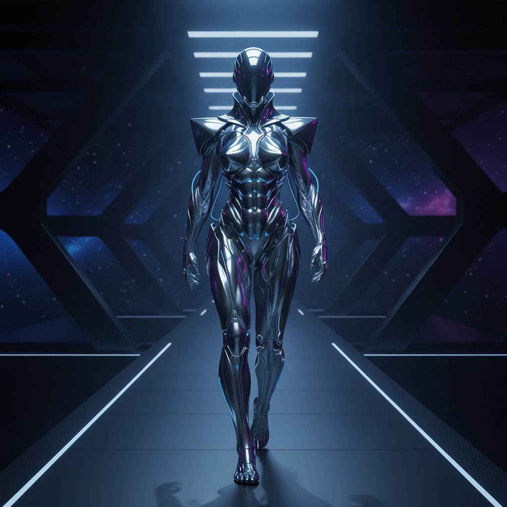

# Y3K（未来主义新浪潮）

> **别名**：Post-Y2K Futurism, Neo-Futurism, Cyber Couture  
> **活跃年代**：2023 – 至今  
> **核心领域**：高端时尚、MV 视觉、社交媒体美学

---

## 一句话定义

Y3K 是 Y2K 美学的"下一代进化"——如果 Y2K 是 2000 年对未来的想象，Y3K 则是 2020 年代对**更遥远未来**的想象：AI、元宇宙、生物科技、末世机甲，一切都更极端、更冷峻、更超人类。

---

## 视觉语言

| 元素 | 描述 |
|------|------|
| 材质 | 液态金属、镜面铬、生物机械、透明硅胶 |
| 色彩 | 银色、冷蓝、黑色、偶尔的荧光点缀 |
| 身体 | 机械义肢、外骨骼、面部金属装饰、非人类比例 |
| 空间 | 太空站、荒芜星球、实验室、虚拟空间 |
| 质感 | 光滑、冰冷、无机、精密 |
| 参考 | 科幻电影（*沙丘*、*银翼杀手*）、赛博朋克动漫 |

---

## Y2K vs Y3K

| 维度 | Y2K | Y3K |
|------|-----|-----|
| 时代情绪 | 乐观、天真、好奇 | 冷峻、警觉、超越 |
| 技术态度 | "技术让生活更好" | "技术改变人类本身" |
| 色彩 | 彩色、透明、泡泡糖 | 银色、黑色、冷光 |
| 材质 | 塑料、充气、果冻 | 金属、碳纤维、液态 |
| 身体观 | 装饰身体 | 改造/超越身体 |
| 代表物 | iMac G3、翻盖手机 | AI 芯片、外骨骼 |

---

## 历史时间线

| 时期 | 事件 |
|------|------|
| 2022 | Y2K 回潮达到饱和，时尚界开始寻找"下一个" |
| 2023 | Mugler 1995 秋冬高定被赞达亚穿上红毯，引爆"机甲美学" |
| 2023-2024 | "Y3K" 标签在 TikTok/小红书上爆发 |
| 2024 | *沙丘2* 上映，末世未来主义视觉成为主流话题 |
| 2024-2025 | AI 生成艺术推动超现实未来视觉的普及 |
| 2025-2026 | Y3K 从时尚扩展到室内设计、产品设计、MV 制作 |

---

## 文化内核

### 从乐观到警觉

Y2K 诞生于互联网泡沫的乐观期——人们相信技术只会带来好事。Y3K 诞生于 AI 焦虑、气候危机和后疫情时代——人们对技术的态度变得**既迷恋又恐惧**。

### 后人类想象

Y3K 的核心问题不再是"未来的手机长什么样"，而是：
- 人类和机器的边界在哪里？
- 身体是否可以被设计和升级？
- 在 AI 时代，"人"意味着什么？

### 时尚作为盔甲

Y3K 时尚的潜台词是**防御**——金属外壳、尖刺、面罩、外骨骼。它不是为了"好看"，而是为了在一个不确定的未来中**生存和保护自己**。

---

## 关键设计师与品牌

| 名称 | 贡献 |
|------|------|
| **Mugler**（Thierry Mugler 遗产） | 机甲女战士、昆虫形态、金属胸衣 |
| **Balenciaga** | 末世时尚、垃圾袋包、铠甲外套 |
| **Iris van Herpen** | 3D 打印时装、液态金属裙 |
| **MISBHV** | 东欧赛博朋克街头 |
| **Gentle Monster** | 未来主义眼镜、零售空间设计 |

---

## 与其他风格的关系

- **Y2K / Cyber Y2K**：Y3K 是其精神续作，但更冷峻
- **Chromecore**：共享金属质感，但 Y3K 更有机/生物化
- **Synthwave**：共享未来主义，但 Synthwave 怀旧而 Y3K 前瞻
- **Cyberpunk**：Y3K 从赛博朋克吸收了反乌托邦元素

---

## 为什么收录在千禧怀旧章节？

Y3K 虽然面向未来，但它的存在**以 Y2K 为前提**——它是对千禧年未来主义的回应、进化和超越。没有 Y2K 的乐观天真，就没有 Y3K 的冷峻警觉。它们是同一枚硬币的两面：一面是"我们曾经如何想象未来"，另一面是"我们现在如何想象未来"。

---

## 代表性视觉参考

- 赞达亚 *沙丘2* 首映红毯造型（Mugler 1995）
- Anya Taylor-Joy *疯狂的麦克斯：狂暴女神* 宣传造型
- Iris van Herpen 高定系列
- AI 生成的未来主义概念艺术

---

## 延伸阅读

- [Y3K 美学解析](https://aesthetics.fandom.com/wiki/Y3K)
- 本项目相关：[Y2K](y2k.md) | [Cyber Y2K](cyber-y2k.md) | [Chromecore](chromecore.md) | [Synthwave](synthwave.md)
