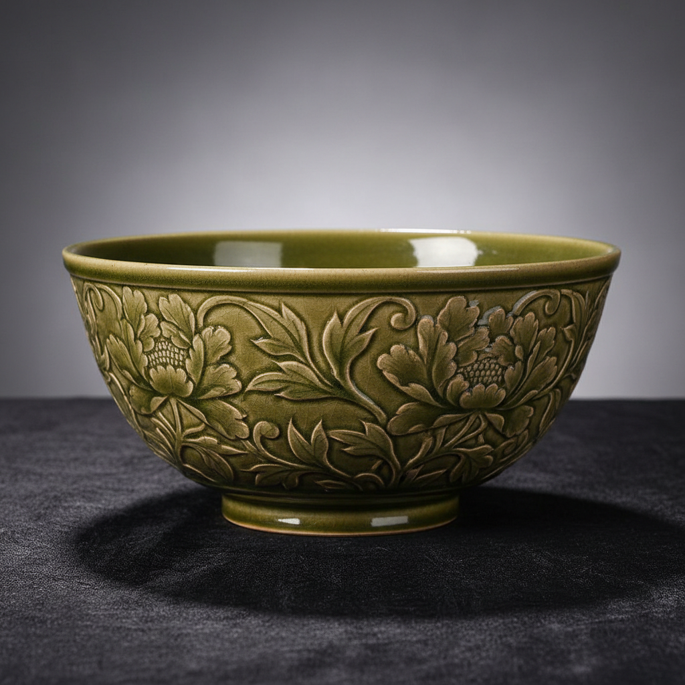

# Yaozhou Ware Art 耀州窑艺术

> "Yaozhou ware is carving elevated to ceramic poetry — olive-green celadon glaze pooling in deeply incised channels to create patterns of extraordinary depth and clarity, each cut revealing the relationship between glaze thickness and color intensity, the Northern Song mastery of knife and kiln working together to produce decoration that seems to float beneath a green glass sea." — Unknown

## 概述

耀州窑艺术（Yaozhou Ware Art）是中国北方最重要的青瓷窑系之一，位于今陕西省铜川市，以其精美的刻花青瓷著称于世。耀州窑的最大特色是在橄榄绿色青釉下进行深刻花装饰——刀法犀利流畅，图案清晰生动，釉色在刻痕深处积聚呈深绿色，在凸起处呈浅绿色，形成强烈的明暗对比和立体效果。

耀州窑艺术的核心要素包括：1）刻花青瓷——深刻花的青瓷装饰；2）橄榄绿釉——温暖的橄榄绿色调；3）刀法犀利——锋利流畅的刻花刀法；4）明暗对比——釉色深浅的明暗效果；5）北方青瓷——北方青瓷的代表；6）题材丰富——花卉动物婴戏等；7）民间活力——充满民间生活气息。

## 核心特征

| 特征 | 描述 |
|------|------|
| 刻花青瓷 | 深刻花的青瓷 |
| 橄榄绿釉 | 温暖橄榄绿色调 |
| 刀法犀利 | 锋利流畅刻花 |
| 明暗对比 | 釉色深浅对比 |
| 北方青瓷 | 北方青瓷代表 |
| 题材丰富 | 花卉动物婴戏 |

## 视觉特征

- **橄榄绿**：温暖的橄榄绿色釉面
- **深刻花**：深刻的花纹图案
- **明暗层次**：釉色深浅的层次感
- **犀利线条**：锋利的刻花线条
- **立体效果**：刻花的立体浮雕感
- **生动图案**：花卉动物的生动表现

## 代表作品

| 作品 | 艺术家/文化 | 年代 | 意义 |
|------|-------------|------|------|
| *耀州窑刻花碗* | 北宋耀州窑 | 北宋 | 刻花的经典 |
| *耀州窑牡丹纹* | 北宋耀州窑 | 北宋 | 牡丹纹的代表 |
| *耀州窑婴戏纹* | 北宋耀州窑 | 北宋 | 婴戏题材 |
| *耀州窑倒流壶* | 耀州窑 | 宋代 | 巧妙的设计 |
| *耀州窑印花* | 金代耀州窑 | 金代 | 印花技法 |

## 历史时间线

| 时期 | 事件 |
|------|------|
| 唐代 | 耀州窑的创烧 |
| 五代 | 耀州窑青瓷的发展 |
| 北宋 | 耀州窑的鼎盛 |
| 金元 | 耀州窑的延续 |
| 当代 | 耀州窑的复兴和研究 |

## 中国语境

耀州窑是中国北方青瓷的最高成就——与南方的龙泉窑并称为中国青瓷的两大高峰。耀州窑的刻花技法达到了极高的艺术水平——其刀法被形容为"刀刀见泥"，每一刀都干净利落，毫不拖泥带水。耀州窑的装饰题材来自北方民间生活——牡丹、莲花、菊花、婴戏、飞鹤等图案充满了生活气息和吉祥寓意。耀州窑的影响范围极广——形成了庞大的"耀州窑系"，河南、甘肃、广东等地都有受其影响的窑口。耀州窑的"倒流壶"是中国古代陶瓷工艺的杰作——利用连通器原理，从壶底注水而从壶嘴倒出，体现了宋代工匠的巧思。

## AI生成概念图

## 与其他风格的关系

- **Celadon** → 青瓷
- **Incised Decoration** → 刻花装饰
- **Northern Kilns** → 北方窑系
- **Longquan** → 龙泉窑
- **Song Dynasty** → 宋代陶瓷
- **Olive Green** → 橄榄绿釉

---

*浮光艺志 | Chronicle of Artistry*
