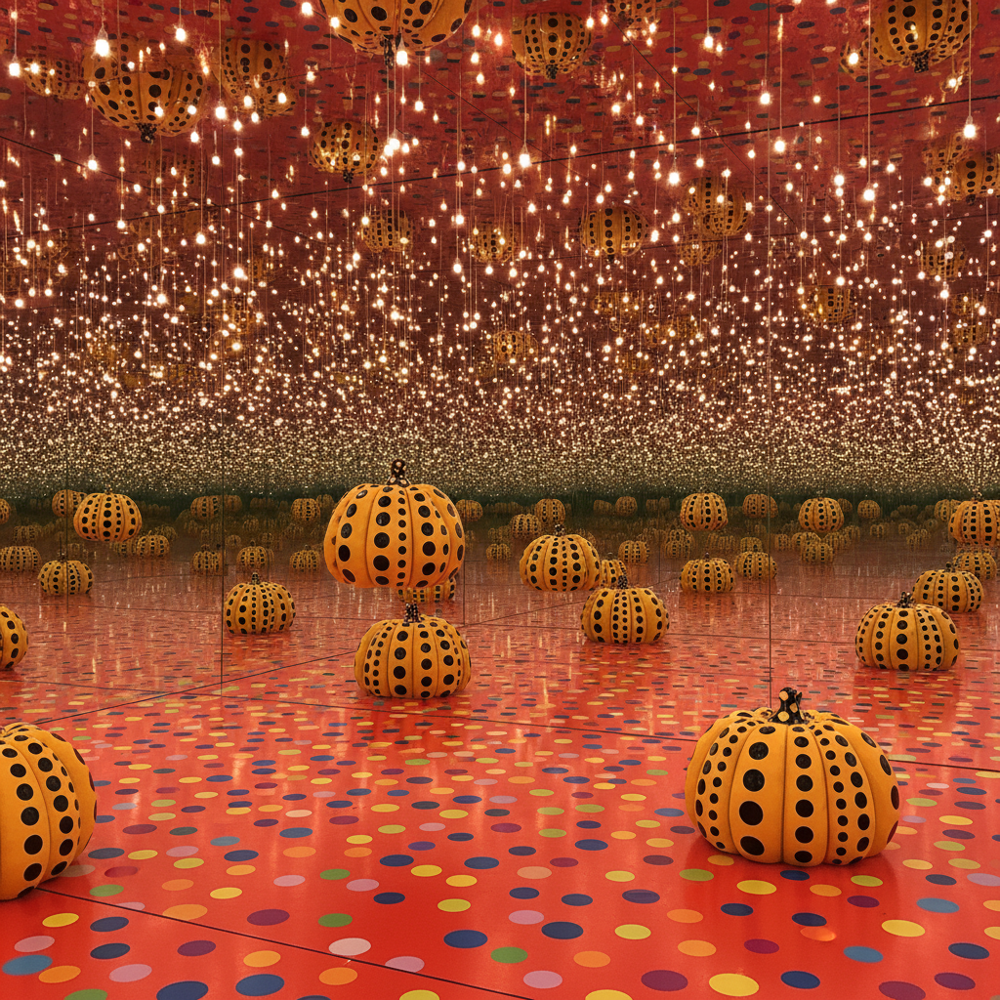

# Yayoi Kusama 草间弥生

> "Our earth is only one polka dot among a million stars in the cosmos." — Yayoi Kusama

## 概述

草间弥生（Yayoi Kusama，1929–）是日本当代艺术家，以无限重复的圆点（polka dots）和镜面无限房间闻名于世。她的创作横跨绘画、雕塑、装置、行为艺术和时尚，用强迫性的重复图案表达自我消融（self-obliteration）的哲学——个体在无限中消失。

## 核心特征

| 特征 | 描述 |
|------|------|
| 无限圆点 | 强迫性重复的波尔卡圆点 |
| 镜面房间 | Infinity Mirror Rooms的沉浸体验 |
| 南瓜 | 标志性的黄色圆点南瓜雕塑 |
| 自我消融 | 个体在无限图案中消失 |
| 网状结构 | Infinity Nets的密集网格 |
| 鲜艳色彩 | 红、黄、粉的强烈视觉冲击 |

## 代表作品

| 作品 | 年代 | 意义 |
|------|------|------|
| *Infinity Mirror Room* | 1965– | 无限空间的沉浸装置 |
| *Infinity Nets* | 1958– | 密集网格的冥想绘画 |
| *Pumpkin* | 1994– | 圆点南瓜的标志雕塑 |
| *Obliteration Room* | 2002– | 参与式圆点装置 |

## AI生成概念图

## 与其他风格的关系

- **Pop Art** → 与沃霍尔同时代的前卫
- **Minimalism** → Infinity Nets的极简重复
- **Psychedelic Art** → 迷幻视觉的日本版本
- **Installation Art** → 沉浸式装置的先驱
