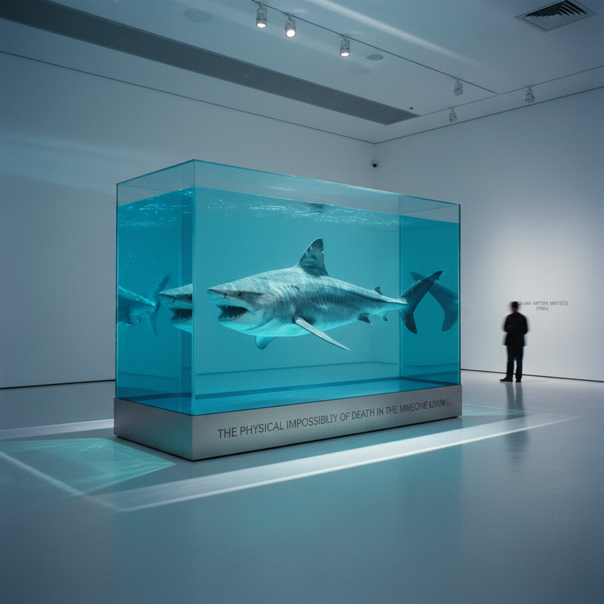

# Young British Artists (YBA) 英国青年艺术家

> "I want to live forever." — Damien Hirst

## 概述

英国青年艺术家（Young British Artists / YBAs）是1990年代英国最具影响力的当代艺术群体，以达米恩·赫斯特（Damien Hirst）和翠西·艾敏（Tracey Emin）为代表。他们以震撼性的材料（死动物、体液、垃圾）、媒体炒作和商业头脑重新定义了当代艺术的边界。

YBA不是一个统一的风格运动，而是一代共享态度的艺术家——他们都毕业于伦敦的艺术学校，都被收藏家查尔斯·萨奇（Charles Saatchi）发掘，都善于利用媒体制造争议。

## 核心特征

| 特征 | 描述 |
|------|------|
| 震撼策略 | 用争议性材料和主题吸引注意 |
| 死亡与身体 | 动物标本、体液、身体痕迹 |
| 日常物品 | 垃圾、床铺、烟头升格为艺术 |
| 媒体操控 | 善于利用小报和电视制造话题 |
| 商业意识 | 艺术家即品牌，作品即商品 |
| 反精英 | 工人阶级背景，拒绝学术腔调 |

## 视觉特征

- **材料**：甲醛、动物尸体、霓虹灯、帐篷、床
- **色彩**：药房般的白色、霓虹色、体液的棕黄
- **空间**：画廊作为剧场——震撼的第一印象
- **尺度**：从亲密（Emin的床）到巨大（Hirst的鲨鱼）
- **质感**：工业化的光滑与肮脏的真实并置
- **态度**：挑衅的、直接的、不道歉的

## 代表作品

| 作品 | 艺术家 | 年代 | 意义 |
|------|--------|------|------|
| *The Physical Impossibility of Death in the Mind of Someone Living* | Damien Hirst | 1991 | 甲醛中的鲨鱼——YBA的标志 |
| *My Bed* | Tracey Emin | 1998 | 未整理的床——私密即公共 |
| *Everyone I Have Ever Slept With* | Tracey Emin | 1995 | 帐篷上缝满名字 |
| *Myra* | Marcus Harvey | 1995 | 用儿童手印拼成杀手肖像 |
| *Self* | Marc Quinn | 1991 | 用自己冷冻血液铸造的头像 |
| *House* | Rachel Whiteread | 1993 | 整栋房屋的混凝土翻模 |

## 历史时间线

| 时期 | 事件 |
|------|------|
| 1988 | "Freeze"展览——Hirst策划，YBA诞生 |
| 1991 | Saatchi开始收藏YBA作品 |
| 1992 | "Young British Artists I"展览在Saatchi Gallery |
| 1995 | "Brilliant!"展览巡回美国 |
| 1997 | "Sensation"展览在Royal Academy——引发全国争议 |
| 1999 | Turner Prize争议高峰（Emin的床） |
| 2004 | Saatchi仓库火灾，大量YBA作品被毁 |
| 2008 | Hirst绕过画廊直接拍卖——艺术市场革命 |

## 子类型

| 子类型 | 特征 |
|--------|------|
| 概念震撼 | Hirst——死亡、药物、商品化 |
| 自传告白 | Emin——极度私密的自我暴露 |
| 雕塑/装置 | Whiteread、Quinn——材料的转化 |
| 绘画 | Chris Ofili、Jenny Saville——回归绘画 |
| 摄影/影像 | Sam Taylor-Johnson、Gillian Wearing |

## 中国语境

YBA对中国当代艺术的影响主要体现在"震撼策略"和商业意识方面。2000年代中国当代艺术市场的爆发式增长中，部分中国艺术家借鉴了YBA的媒体操控和品牌化策略。更深层地说，YBA证明了"来自边缘的年轻人可以颠覆艺术体制"——这对中国的798艺术区和独立艺术空间运动有启发意义。

## 争议与遗产

- **争议**：是深刻的艺术还是空洞的炒作？
- **Sensation展览**：纽约展出时市长朱利安尼威胁撤资
- **商业化**：Hirst成为在世最富有的艺术家——艺术的胜利还是堕落？
- **遗产**：永久改变了当代艺术的媒体关系和市场结构
- **当代回响**：社交媒体时代的"网红艺术"、沉浸式体验展

## AI生成概念图

## 与其他风格的关系

- **Pop Art** → 波普艺术的商业意识和大众文化关注
- **Conceptual Art** → 概念艺术的"观念优先"传统
- **Neo-Expressionism** → 新表现主义的情感直接性
- **Installation Art** → 装置艺术的空间震撼力
- **Relational Aesthetics** → 同时代的不同路径——YBA更个人主义
- **Post-Internet** → 后网络艺术继承了YBA的媒体意识

---

*浮光艺志 | Chronicle of Artistry*
