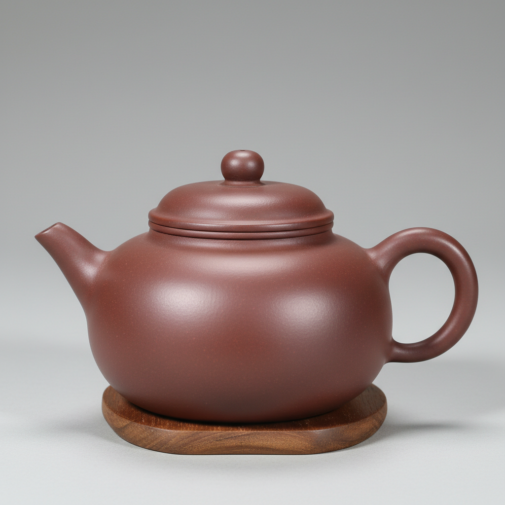

# Yixing Zisha Art 宜兴紫砂艺术

> "Yixing zisha is tea's perfect vessel — unglazed purple clay teapots shaped from the unique mineral-rich earth of Yixing that breathes with the tea it holds, absorbing flavor over decades until the pot itself becomes seasoned, a marriage of function and form where the potter's hand leaves its mark in every curve and the clay's natural color needs no adornment, the most intimate of all ceramic traditions because each pot belongs to one tea and one owner." — Unknown

## 概述

宜兴紫砂艺术（Yixing Zisha Art）是中国江苏省宜兴市独有的一种以紫砂泥制作茶壶和茶具的陶瓷艺术。紫砂壶以其独特的材质、精湛的工艺和深厚的文化内涵著称——紫砂泥是一种含铁量高的特殊陶土，烧成后呈现紫红、暗红、米黄等自然色泽，不施釉而自有温润光泽。紫砂壶是中国茶文化的核心器物——其双重气孔结构使茶壶具有良好的透气性和保温性，被誉为"泡茶最佳器具"。

紫砂艺术的核心要素包括：1）紫砂泥——宜兴独有的特殊陶土；2）不施釉——素面朝天的自然美；3）全手工——传统全手工成型；4）茶文化——与茶道密不可分；5）文人参与——文人设计和题刻；6）养壶文化——越用越美的养壶传统；7）造型丰富——几何、自然、筋纹等造型。

## 核心特征

| 特征 | 描述 |
|------|------|
| 紫砂泥 | 宜兴独有特殊陶土 |
| 不施釉 | 素面朝天自然美 |
| 全手工 | 传统全手工成型 |
| 茶文化 | 与茶道密不可分 |
| 文人参与 | 文人设计和题刻 |
| 养壶文化 | 越用越美的传统 |

## 视觉特征

- **自然色泽**：紫红、暗红、米黄等
- **素面无釉**：不施釉的自然质感
- **造型多样**：圆器、方器、筋纹器等
- **手工痕迹**：手工成型的温度
- **比例和谐**：壶身各部分的和谐比例
- **温润光泽**：使用后的温润包浆

## 代表作品

| 作品 | 艺术家/文化 | 年代 | 意义 |
|------|-------------|------|------|
| *供春壶* | 供春 | 明代正德 | 紫砂壶的鼻祖 |
| *曼生十八式* | 陈曼生/杨彭年 | 清代嘉庆 | 文人壶的典范 |
| *时大彬壶* | 时大彬 | 明代万历 | 紫砂壶的宗师 |
| *顾景舟壶* | 顾景舟 | 当代 | 当代紫砂泰斗 |
| *石瓢壶* | 各代名家 | 各时期 | 经典壶形 |

## 历史时间线

| 时期 | 事件 |
|------|------|
| 明代正德 | 供春创制紫砂壶 |
| 明代万历 | 时大彬确立紫砂工艺 |
| 清代 | 文人壶的兴盛 |
| 民国 | 紫砂的近代发展 |
| 当代 | 紫砂艺术的繁荣与收藏热 |

## 中国语境

紫砂壶是中国陶瓷艺术中最具文化深度的品类之一。宜兴紫砂的历史可追溯到明代正德年间——传说书童供春模仿银杏树瘤的形态制作了第一把紫砂壶。紫砂壶的发展与中国茶文化的演变密切相关——明代废除团茶改用散茶后，紫砂壶成为泡茶的理想器具。清代文人的参与使紫砂壶从实用器具升华为艺术品——陈曼生与杨彭年合作的"曼生壶"开创了文人壶的传统，将诗书画印融入壶艺。当代紫砂大师顾景舟被誉为"壶艺泰斗"——其作品在拍卖市场上屡创天价。紫砂壶的"养壶"文化是中国独有的——通过长期使用和保养，壶面会形成温润的包浆，如同玉器般光泽，这种"人养壶、壶养人"的理念体现了中国人与器物之间的深厚情感。

## AI生成概念图

## 与其他风格的关系

- **Tea Culture** → 茶文化
- **Literati Art** → 文人艺术
- **Unglazed Ceramics** → 无釉陶瓷
- **Stoneware** → 炻器
- **Chinese Calligraphy** → 中国书法
- **Functional Ceramics** → 功能陶瓷

---

*浮光艺志 | Chronicle of Artistry*
