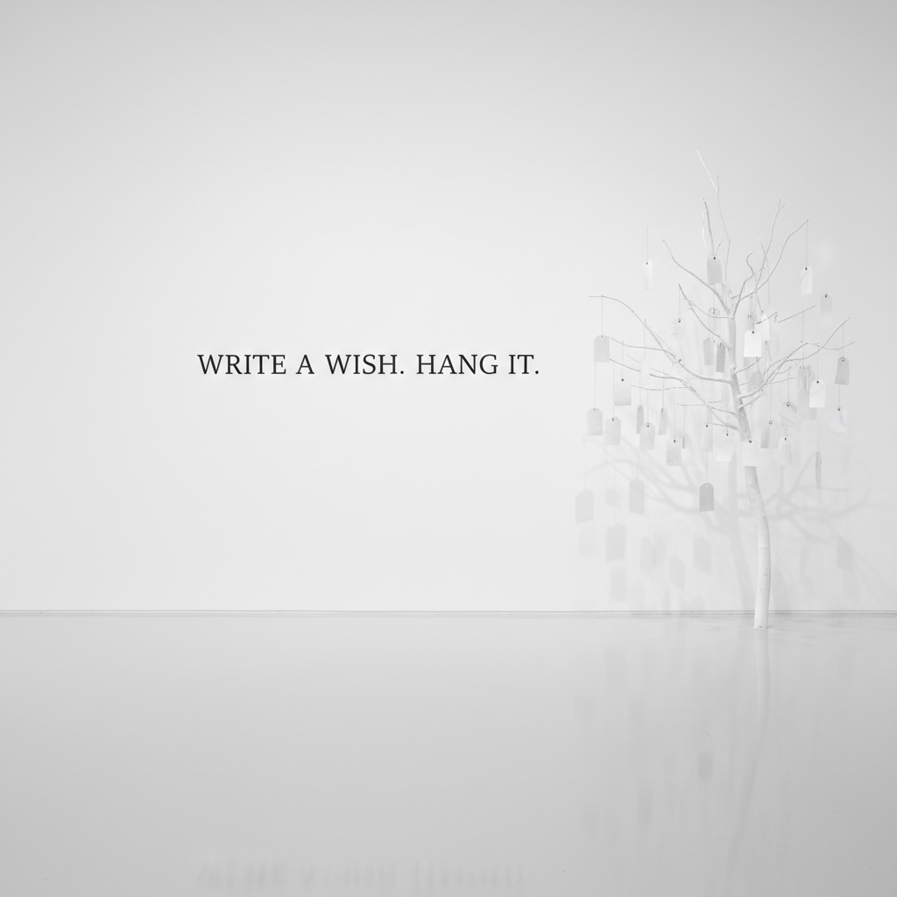

# Yoko Ono 小野洋子

> **流派**: 激浪派 (Fluxus) · 观念艺术 · 行为艺术  
> **时期**: 1933–至今 日本/美国  
> **关键词**: 指令艺术、互动参与、和平运动、跨媒介

## 概述

小野洋子是激浪派运动的核心人物之一，也是观念艺术和行为艺术的先驱。她的作品以"指令"(Instruction)为核心——用简短的文字邀请观众完成一个想象或行动，从而将艺术从物质对象解放为精神体验。她的创作横跨音乐、电影、装置和社会行动。

## 视觉特征

- **文字指令**: 简洁诗意的文本作为艺术作品本身
- **白色极简**: 大量使用白色空间和纯净材料
- **互动参与**: 观众必须完成作品（踩、剪、想象）
- **和平符号**: 反战与和平的视觉语言贯穿始终
- **跨媒介**: 绘画、雕塑、电影、音乐无界限

## 代表作品

- 《切片》(Cut Piece, 1964) — 行为艺术
- 《葡萄柚》(Grapefruit, 1964) — 指令艺术书
- 《天花板画/是画》(Ceiling Painting/Yes Painting, 1966)
- 《许愿树》(Wish Tree) 系列
- 与约翰·列侬的"床上和平"(Bed-In, 1969)

## 历史影响

小野洋子证明了艺术可以仅由一个想法构成，不需要任何物质载体。她的指令艺术预示了后来的互动艺术、社会实践艺术和网络艺术。她也是将东方禅宗思维引入西方前卫艺术的关键桥梁。

## 相关风格

- [Fluxus 激浪派](fluxus.md)
- [Conceptual Art 观念艺术](conceptual-art.md)
- [Performance Art 行为艺术](performance-art.md)
