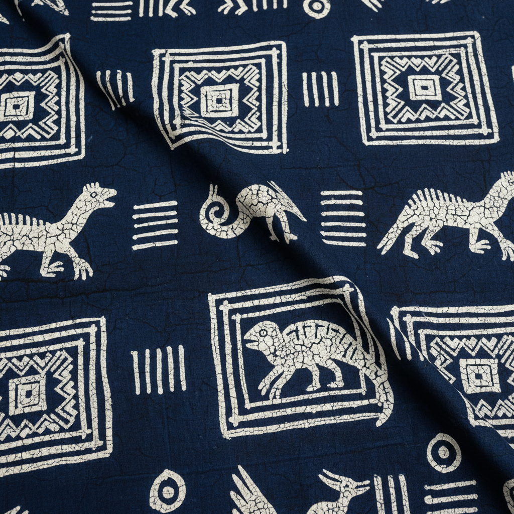

# Yoruba Adire 约鲁巴蓝染布 | Adire

> **"靛蓝是力量的颜色——约鲁巴女性用淀粉和蜡在布上书写神话。"**

## 概述

Adire（约鲁巴蓝染布）是尼日利亚西南部约鲁巴族（Yorùbá）女性创造的传统靛蓝防染纺织艺术。"Adire"在约鲁巴语中意为"绑和染"（àdìrẹ），涵盖多种防染技法——扎染（Adire Oniko）、淀粉糊防染（Adire Eleko）和蜡染。这种工艺有千年以上的历史，20世纪初在阿贝奥库塔（Abeokuta）和伊巴丹（Ibadan）达到巅峰，女性染工既是艺术家也是企业家。靛蓝色在约鲁巴文化中象征保护和力量。

## 主要技法

| 技法 | 约鲁巴名 | 特征 |
|------|----------|------|
| 扎染 | Adire Oniko | 用线绑扎布料后染色 |
| 淀粉糊防染 | Adire Eleko | 用木薯淀粉糊手绘图案 |
| 缝扎 | Adire Alabere | 缝合后拉紧防染 |
| 蜡染 | Adire Batik | 用蜡防染（较晚引入） |

## 核心特征

- **靛蓝色**：从靛蓝植物叶提取的天然染料
- **防染技法**：通过阻止染料渗透创造图案
- **女性主导**：传统上由约鲁巴女性完成
- **几何与具象**：抽象几何和神话动物图案
- **白蓝对比**：未染部分为白色，形成蓝白图案
- **多层蓝色**：通过反复浸染获得不同深浅的蓝

## 常见图案

| 图案 | 含义 |
|------|------|
| Ibadandun | "伊巴丹是甜的"——城市自豪 |
| Olokun | 海洋女神——保护 |
| 几何格子 | 宇宙秩序 |
| 鸟和动物 | 神话传说 |
| 梳子图案 | 美丽和身份 |

## 视觉特征

- 深浅不一的靛蓝色调
- 白色图案在蓝色底上
- 精细的手绘淀粉糊线条
- 几何和有机图案的结合
- 布料的自然褶皱质感
- 蓝白的强烈对比

## 与其他风格的关系

| 风格 | 关系 |
|------|------|
| 日本蓝染（藍染） | 共享靛蓝染色传统 |
| Bògòlanfini泥染布 | 共享西非纺织传统 |
| 印尼蜡染 Batik | 共享蜡染技法 |
| 中国蓝印花布 | 共享防染印花传统 |
| 当代非洲时装 | Adire复兴于当代设计 |

## 概念图

---

*浮光艺志 | Chronicle of Artistry*
