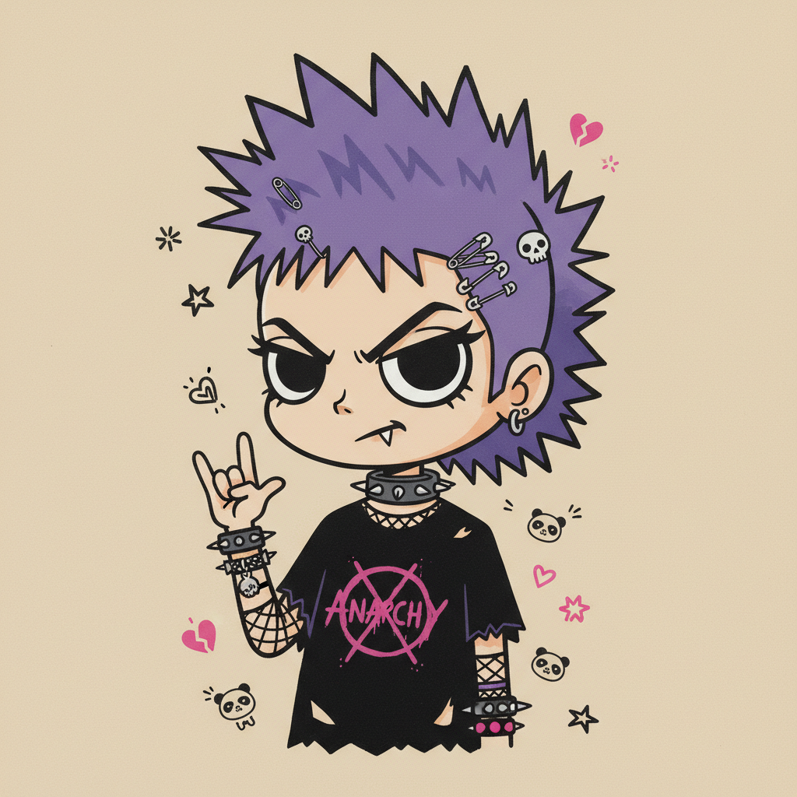

# Yoshitomo Nara 奈良美智

> **时期：** 1959–至今  
> **关键词：** 大眼女孩、朋克精神、孤独童年、日本新波普

## 概述

Yoshitomo Nara 是日本艺术家，以画大头大眼、表情倔强的小女孩闻名。这些看似可爱的角色往往带着叛逆的眼神、拿着小刀或香烟——融合了日本卡哇伊文化与朋克摇滚的反叛精神，表达一种孤独而不妥协的童年记忆。

## 风格特征

- **大头娃娃**：不成比例的大头和大眼睛，简化的身体
- **叛逆表情**：斜眼、撇嘴、冷漠或愤怒的面部表情
- **柔和色调**：奶油色、淡粉、浅绿等温柔的背景色
- **朋克元素**：绷带、小刀、香烟等反叛符号
- **孤独感**：单独的人物漂浮在空白背景中

## 代表作品

- *Knife Behind Back*（2000）
- *Sleepless Night (Sitting)*（2007）
- *Miss Forest*（2016）
- *Midnight Truth*（2017）

## 概念图

