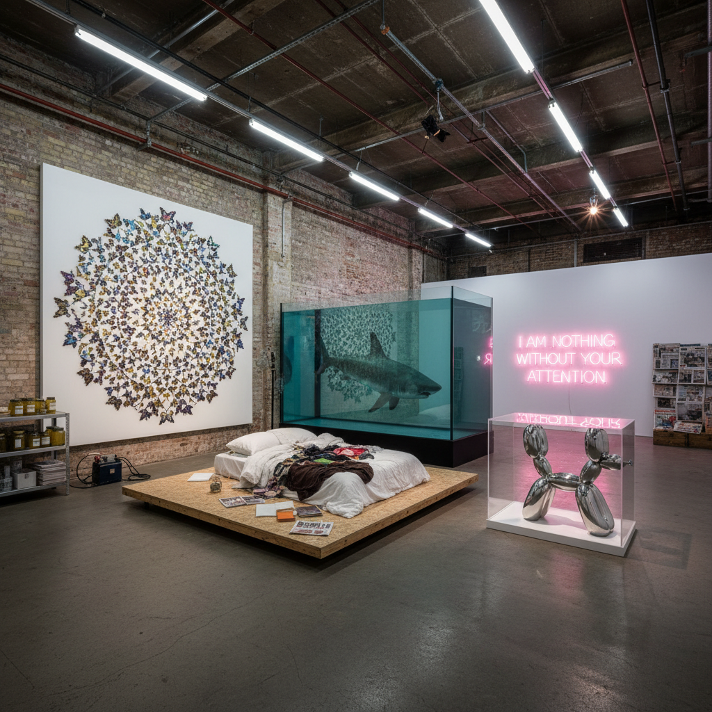

# Young British Artists 英国青年艺术家

> "The YBAs were art's last great gang — brash, entrepreneurial, media-savvy provocateurs who turned the London art world from a genteel backwater into a global spectacle, who understood that in the age of tabloid culture the artwork was inseparable from the scandal, that a shark in formaldehyde was simultaneously a meditation on mortality and a masterpiece of branding, that an unmade bed could be both confessional vulnerability and calculated outrage, and that the line between genius and charlatan was exactly where the most interesting art happened." — Unknown

## 概述

英国青年艺术家（Young British Artists，简称YBAs）是1990年代英国最具影响力的艺术运动，核心成员包括达米恩·赫斯特（Damien Hirst）、翠西·艾敏（Tracey Emin）、查普曼兄弟（Jake and Dinos Chapman）、马克·奎恩（Marc Quinn）、萨拉·卢卡斯（Sarah Lucas）等。YBAs以其挑衅性、媒体意识和企业家精神著称，彻底改变了英国当代艺术的面貌。

YBAs的崛起始于1988年达米恩·赫斯特在伦敦码头区组织的"Freeze"展览，随后得到收藏家查尔斯·萨奇（Charles Saatchi）的大力支持。1997年的"Sensation"展览在皇家艺术学院引发巨大争议，使YBAs成为全球文化现象。YBAs的作品涉及死亡、性、身体、身份和消费文化，使用非传统材料（福尔马林、体液、日常物品），并善于利用媒体争议来提升知名度。

## 核心特征

| 特征 | 描述 |
|------|------|
| 挑衅 | 挑衅和争议 |
| 媒体 | 媒体意识 |
| 死亡 | 死亡和身体 |
| 日常 | 日常物品的转化 |
| 企业 | 企业家精神 |
| 身份 | 身份和自传 |

## 视觉特征

- **标本**：动物标本和福尔马林
- **身体**：身体和体液
- **日常**：日常物品的艺术化
- **规模**：大规模的装置
- **争议**：争议性的图像
- **品牌**：艺术家作为品牌

## 代表作品

| 作品 | 艺术家 | 年代 | 意义 |
|------|--------|------|------|
| *The Physical Impossibility of Death* | Damien Hirst | 1991 | 福尔马林中的鲨鱼 |
| *My Bed* | Tracey Emin | 1998 | 艾敏的床 |
| *Self* | Marc Quinn | 1991 | 血液自塑像 |
| *Great Deeds Against the Dead* | Chapman Brothers | 1994 | 查普曼兄弟的人体模型 |
| *Au Naturel* | Sarah Lucas | 1994 | 卢卡斯的床垫雕塑 |

## 历史时间线

| 时期 | 事件 |
|------|------|
| 1988 | "Freeze"展览 |
| 1992 | 萨奇画廊的"Young British Artists"展 |
| 1995 | 赫斯特获特纳奖 |
| 1997 | "Sensation"展览 |
| 1999 | 艾敏的《我的床》入围特纳奖 |

## 中国语境

YBAs对中国当代艺术有重要影响，特别是在艺术市场化和媒体策略方面。中国的一些当代艺术家借鉴了YBAs的挑衅策略和企业家精神——将艺术家塑造为品牌、利用争议获取关注、以及将日常物品和身体经验转化为艺术。中国的"后感性"艺术群体在1990年代末的一些展览（如"对伤害的迷恋"）与YBAs有类似的挑衅性。达米恩·赫斯特在中国有很高的知名度，其商业成功模式也影响了中国艺术市场的发展。中国当代艺术的全球化进程中，YBAs提供了一个重要的参照——如何在全球艺术市场中建立影响力。

## AI生成概念图

## 与其他风格的关系

- **Conceptual Art** → 概念艺术
- **Installation Art** → 装置艺术
- **Pop Art** → 波普艺术
- **Shock Art** → 震撼艺术
- **Neo-Expressionism** → 新表现主义
- **Post-Punk** → 后朋克文化

---

*浮光艺志 | Chronicle of Artistry*
