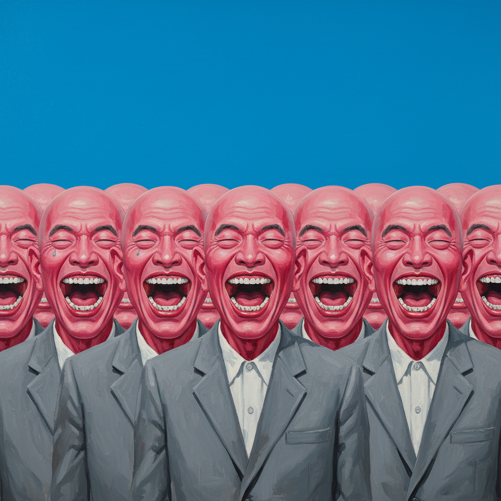

# Yue Minjun 岳敏君

> **流派**: 玩世现实主义 · 中国当代艺术  
> **时期**: 1962–至今 中国  
> **关键词**: 大笑自画像、玩世现实主义、粉红色、集体荒诞

## 概述

岳敏君以标志性的"大笑人"形象闻名全球——画面中的人物全部是他自己的自画像变体，张大嘴巴露出整齐的牙齿，发出夸张而空洞的笑声。这种笑既不是快乐也不是讽刺，而是一种面对荒诞现实时的本能反应——当你无法改变什么的时候，你只能笑。

## 视觉特征

- **大笑面孔**: 所有人物都是同一张夸张大笑的脸
- **粉红肤色**: 标志性的粉红色皮肤
- **重复排列**: 相同人物反复出现，形成集体感
- **鲜艳色彩**: 明亮的蓝天、绿草、红色背景
- **经典挪用**: 将自己的笑脸置入名画或历史场景

## 代表作品

- 《处决》(Execution, 1995) — 挪用马奈和戈雅
- 《自由引导人民》(2005) — 挪用德拉克洛瓦
- 《太阳》系列
- 《迷宫》系列雕塑

## 历史影响

岳敏君是"玩世现实主义"(Cynical Realism)的代表人物，这一运动以黑色幽默回应1990年代中国社会的快速商业化和精神空虚。他的大笑形象成为中国当代艺术最具辨识度的视觉符号之一。

## 相关风格

- [Zhang Xiaogang 张晓刚](zhang-xiaogang.md)
- [Zeng Fanzhi 曾梵志](zeng-fanzhi.md)
- [Cynical Realism 玩世现实主义](cynical-realism.md)
