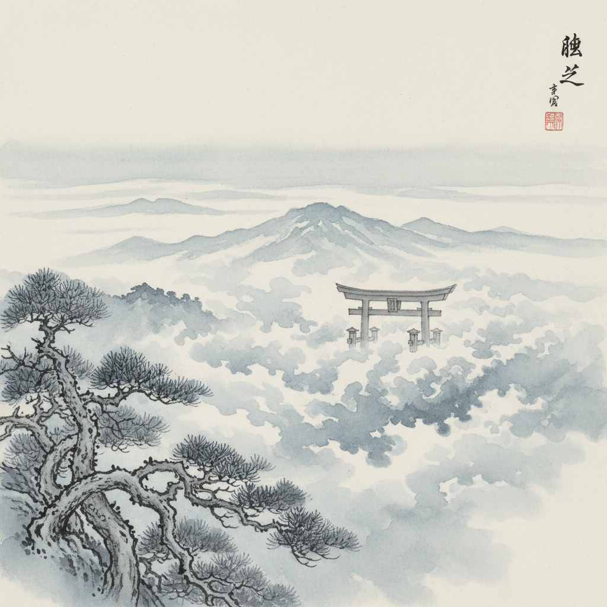

# Yūgen 幽玄



> **"月色朦胧，薄雾笼罩——美在于不可言说的深远暗示。"**

## 概述

幽玄（ゆうげん / Yūgen）是日本中世美学的核心概念，意为"幽深玄妙"——一种隐微、朦胧、不可言喻的深远之美。它追求的不是明确的展示，而是暗示、余韵和无限延展的想象空间。

## 时代背景

| 维度 | 内容 |
|------|------|
| 起源 | 中国老庄哲学"玄"的概念东传日本 |
| 成熟 | 日本中世（�的�的仓~室町时代，12–16世纪） |
| 理论化 | 藤原俊成（和歌）、世阿弥（能剧） |
| 哲学根基 | 老庄思想 + 禅宗 + 神道 |

## 视觉特征

- **薄明与阴翳**：非明非暗的中间地带
- **雾霭朦胧**：山间薄雾、月夜云影
- **黑与深色**：深邃不透光的玄色
- **极简留白**：大面积空白暗示无限
- **模糊边界**：形体消融于背景之中
- **静谧氛围**：时间仿佛停止流动

## 核心理念

### 幽玄的三重含义

1. **隐微**（幽）：美被某种程度地遮蔽、不完全显露
2. **深远**（玄）：暗示着无限深度的奥妙
3. **余韵**：言有尽而意无穷的延展感

### 世阿弥的"花"论

能剧大师世阿弥将幽玄比作"花"——花之美不在于花本身，而在于观者心中被唤起的感动。真正的艺术应如花般自然绽放，不露痕迹。

## 艺术表现

| 领域 | 幽玄体现 |
|------|------|
| 和歌 | 藤原俊成"余情"说：歌外有歌 |
| 能剧 | 面具下的无表情即是万千表情 |
| 水墨画 | 留白处即是山水最深远处 |
| 枯山水 | 白砂代水，石代山，以无示有 |
| 建筑 | 谷崎润一郎《阴翳礼赞》中的暗室美学 |

## 与其他美学的关系

```
中国老庄"玄" ──→ 日本"幽玄"(中世)
                        ↓
物哀(感知无常) ←→ 幽玄(暗示深远) ←→ 侘寂(枯淡简素)
                        ↓
              能剧 · 水墨画 · 枯山水
                        ↓
              当代：极简主义 · 环境艺术
```

## 当代影响

- 安藤忠雄建筑中的光影与混凝土
- 杉本博司摄影的极简海景
- 日本环境音乐（Ambient）的空间感
- 游戏《风之旅人》《ICO》的视觉叙事
- 极简主义设计中"少即是深"的哲学

## 多语言名称

| 语言 | 名称 |
|------|------|
| 日语 | 幽玄（ゆうげん） |
| 英语 | Yūgen / Profound Grace |
| 中文 | 幽玄 |
| 韩语 | 유현 |

## 延伸阅读

- 大西克礼《幽玄·物哀·寂》
- 世阿弥《風姿花伝》
- 谷崎润一郎《阴翳礼赞》

---

*最后更新：2026-07-26*
