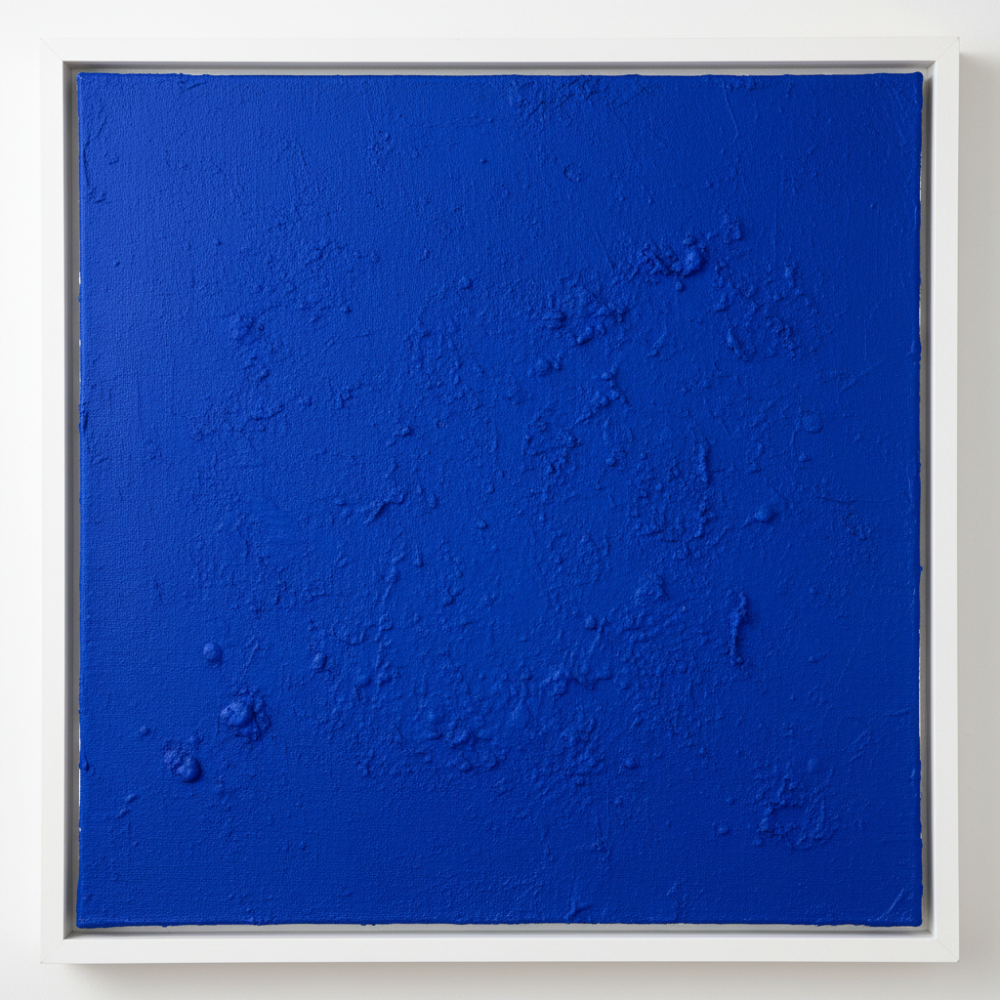

# Yves Klein 伊夫·克莱因

> **流派**: 新现实主义 · 单色画 · 行为艺术  
> **时期**: 1928–1962 法国  
> **关键词**: 国际克莱因蓝、单色画、人体测量、虚空

## 概述

伊夫·克莱因是20世纪最具传奇色彩的艺术家之一。他发明了专属的"国际克莱因蓝"(IKB)——一种极度饱和的群青蓝，并用它创作了大量单色画。他将裸体模特涂满蓝色颜料在画布上印出"人体测量"，举办"虚空"展览（空无一物的画廊），甚至将黄金投入塞纳河作为艺术交易。

## 视觉特征

- **国际克莱因蓝**: 极度饱和的深蓝色，几乎有物质感
- **纯粹单色**: 整幅画面只有一种颜色，无任何图像
- **人体印痕**: 女性身体蘸蓝色颜料在画布上留下的痕迹
- **金色与火焰**: 后期使用金箔和火焰喷枪
- **虚空美学**: 空白、缺席本身即为作品

## 代表作品

- IKB系列单色画 (1957–1962)
- 《人体测量》(Anthropometries) 系列
- 《虚空》(Le Vide, 1958) — 空画廊展览
- 《跃入虚空》(Leap into the Void, 1960) — 摄影
- 火焰画 (Fire Paintings)

## 历史影响

克莱因在短短34年的生命中重新定义了艺术的边界。他证明了颜色本身可以是一件作品，空无可以是一场展览，身体可以是画笔。他是极简主义、行为艺术和观念艺术的重要先驱。

## 相关风格

- [Nouveau Réalisme 新现实主义](nouveau-realisme.md)
- [Minimalism 极简主义](minimalism.md)
- [Monochrome Painting 单色画](monochrome-painting.md)
