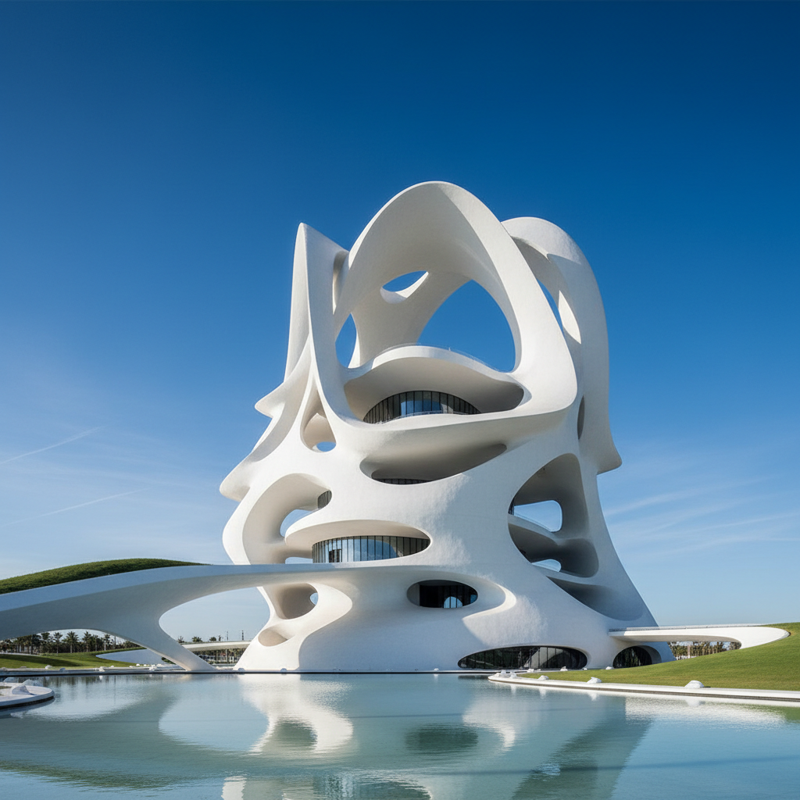

# Zaha Hadid 扎哈·哈迪德

> **时期：** 1950–2016  
> **关键词：** 参数化建筑、流动曲线、解构主义、未来主义形态

## 概述

Zaha Hadid 是伊拉克裔英国建筑师，首位获得普利兹克奖的女性。她以激进的流动曲线和参数化设计闻名——建筑如同凝固的液体或外星飞船降落在城市中，打破了直角和重力的常规，将建筑推向雕塑和景观的边界。

## 风格特征

- **流动曲线**：没有直角，所有表面连续流动
- **参数化设计**：计算机算法生成的复杂几何形态
- **悬浮感**：建筑似乎脱离地面，挑战重力
- **白色与混凝土**：大面积白色表面和清水混凝土
- **内外连续**：室内外空间无缝过渡

## 代表作品

- *广州大剧院*（2010）
- *伦敦水上运动中心*（2012）
- *阿塞拜疆海达尔·阿利耶夫文化中心*（2012）
- *北京大兴国际机场*（2019）

## 概念图

