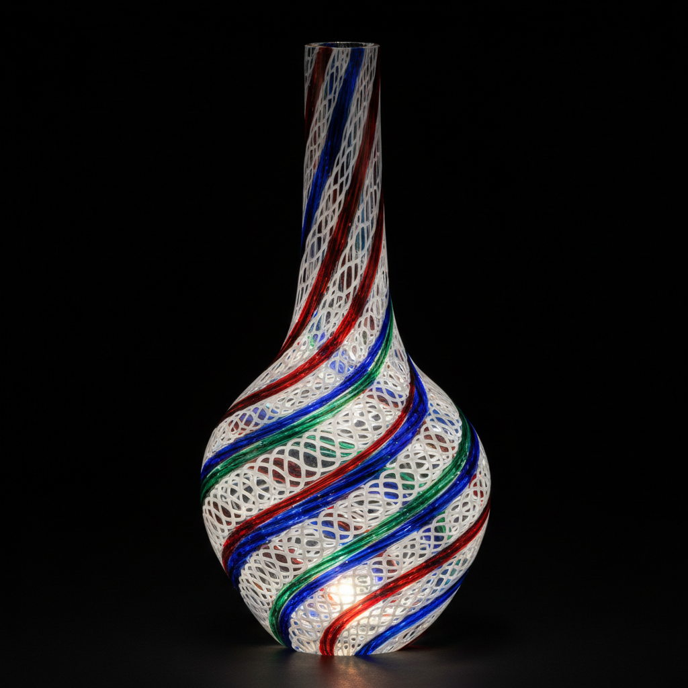

# Zanfirico Art 赞菲里科玻璃艺术

> "Zanfirico is lace frozen in glass — twisted ribbons of white or colored glass are embedded within a clear matrix, spiraling through the transparent walls of a vessel like threads of spun sugar caught in amber, creating patterns of breathtaking delicacy that recall the finest Venetian lace translated into a medium of light and fire." — Unknown

## 概述

赞菲里科玻璃艺术（Zanfirico Art）是一种威尼斯穆拉诺岛的传统玻璃技法——将扭曲的彩色玻璃丝（通常为白色或多色）嵌入透明玻璃基体中，形成螺旋状的蕾丝般图案。赞菲里科是filigrana（玻璃丝装饰）技法家族中最复杂的一种，以其精美的扭曲螺旋图案和极高的技术难度著称。

赞菲里科玻璃艺术的实践包括：1）玻璃棒制作——制作含有彩色丝线的玻璃棒；2）扭曲——将玻璃棒扭曲形成螺旋；3）排列——将多根扭曲棒排列在模具中；4）吹制——将排列好的棒加热融合并吹制成型；5）图案控制——控制螺旋的方向和密度；6）透明基体——在透明玻璃中嵌入丝线；7）当代赞菲里科——将传统技法与现代设计结合的创作。

## 核心特征

| 特征 | 描述 |
|------|------|
| 螺旋 | 扭曲的螺旋图案 |
| 丝线 | 嵌入的彩色玻璃丝 |
| 透明 | 透明基体中的图案 |
| 蕾丝 | 蕾丝般的精美效果 |
| 威尼斯 | 威尼斯穆拉诺传统 |
| 精密 | 极高的技术难度 |

## 视觉特征

- **螺旋**：优美的螺旋线条
- **透明**：透明玻璃中的丝线
- **精细**：极其精细的线条
- **蕾丝**：蕾丝般的轻盈感
- **光影**：光线穿过时的美丽效果
- **优雅**：优雅精致的整体感

## 代表作品

| 作品 | 艺术家/文化 | 年代 | 意义 |
|------|-------------|------|------|
| *Murano zanfirico goblets* | 意大利 | 16世纪起 | 穆拉诺赞菲里科高脚杯 |
| *Venetian lattimo vessels* | 意大利 | 16-18世纪 | 威尼斯乳白玻璃器 |
| *Lino Tagliapietra works* | 意大利 | 当代 | 利诺·塔利亚皮耶特拉作品 |
| *Dante Marioni vessels* | 美国 | 当代 | 但丁·马里奥尼器皿 |
| *Contemporary zanfirico* | 国际 | 当代 | 当代赞菲里科 |

## 历史时间线

| 时期 | 事件 |
|------|------|
| 16世纪 | 赞菲里科在穆拉诺岛发展 |
| 17-18世纪 | 威尼斯玻璃的黄金时代 |
| 19世纪 | 技法的衰落和复兴 |
| 20世纪 | 工作室玻璃运动的传播 |
| 当代 | 全球玻璃艺术家的实践 |

## 中国语境

赞菲里科玻璃与中国的传统玻璃工艺有一定的关联。中国的套料玻璃——虽然技法不同但有类似的多层玻璃理念。中国当代的玻璃艺术家——有一些学习和实践赞菲里科技法。中国的玻璃艺术教育中，赞菲里科作为威尼斯玻璃的重要技法——在相关课程中介绍。中国的工艺美术展览中，赞菲里科风格的作品——偶尔出现在国际交流展中。中国的玻璃收藏界——对威尼斯赞菲里科玻璃有一定的了解和欣赏。

## AI生成概念图

## 与其他风格的关系

- **Filigrana** → 玻璃丝装饰
- **Murrine** → 穆里尼玻璃
- **Murano Glass** → 穆拉诺玻璃
- **Latticino** → 乳白丝玻璃
- **Venetian Glass** → 威尼斯玻璃
- **Studio Glass** → 工作室玻璃

---

*浮光艺志 | Chronicle of Artistry*
