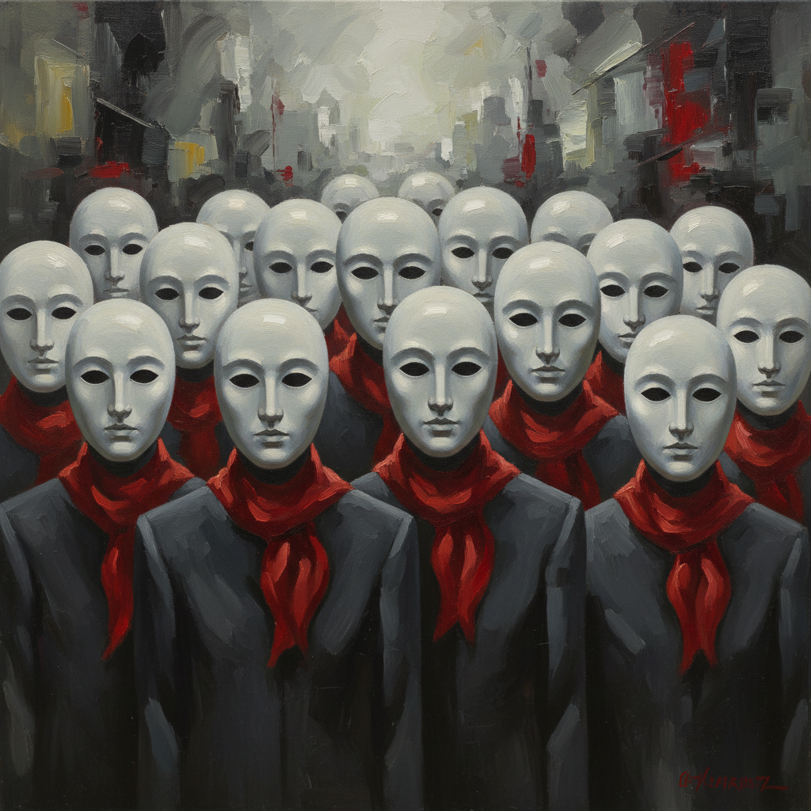

# Zeng Fanzhi 曾梵志

> **流派**: 中国当代艺术 · 表现主义  
> **时期**: 1964–至今 中国  
> **关键词**: 面具系列、肉联厂、乱笔风景、身份焦虑

## 概述

曾梵志是中国当代艺术最重要的画家之一。他的创作经历了几个鲜明阶段：早期的"协和医院"和"肉联厂"系列以表现主义手法描绘肉体的脆弱；中期的"面具"系列用戴白色面具的都市人物揭示社会关系的虚伪；近期的"乱笔"风景则以狂暴的线条重新诠释中国山水传统。

## 视觉特征

- **白色面具**: 人物戴着统一的白色面具，只露出眼睛
- **红色领巾**: 面具系列中常出现的红领巾元素
- **乱笔线条**: 后期作品中密集交织的线条覆盖画面
- **肉色调**: 早期作品中大量的粉红肉色
- **大尺幅**: 作品通常超过2米

## 代表作品

- 《面具系列》(1994–2004)
- 《最后的晚餐》(2001) — 拍卖价1.8亿港元
- 《协和医院》系列 (1992)
- 《乱笔风景》系列 (2006–)

## 历史影响

曾梵志的"面具"系列成为描述中国1990年代社会转型期人际关系异化的经典图像。他证明了中国当代绑画可以同时具有市场价值和批判深度。

## 相关风格

- [Zhang Xiaogang 张晓刚](zhang-xiaogang.md)
- [Yue Minjun 岳敏君](yue-minjun.md)
- [Neo-Expressionism 新表现主义](neo-expressionism.md)
