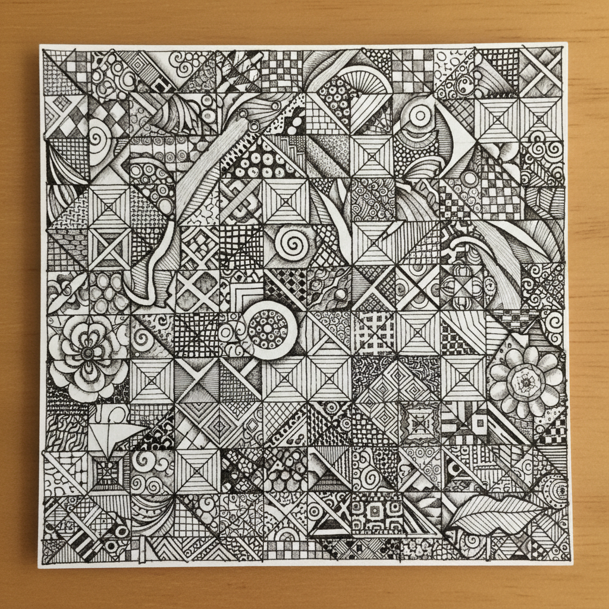

# Zentangle 禅绕画 | Zentangle®

> **"一笔一画的冥想——用重复的结构化图案填满空间，让心灵归于平静。"**

## 概述

禅绕画（Zentangle®）是2004年由美国书法家Maria Thomas和僧侣Rick Roberts创立的结构化绘画方法。"Zen"取自禅宗的专注冥想，"tangle"意为缠绕的图案。禅绕画的核心理念是：通过绘制重复的、结构化的图案（称为"tangle"），进入一种类似冥想的专注状态。每一个tangle都有固定的步骤，但组合方式无限。禅绕画强调"没有错误"——每一笔都是有意的，每一个"意外"都可以变成新的可能。

## 核心原则

| 原则 | 含义 |
|------|------|
| 无橡皮擦 | 没有错误，只有机会 |
| 无方向 | 可以任意旋转 |
| 一笔一画 | 专注当下的每一笔 |
| 结构化 | 每个tangle有固定步骤 |
| 无计划 | 不预先设计整体 |
| 感恩 | 完成后欣赏和感恩 |

## 核心特征

- **黑白为主**：传统用黑色针管笔在白纸上
- **8.9cm方砖**：标准尺寸的方形纸砖
- **重复图案**：结构化的重复tangle
- **无需美术基础**：人人可学
- **冥想性**：绘画过程即冥想
- **抽象**：非具象的图案组合

## 经典Tangle图案

| 图案名 | 特征 |
|------|------|
| Crescent Moon | 月牙形重复 |
| Hollibaugh | 交叉带状 |
| Florz | 棋盘格变体 |
| Paradox | 螺旋三角 |
| Mooka | 有机藤蔓 |
| Tipple | 圆形气泡 |

## 视觉特征

- 黑白的高对比度
- 精细的重复图案
- 有机与几何的混合
- 密集的图案填充
- 阴影增加立体感
- 冥想般的视觉节奏

## 与其他风格的关系

| 风格 | 关系 |
|------|------|
| 曼陀罗 Mandala | 共享冥想和对称 |
| Doodle Art | 共享即兴绘画传统 |
| Islamic Geometry | 共享重复几何美学 |
| Celtic Knotwork | 共享缠绕图案 |
| 当代正念艺术 | Zentangle的文化影响 |

## 概念图

---

*浮光艺志 | Chronicle of Artistry*
