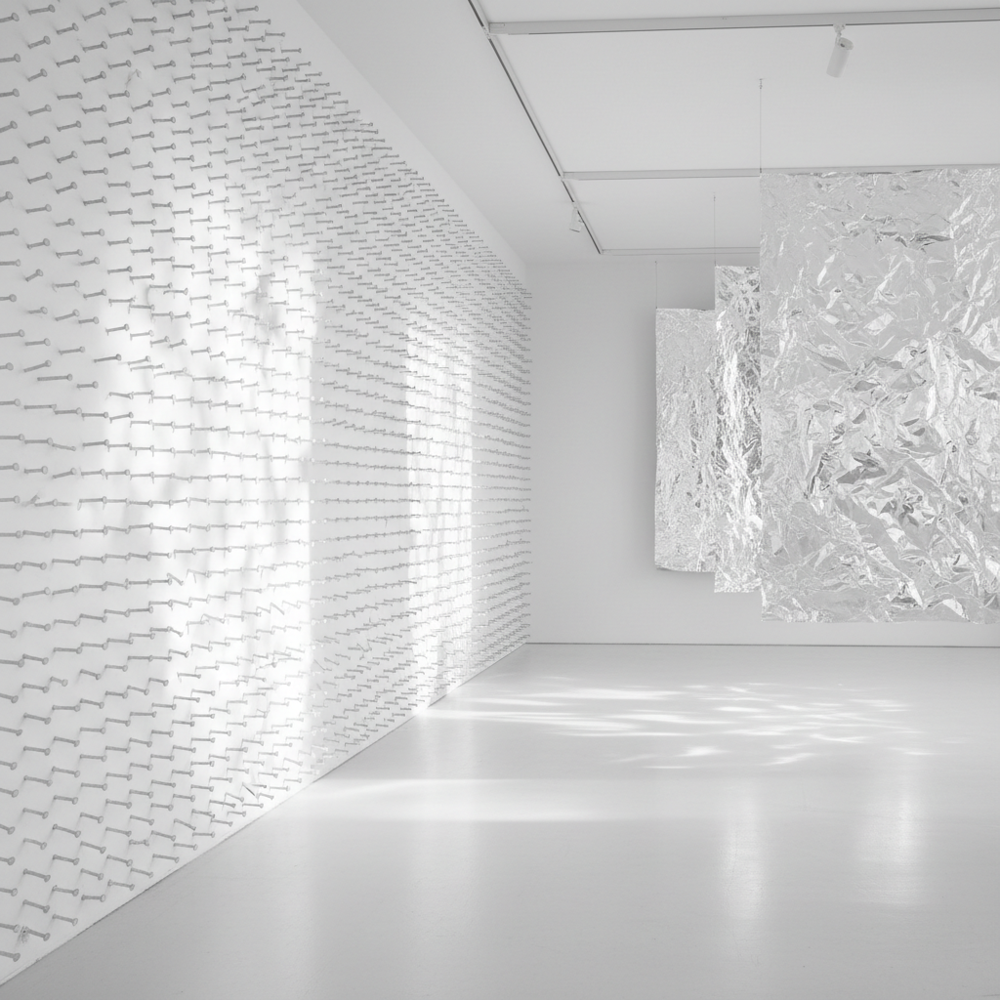

# ZERO Group 零派

> "ZERO is the silence. ZERO is the beginning." — Heinz Mack

## 概述

零派（ZERO / Gruppe ZERO）是1957年由海因茨·马克（Heinz Mack）和奥托·皮内（Otto Piene）在杜塞尔多夫创立的国际艺术运动。"ZERO"象征着一个新的起点——在二战的废墟上，从零开始，用光、运动和纯粹的能量创造一种全新的、非主观的艺术。

零派拒绝抽象表现主义的个人情感宣泄，转而追求光线、振动、反射和自然力量的客观美——让艺术像自然现象一样纯粹地存在。

## 核心特征

| 特征 | 描述 |
|------|------|
| 光即材料 | 光线、反射、折射是主要媒介 |
| 运动 | 动态雕塑、光的振动 |
| 非主观 | 拒绝个人情感表达 |
| 单色 | 白色、金色、银色——纯粹的光载体 |
| 自然力量 | 火、风、水作为创作元素 |
| 国际网络 | 与Fontana、Klein、Manzoni等国际艺术家合作 |

## 视觉特征

- **色彩**：白色、银色、金色——光的载体
- **材料**：铝箔、钉子、玻璃、镜面、火
- **光线**：作品本身发光或反射光线
- **运动**：机械或自然力驱动的动态
- **质感**：金属的精密、钉子的重复、箔的褶皱
- **空间**：光的环境——整个空间被光充满

## 代表作品

| 作品 | 艺术家 | 年代 | 意义 |
|------|--------|------|------|
| *Light Ballet* | Otto Piene | 1959 | 穿孔金属板投射的光影舞蹈 |
| *Silver Dynamo* | Heinz Mack | 1963 | 振动的铝箔反射光线 |
| *White Paintings* | Günther Uecker | 1961+ | 钉子创造的光影浮雕 |
| *Fire Paintings* | Yves Klein | 1961 | 用火焰直接作画 |
| *Achrome* | Piero Manzoni | 1958-63 | 白色的物质性 |
| *Sahara Project* | Heinz Mack | 1968 | 沙漠中的光反射装置 |

## 历史时间线

| 时期 | 事件 |
|------|------|
| 1957 | Mack和Piene在杜塞尔多夫创立ZERO |
| 1958 | 第一期ZERO杂志出版 |
| 1961 | Uecker加入，三人核心形成 |
| 1961 | 与Klein、Manzoni、Fontana建立国际网络 |
| 1964 | documenta III——ZERO获得国际认可 |
| 1966 | ZERO正式解散 |
| 2014 | 柏林Martin-Gropius-Bau大型回顾展——ZERO重新被发现 |

## 子类型

| 子类型 | 特征 |
|--------|------|
| 光动态 | Mack——振动的金属反射光线 |
| 光投射 | Piene——穿孔板创造光影图案 |
| 钉子浮雕 | Uecker——白色钉子的光影 |
| 火与身体 | Klein——火焰和身体印记 |
| 国际零派 | NUL(荷兰)、Azimuth(意大利)——平行运动 |

## 中国语境

零派的"从零开始"精神与中国当代艺术在文革后的重建有精神上的共鸣。零派对光和材料的纯粹探索影响了中国当代装置艺术中的光艺术实践。李晖的LED装置、杨泳梁的数字光影作品都可以在零派的传统中找到回响。

## 争议与遗产

- **争议**：被批评为"过于唯美"、回避了战后德国的政治责任
- **与Klein的关系**：Klein的加入带来了神秘主义色彩
- **短命**：正式存在仅9年（1957-1966）
- **遗产**：为光艺术、动态艺术、装置艺术奠定基础
- **当代回响**：James Turrell的光空间、Olafur Eliasson的光装置、LED艺术

## AI生成概念图

## 与其他风格的关系

- **Kinetic Art** → 动态艺术与零派共享运动和光线
- **Minimalism** → 极简主义共享零派的纯粹性和非主观性
- **Op Art** → 欧普艺术共享光学效果的探索
- **Light Art** → 光艺术是零派最直接的遗产
- **Spatialism** → Fontana的空间主义是零派的意大利盟友
- **Nouveau Réalisme** → 新现实主义与零派共享对新材料的探索

---

*浮光艺志 | Chronicle of Artistry*
